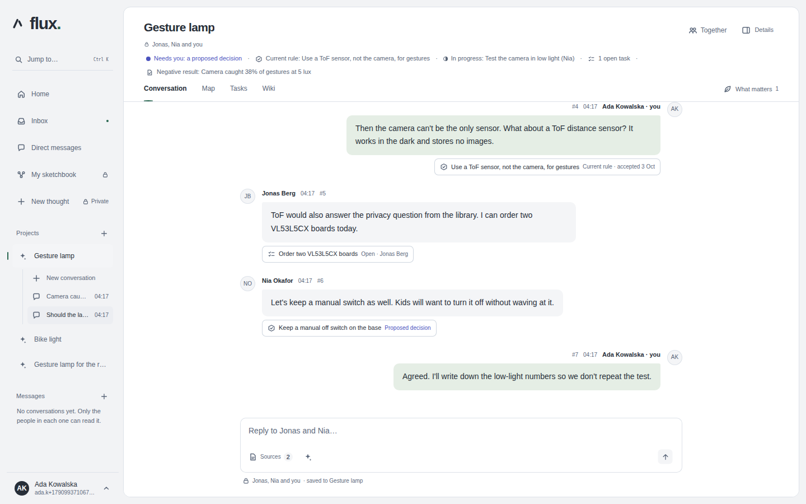
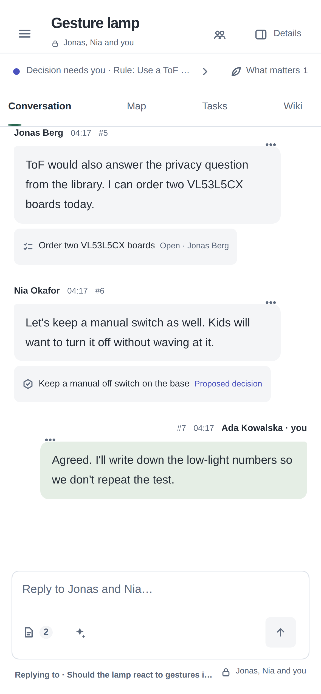
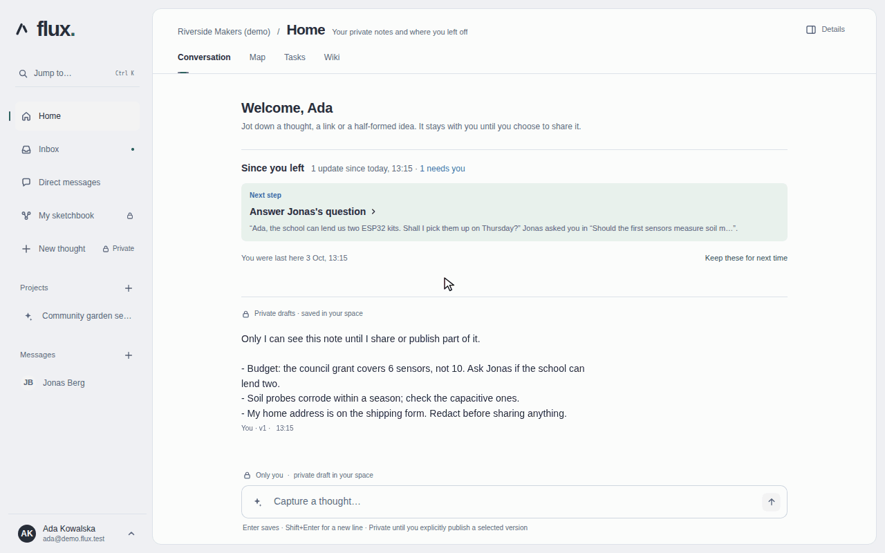

# Flux

An open source, self-hostable workspace where people and AI agents work on the same
projects: conversations, and the tasks, documents and decisions that come out of them.

<p align="center">
  
  
</p>

<p align="center"><sub>A project conversation on a 1440&nbsp;px desktop and a 390&nbsp;px phone, captured from the running
application with fictional test data (<a href="docs/assets/readme/README.md">how these were made</a>).</sub></p>

The [product foundation](docs/product/README.md) describes the direction: human and
agent collaboration, continuity of project knowledge, self-hosting and extensibility.

## Project status

**Pre-release.** No version has been published yet, so there is no upgrade promise or
supported deployment; do not use it for sensitive data or production teams.

The application runs as a Docker Compose stack (API, worker, PostgreSQL and a browser/PWA
client) and covers the core loop of working together:

- accounts with email sign-in and password reset, and workspace and project access;
- project conversations whose messages become tasks, decisions and results, with each
  project's map, tasks and wiki;
- direct messages, a private sketchbook, search, an inbox with Web Push notifications and
  a summary of what changed since you left;
- connecting your own MCP-capable AI agent to the projects you choose, and an optional
  in-app assistant that uses a model provider key you connect;
- optional self-hosted live audio/video, and backups, restore, project export and upgrades
  through `./flux`.

The [current milestone](https://github.com/ColdPhase/flux/milestone/2) tracks the rest of
the first release, including installation and notifications on real phones and tablets.

The application follows one design for the computer and the phone, the
[final design "Prostota"](docs/design/final/README.md). Its screens and guidelines are the
reference for every UI change.

## Quick start

Prerequisites: Git and Docker Engine (or Docker Desktop) with Compose. No host Node.js or PostgreSQL.

```sh
git clone https://github.com/ColdPhase/flux.git
cd flux
./flux up      # creates docker/.env with random secrets once, builds, migrates, starts, prints the URL
./flux demo    # optional: sample workspace, project, conversation and note; prints two logins
```

<p align="center"></p>

<p align="center"><sub>The <code>./flux demo</code> data in the running app: return view, conversation, sketch, task and
decision (<a href="docs/assets/demo/README.md">how this was recorded</a>).</sub></p>

Then open the URL that `./flux up` prints, <http://127.0.0.1:8081/> by default. If port 8081 is
taken, start the first time with `FLUX_PORT=8090 ./flux up`. The first `./flux up` takes a few
minutes, because it downloads the dependencies and builds Flux
([measured times](docs/development/time-to-first-run.md)). To connect your own MCP client, such
as Claude Code or Codex, sign in, open Settings and choose Agent connections (MCP). The page
shows the commands for this server.

`./flux up` never overwrites an existing `docker/.env`. An older root `.env` is moved once with its secrets and project name intact; if both files exist, choose the intended one before continuing. `app/.env.example` documents variables and is never loaded.
Other commands: `./flux dev` (hot reload in Docker), `./flux down`, `./flux logs`,
`./flux reset` (deletes data after confirmation), `./flux clean` (also removes the
images this checkout built) and `./flux help`. Backups, restore, project export and
upgrades (`./flux backup`, `restore`, `export`, `upgrade`) are described in
[operations](docs/operations/README.md). The
[application foundation guide](docs/development/application-foundation.md) covers the
launcher, configuration, backups and the integration fixture;
[containers](docs/development/containers.md) describes every service and variable.

Run the checks, all in Docker. Each run uses its own Compose project and removes only its
own test data:

```sh
./scripts/check_application.sh   # build, type check, lint, API, architecture and end-to-end tests
./scripts/check_ui.sh            # browser tests of the web app (Playwright)
./scripts/check_runtime.sh       # production-mode stack: worker jobs, migration and restart keep data
python3 scripts/check_agent_setup.py
python3 -m unittest discover -s tests -p 'test_*.py'
```

Changes to the launcher or operations also have `./scripts/check_flux_cli.sh` and
`./scripts/check_backup.sh`. [Contributing](docs/CONTRIBUTING.md) says which checks fit
which change.

## Connect your own agent

Your own MCP client, such as Claude Code or Codex, can read the projects you choose and suggest
next steps. It runs on your computer with your own model account, which Flux never sees. On the
`./flux demo` data:

1. Sign in as Ada, the workspace owner (`./flux demo` prints her password), and open
   <http://127.0.0.1:8081/connect-agent> (Settings → Agent connections (MCP)). 8081 is the
   default port; use the one `./flux up` printed.
2. **Create your personal agent.** Keep the workspace "Riverside Makers (demo)", give the agent a
   name and choose **Create personal agent**. The form is already open on a first visit. The demo
   seeds no agent.
3. **Grant it the project.** Under **New connection**, name the connection and pick your client.
   Next to "Community garden sensors", keep **Read and propose** and choose **Grant**; only a
   project manager can do this, and Ada is one. Under **Allowed actions**, tick all three: Claude
   Code asks for all three when it connects, and a connection without **Run approved project
   actions** is refused at consent. Each action still needs its own grant from you (step 6).
   Tick the project and choose **Save connection**.
4. **Add Flux to your client** with the commands the page shows:

   ```sh
   claude mcp add --transport http flux http://127.0.0.1:8081/mcp   # Claude Code
   claude mcp login flux

   codex mcp add flux --url http://127.0.0.1:8081/mcp               # Codex; adding may start the sign-in
   codex mcp login flux
   ```

   `claude mcp login flux` needs a terminal: outside one it stops with "stdin isn't a terminal".
   If the login times out before you choose **Allow access**, run it again.

5. **Consent.** The login opens Flux in your browser. Choose the saved connection, then
   **Continue to consent**. Check that access goes to an address on your own computer and to the
   selected project only, and choose **Allow access**.
6. **Ask it something**, for example: "Using Flux, what is the Community garden sensors project
   working on, and what is still open?" The client reads the project's conversations, tasks and
   docs, and answers in your client. A suggestion it makes waits in Flux for a person to review;
   replying or creating tasks in Flux also needs **Approved actions** and a grant from you on the
   same page.

The loopback `http://` address works only for a client on the same computer. A client on another
computer needs an HTTPS address: the operator sets `FLUX_PUBLIC_ORIGIN` behind a TLS reverse proxy
([agent connection](docs/development/agent-connection.md),
[integrations for operators](docs/integrations/README.md#for-operators)). Flux accepts clients
only through their public client metadata documents, so the server needs outbound HTTPS when a
client signs in. Claude Code completed this sign-in on a loopback install on 2026-09-28; the Codex
commands come from Codex's own documentation and have not yet been run against Flux
([#320](https://github.com/ColdPhase/flux/issues/320) times the whole path).

## Repository layout

| Path | Contents |
| --- | --- |
| `app/apps/server` | API: HTTP routes, identity, push, serving the web build |
| `app/apps/worker` | Background jobs and Web Push delivery |
| `app/apps/web` | Browser application and PWA |
| `app/packages/core` | Domain rules, authorization, use cases and ports |
| `app/packages/db` | Database schema, SQL migrations and persistence adapters |
| `app/packages/contracts` | Public API wire types (Apache-2.0) |
| `app/packages/sdk` | TypeScript client for the public API (Apache-2.0) |
| `app/packages/agent-runtime` | Optional model/provider adapter |
| `app/examples/external-agent` | An external agent using the SDK (Apache-2.0) |
| `app/` | Sole pnpm workspace, lockfile, TypeScript/ESLint config and application variable reference |
| `app/tooling` | Migration and operations entry points |
| `docker` | Dockerfiles, source/dev/test/live Compose, pull-only operator example and executable env template |
| `app/tests` | Application checks and Python/Playwright browser checks |
| `tests` | Repository and agent tooling checks |
| `flux` | One-command launcher: `up`, `demo`, `dev`, `down`, `reset`, `clean`, `backup`, `restore`, `export`, `upgrade` |
| `scripts` | Check scripts, the demo seed and repository tooling |
| `docs` | Product, design, development and agent documentation |

Dependency directions between these are described and enforced in
[architecture](docs/development/architecture.md).

## Contribute

Bug reports, documentation, accessibility feedback and focused fixes are welcome.
Read [CONTRIBUTING.md](docs/CONTRIBUTING.md) first and discuss larger features or
architecture changes in an issue before starting.

- [Report a bug or propose a feature](https://github.com/ColdPhase/flux/issues/new/choose)
- [Project board](https://github.com/orgs/ColdPhase/projects/1)
- [Discussions](https://github.com/ColdPhase/flux/discussions)
- [Report a security vulnerability privately](docs/SECURITY.md)

Much of the development is done by two coding agents (Codex and Claude) working
through GitHub issues and pull requests with independent review; see
[agent collaboration](docs/agents/README.md). The [documentation index](docs/README.md)
lists everything else.

## License

The application is licensed under the [GNU Affero General Public License v3](LICENSE).
`app/packages/contracts`, `app/packages/sdk` and `app/examples/external-agent` are licensed under
Apache-2.0 so that external agents and clients can use them; see
[licensing](docs/product/licensing.md).
