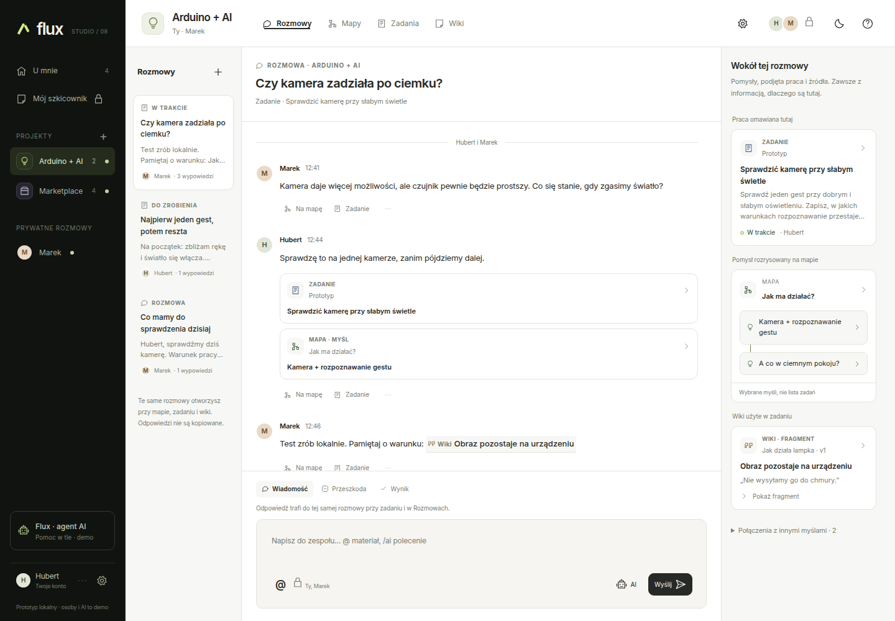

# Flux

Conversations, mind maps, tasks, and wiki pages in one connected workspace.

Flux is an open source project working toward a workspace that creative teams can
host themselves. The idea is to keep a discussion connected to the work and
materials it produces.

## Project status

**Early development: this repository currently contains the Flux Studio v8 UX
prototype.** It runs locally as a single HTML file with embedded JavaScript and
CSS. The interface and sample content are currently in Polish.

You can explore conversations, mind maps, task boards, wiki pages, and the links
between them. Accounts, permissions, collaboration, AI agents, MCP, and external
integrations are demonstrations. There is no shared backend or real AI service.



The prototype uses browser storage for local data. Use the JSON export for data
you want to keep, and use sample data when trying it out. It is not ready to store
sensitive information or serve a team in production.

## Try the prototype

Download or clone the repository, then open `flux-ux-v8.html` in a modern browser.
No build step or account is needed.

To serve it locally with Python 3:

```sh
git clone https://github.com/ColdPhase/flux.git
cd flux
python3 -m http.server 8080 --bind 127.0.0.1
```

Open <http://127.0.0.1:8080/flux-ux-v8.html>. On systems where Python 3 is named
`python`, use that command instead of `python3`.

Start with the **Arduino + AI** project. Explore its conversation, switch to
**Mapy**, **Zadania**, or **Wiki**, and follow the related materials. The
[prototype guide in Polish](docs/prototype/README.md) describes a more detailed walkthrough.

## Contribute

Bug reports, UX and accessibility feedback, documentation, and focused fixes are
welcome. Read [CONTRIBUTING.md](docs/CONTRIBUTING.md) before opening a pull request.
Discuss substantial features or architecture changes with the maintainers first.

- [Report a bug or propose a feature](https://github.com/ColdPhase/flux/issues/new/choose).
- [Ask a question or discuss an idea](https://github.com/ColdPhase/flux/discussions).
- [Report a security vulnerability privately](docs/SECURITY.md).

Maintainers review contributions and decide what is merged into the project.

## Documentation

The [documentation index](docs/README.md) covers contributing, security, and the
prototype's design:

- [Prototype walkthrough](docs/prototype/README.md) — Polish user guide and limitations.
- [UX specification](docs/prototype/SPECIFICATION.md) — design notes for this prototype.
- [Changelog](docs/prototype/CHANGELOG.md) — changes in v8.
- [UX audit](docs/prototype/AUDIT.md) — historical observations and limitations.

These notes describe the prototype and its design history. Future architecture
and feature proposals are discussed in Issues and Discussions.

## License

Flux is licensed under the GNU Affero General Public License, version 3.
See [LICENSE](LICENSE) for the full terms.
