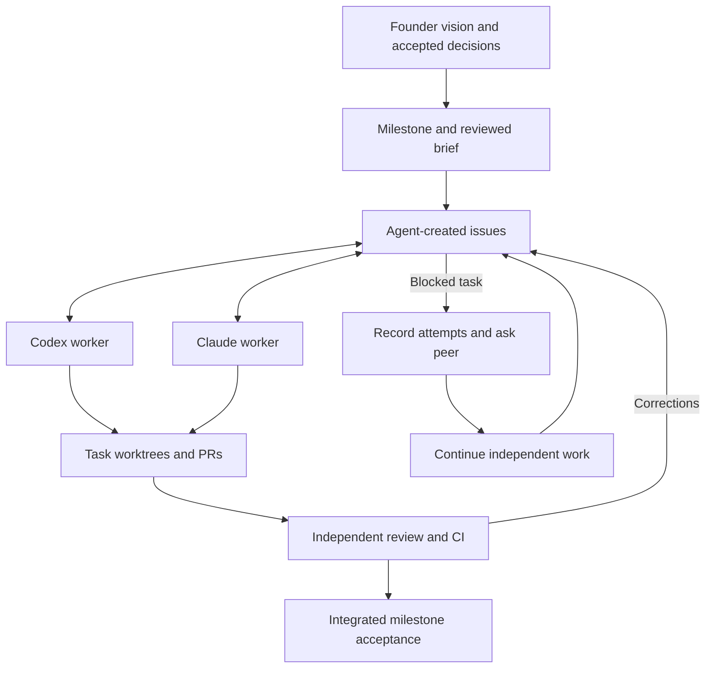

# Agent collaboration

Two agents, Codex/Hubert and Claude/Maurycy, share the product foundation,
skills, and GitHub milestones. Each founder runs one `/goal` session;
[start here](startup.md). The Flux application is still an exploratory HTML
prototype.

The [delegation](../product/autonomy.md) authorizes decisions and the complete
application. Planning and implementation milestones overlap, and agents create
further milestones. No human acceptance is required. Agents create useful issues,
agree short criteria, implement agreed work in small PRs (at most two open each),
and evaluate the other's changes. Roles can
alternate; there is no fixed provider-to-frontend/backend assignment.

## Read as needed

1. [Product direction](../product/README.md) and [decision register](../product/decisions.md).
2. [Startup](startup.md): each person's `/goal` prompt, pause and resume.
3. [Workflow](workflow.md): milestone scope, tasks, blockers, acceptance.
4. [GitHub protocol](github-protocol.md): identity, ownership and when to comment.
5. [Evaluation](evaluation.md), [design](../design/README.md), and [containers](../development/containers.md).
6. [CI and releases](ci-and-releases.md): agents prove validation, required checks,
   packaging and publication within accepted scope.

## Shared entry points

[AGENTS.md](../../AGENTS.md) is shared; [CLAUDE.md](../../CLAUDE.md) imports it.
`.claude/skills` links to [.agents/skills](../../.agents/skills/). Restore symlinks
if your Git environment does not preserve them; do not maintain separate copies.

| Skill | Use |
| --- | --- |
| `flux-resume-work` | Recover an interrupted task and continue its existing artifact. |
| `flux-work-loop` | Continue milestone work and revisit parked tasks. |
| `flux-plan-task` | Agree on a bounded task and its criteria. |
| `flux-research-product` | Research product/architecture decisions with dated evidence. |
| `flux-design-ui` | Explore or refine compact, readable working UI. |
| `flux-review-visual` | Independently assess screenshots with a neutral brief. |
| `flux-implement-task` | Implement and hand off a pinned PR head. |
| `flux-review-task` | Independently test results and report findings. |
| `flux-verify-release` | Verify the integrated release against accepted outcomes. |
| `flux-maintain-ci` | Build and prove Actions validation and PR gates. |
| `flux-publish-release` | Package and publish the accepted application revision. |

Records: [milestone brief](templates/milestone.md),
[release details](templates/release-contract.md), [handoff](templates/handoff.md),
[evaluation](templates/evaluation.md), [task form](../../.github/ISSUE_TEMPLATE/task.yml).

## References

[Anthropic's harness article](https://www.anthropic.com/engineering/harness-design-long-running-apps)
informed independent evaluation and durable handoffs.
[Open Mercato's shared skills](https://github.com/open-mercato/skills/tree/e886001ab1dea2123af79e52dcd175c36878dab1)
informed reusable procedures. Flux's skills are its own implementation for two
maintainers and the founder's current vision.
