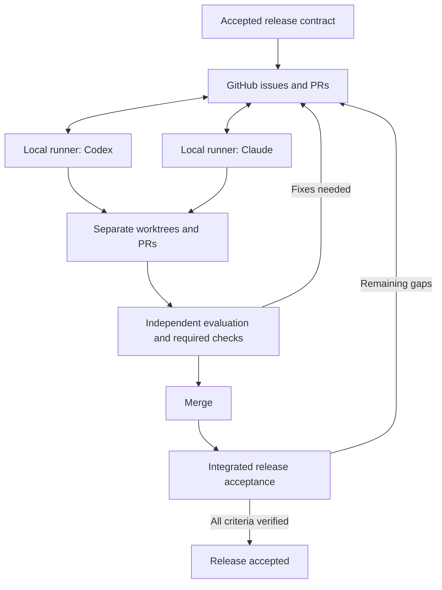

# Agent collaboration

## Current stage

This repository contains the design foundation for two cooperating coding
workers: Codex operated by Hubert and Claude operated by Maurycy. GitHub is their
shared task queue, conversation history, and record of verification.

Shared instructions, skills, and a repository-structure validation workflow are
available in this branch. The background runner, provider adapters, and automatic
agent GitHub mutations are **not implemented or enabled**. The application plan
and technology choices will be supplied later. The current HTML prototype remains
the runnable application.

## Intended operation

Maintainers agree on a release contract. Two workers then plan tasks, negotiate
acceptance criteria, implement in separate worktrees, evaluate each other's
changes, and create necessary follow-up tasks through GitHub. They continue until
the integrated release passes its acceptance checks, or report a specific blocker.

Planning, building, and evaluation are roles, not permanent assignments of a
model to frontend or backend. Either worker can build a task; the other evaluates
it. A planning pass can use the same two workers. Reviews take a fresh view of
the contract, diff, and running application.

## Read in this order

1. [Workflow](workflow.md): task lifecycle, scope, and release completion.
2. [GitHub protocol](github-protocol.md): communication, ownership, and recovery.
3. [Harness design](harness.md): runner loop, state, adapters, and implementation plan.
4. [Evaluation](evaluation.md): independent review and evidence requirements.
5. [CI and releases](ci-and-releases.md): agents build validation workflows,
   enable proven PR checks, package the application, and publish accepted versions.

Reusable records:

- [Release contract](templates/release-contract.md)
- [Session handoff](templates/handoff.md)
- [Evaluation report](templates/evaluation.md)
- [Implementation task form](../../.github/ISSUE_TEMPLATE/task.yml)

## One source for both tools

- [AGENTS.md](../../AGENTS.md) is the shared entry point.
- [CLAUDE.md](../../CLAUDE.md) imports it for Claude.
- [.agents/skills](../../.agents/skills/) contains the shared skills.
- `.claude/skills` is a relative symlink to that directory. Both checkouts use the
  same committed skill revision. If a checkout cannot preserve symlinks, restore
  the link before using Claude's project skills; do not maintain divergent copies.
- [.harness/project.json](../../.harness/project.json) records the proposed worker
  identities and runtime configuration. It is a Flux design manifest, not an
  Open Mercato or SDK configuration file.

| Skill | Use |
| --- | --- |
| `flux-work-loop` | Choose or resume the next authorized unit of work. |
| `flux-plan-task` | Turn an accepted outcome into a bounded task contract. |
| `flux-implement-task` | Implement an agreed task and prepare its PR for evaluation. |
| `flux-review-task` | Independently evaluate a task and publish actionable findings. |
| `flux-verify-release` | Verify the integrated release against its full contract. |
| `flux-maintain-ci` | Build and verify Actions workflows, then roll out required PR checks. |
| `flux-publish-release` | Package and publish the accepted application version with provenance. |

These skills guide an explicitly invoked session today. They do not start a
daemon, grant GitHub permissions, or keep a stopped client alive. The future
runner will invoke them and deliver incoming messages.

## Inputs for the next stage

The later application-planning step supplies a release specification, architecture
and stack decisions, acceptance scenarios, and actual build/test/start commands.
Until then, the manifest remains in `design` with execution disabled. Normal
repository work and explicitly requested prototype changes remain possible.

Before autonomous execution, implement and exercise the runner, bind a release
milestone and contract, configure verification and a run limit, and record which
merge, publication, and deployment actions the maintainers authorize. See the activation conditions
in [Harness design](harness.md).

Check the current foundation with `python3 scripts/check_agent_setup.py`. The
`Repository checks` Actions workflow runs the same structural check. Application
lint, tests, builds, and release packaging are later tasks after stack selection.

## Design references

[Anthropic's harness article](https://www.anthropic.com/engineering/harness-design-long-running-apps)
motivates independent evaluation, negotiated acceptance criteria, and durable
handoffs. Its later experiment reduced sprint ceremony; it supports testing
which controls help rather than imposing resets or a fixed sprint cadence.

[Open Mercato's shared skills](https://github.com/open-mercato/skills/tree/e886001ab1dea2123af79e52dcd175c36878dab1)
provide a reference for reusable PR procedures. Flux uses its own smaller skill
set and GitHub protocol, adapted for two maintainers. The design below is a
proposal for Flux, not a claim that either reference already supplies our runner.
