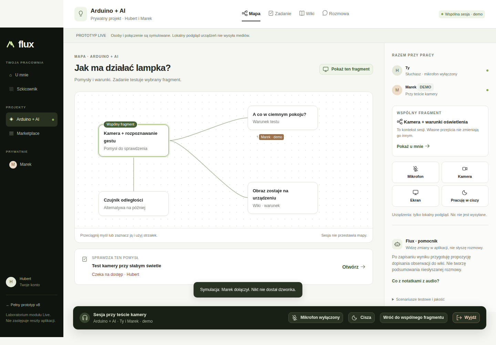
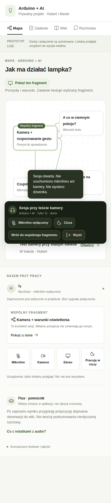

# Live collaboration reference

Hubert supplied `flux-live.html` on 27 September 2026 as an interaction reference
for working together at a task, map or wiki. The accepted requirements and
implementation tasks are in [Live collaboration at the work](../../../product/live-collaboration.md).
Continue the accepted C/v8 application direction; this separate module exploration does
not replace the application or establish a new palette.

## Open and explore

Open [flux-live.html](flux-live.html) directly in a browser. No installation is
needed. Joining, simulated participation, view changes, sharing a context,
following, quiet/return, task changes and wiki proposals are local demonstrations.
To explore: start **Zróbmy to razem**, expand **Scenariusze testowe i jakość**,
simulate the peer, navigate and explicitly show a fragment. Observe the difference
between browsing privately and presenting. Leave and reload to inspect saved work.

**No remote connection exists.** Explicit microphone/camera/screen buttons may
request real local device access in a supporting browser/secure context, but
the file transmits nothing to a peer. People, presence, access, shared pointers
and AI are simulated. AI is a deterministic rule over written results. Local
browser storage is not the production persistence or authorization model.
The media capability must be tested over HTTPS/localhost when appropriate.

The imported HTML preserves the supplied CSS/JavaScript and sample content.
Only its two links back to the earlier prototype were changed to repository-relative paths;
that prototype has since been removed (#336), so those two links no longer resolve. Original/imported
SHA-256 values are recorded in [inspection.json](inspection.json). Keep this
reference outside the production app bundle; do not copy its single-file
structure, hard-coded global helper or fake participant model into product code.

The separately mentioned ZIP, specification and prior 29-test report were not
provided in this change. Their contents/results have not been verified here.

## Inspection

Self-inspected in isolated Docker Chromium 151.0.7922.34 at 100% scale. The exact
browser version is also recorded in [inspection.json](inspection.json).
Nine local behavior checks and three document-overflow checks passed, with no
page errors. Device methods were instrumented to count requests and reject real
capture; no camera, microphone, screen hardware or remote media were tested.

The behavior checks covered device-free join, session/context continuity during
navigation, explicit presentation, opt-in following, independent navigation,
quiet/return, leaving and local content recovery after reload. Overflow checks
covered 1280×800, 390×844 and 768×1024. Desktop rendering also used 1440×900.
Quiet was checked with no active real tracks; stopping real capture or incoming
audio still requires production tests. These checks do not establish usability,
accessibility, actual collaboration, media quality or independent visual acceptance.
In a separate fake-device Chromium check of the supplied HTML, a microphone track
started only after a click and stopped on entering quiet mode. The fake device
was not physical hardware or a remote participant; production capture and receiver
behavior still require their own tests.

### Observations to carry into implementation

1. **Preserve:** the work remains central; navigation does not silently change
   shared context; following is explicit and reversible; device-free entry and
   the persistent session are understandable starting points.
2. **Improve mobile controls:** the fixed session strip occupies substantial
   viewport space and can cover work. Reserve space/adapt it, consolidate repeated
   controls and keep leave/mute plus the currently edited material reachable with
   the virtual keyboard and safe areas.
3. **Replace simulation assumptions:** “Flux · pomocnik” must become an identified
   personal helper under [#57](https://github.com/ColdPhase/flux/issues/57).
   Production pointers need actual authorized object/selection references,
   real participants and source revisions, not the demo's fixed view names.

The two screenshots below show the supplied prototype, including its demo notices
and transient feedback. They are reference observations, not product screenshots.

### Desktop session

### Phone session

