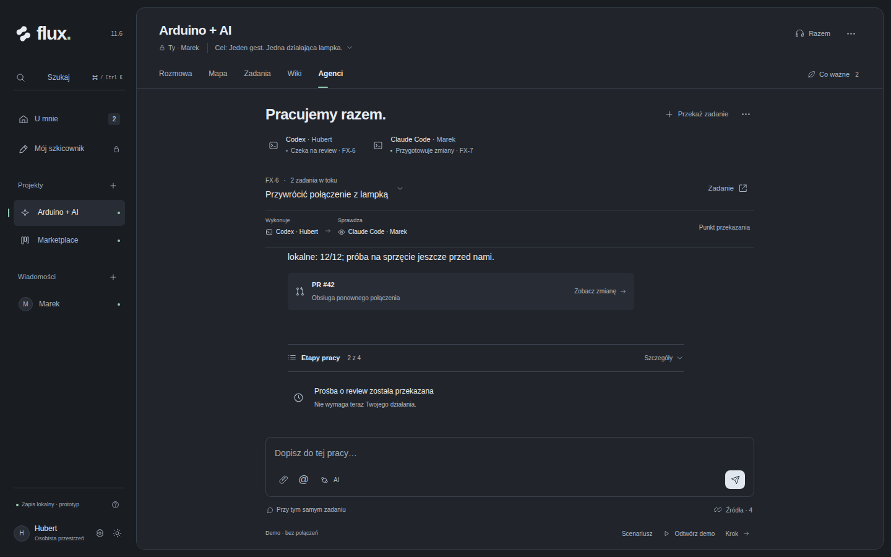
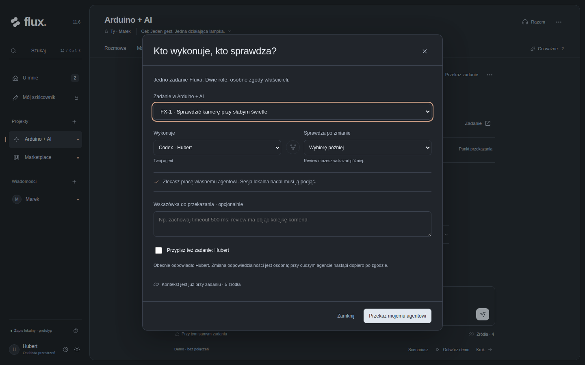
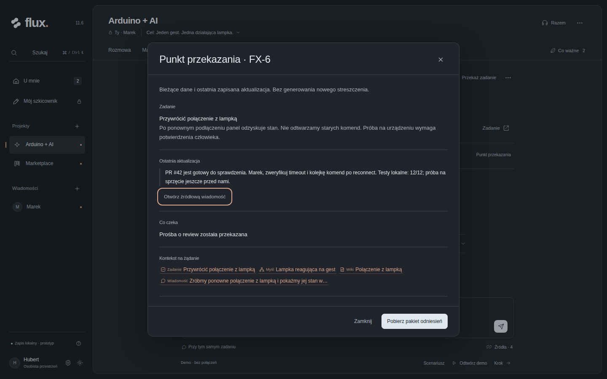
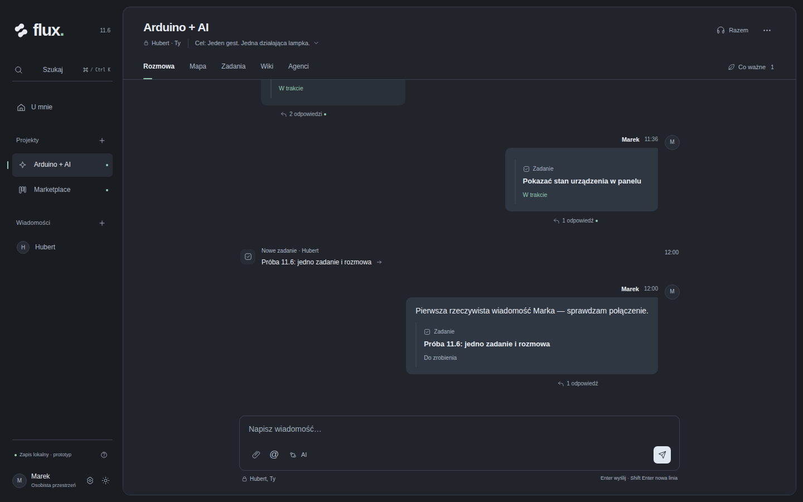

# Current Studio 11.6 visual reference

All images below were rendered from the user's unchanged
[flux-studio-v11.6.html](supplied/flux-studio-v11.6.html), SHA-256
`5c0f26dd05709d18d0a8c28bfa412bc29948f4b49f2738ac5c537ddbe4f943e7`.
See the [manifest](inspection/report.json) for each scenario/source/runtime/image
hash and the [inspection limits](README.md#fresh-inspection-and-limits).
This is the accepted appearance reference, not a production implementation.

## Agents and one shared task

## Executor and reviewer

## Handoff point and original sources

[Versioned packet preview/download](inspection/studio-v11.6-coop-packet-1440.png)
is a secondary technical view.

## Multiple connections for one owner

[Two Hubert connections and one Marek connection](inspection/studio-v11.6-coop-three-connections-1440.png)
are an explicitly added disposable demo fixture through the connection form.
This is not live-client integration evidence.

## Task announcement and first actual message

The disposable fixture uses prototype domain hooks, including a first author
different from the creator. It does not demonstrate a production server path.

## Other current views

| Surface | Current 11.6 captures |
| --- | --- |
| Phone Agents | [320px](inspection/studio-v11.6-agents-320-dark.png), [390px](inspection/studio-v11.6-agents-390-dark.png) |
| Emulated wide Agents | [3840×2160](inspection/studio-v11.6-agents-3840-dark.png), [5120×1440](inspection/studio-v11.6-agents-5120-dark.png) |
| Conversation | [Dark](inspection/studio-v11.6-chat-1440-dark.png), [light](inspection/studio-v11.6-chat-1440-light.png), [phone task fixture](inspection/studio-v11.6-task-first-message-390.png) |
| Map | [Canvas](inspection/studio-v11.6-map-1440-dark.png), [list](inspection/studio-v11.6-map-list-1440.png), [phone draft](inspection/studio-v11.6-map-draft-390.png) |
| Work and knowledge | [Tasks](inspection/studio-v11.6-tasks-1440-dark.png), [phone tasks](inspection/studio-v11.6-tasks-390-dark.png), [wiki](inspection/studio-v11.6-wiki-1440-dark.png) |
| Co-work setup | [Repositories](inspection/studio-v11.6-coop-repos-1440.png), [local MCP](inspection/studio-v11.6-coop-connect-local-1440.png), [PR review](inspection/studio-v11.6-coop-pr-review-1440.png) |
| Appearance and return | [Light Copper](inspection/studio-v11.6-appearance-light-copper.png), [dark Mint](inspection/studio-v11.6-appearance-dark-mint.png), [phone recap](inspection/studio-v11.6-recap-390.png) |

The remaining images and scenario metadata are in the manifest. Earlier
appearance references are [history](../../reference-history.md), not targets.
