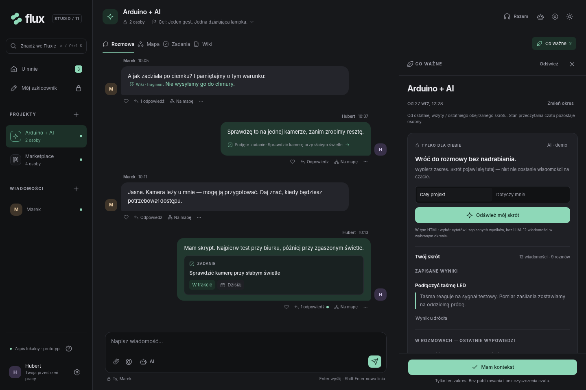
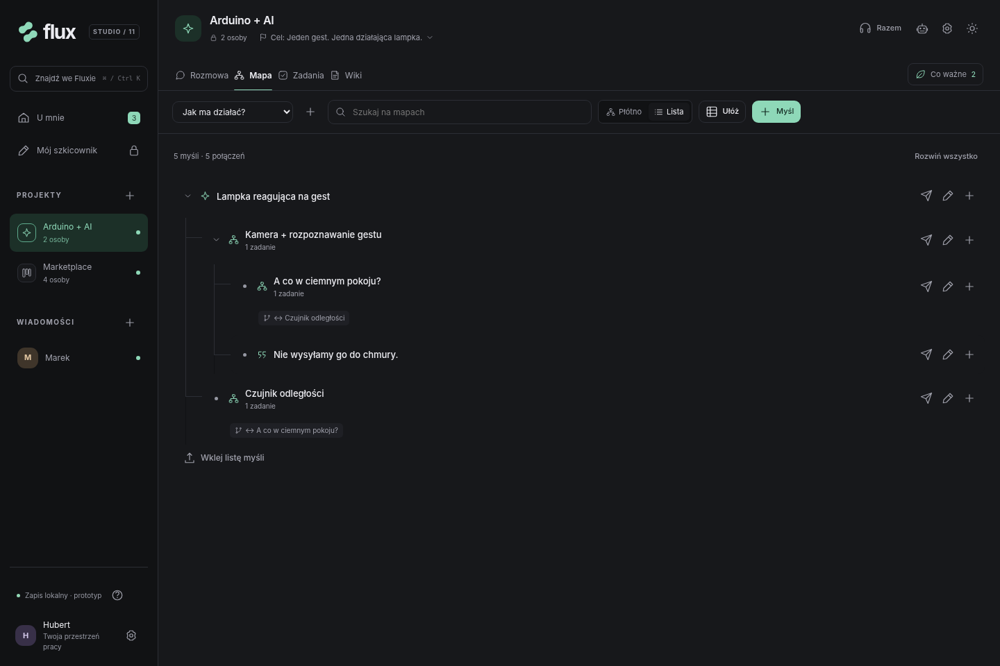
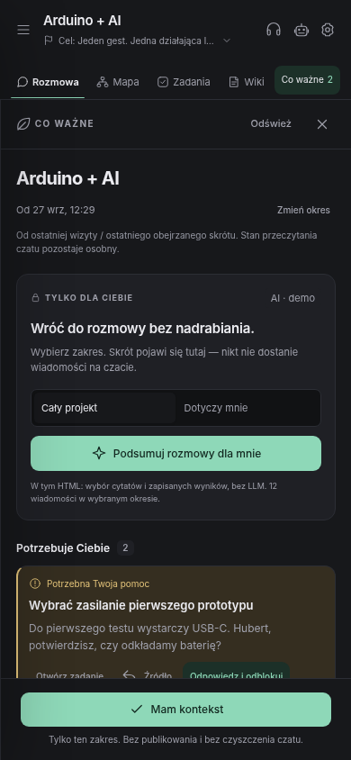
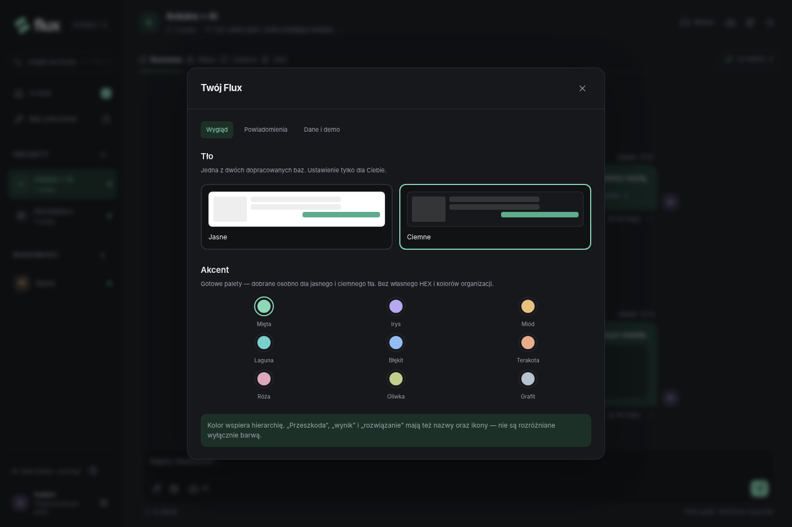

# Flux Studio 11

### Mniej porządkowania. Więcej tworzenia razem.

Flux to projekt otwartego, samodzielnie hostowanego środowiska pracy dla małych zespołów twórczych i technicznych. Rozmowy, myśli na mapie, podejmowane działania i wiedza projektu zachowują wspólny kontekst, ale nie stają się kopiami siebie nawzajem.

**Studio 11 dopracowuje cały produkt: prywatny powrót od ostatniej wizyty, kompaktowy cel, wyszukiwanie zadań/map/wiki, czytelne gałęzie, zadania na wąskim ekranie oraz przenoszenie projektu z autorstwem i dostępną historią.** Messengerowy czat, mapy, zadania, wiki, blokady, wyniki, agent i sesje „Zróbmy to razem” pozostają jednym systemem. Dziewięć statycznych akcentów działa na dwóch tłach.

**Nie jest to produkcyjny serwer.** Wersja HTML jest aplikacją lokalną: stany i interakcje działają, podsumowanie jest ekstrakcyjnym DEMO bez LLM, agent używa reguł, a drugi uczestnik Live jest symulowany. Lokalne przechwytywanie urządzeń nie transmituje dźwięku ani ekranu do innego komputera. Nie ma prawdziwych kont, SSO, MCP ani współedycji.

Schemat danych: **11**. Osobny magazyn nie modyfikuje automatycznie v10. Jest jawny import pełnej kopii schematu 09/10/11 oraz nowy, oddzielny format eksportu pojedynczego projektu. Domyślnie import projektu tworzy kopię z nowymi identyfikatorami i profilami historycznymi — nie scala danych ani kont po nazwie.



## Spis treści

1. [Uruchomienie i zawartość pakietu](#1-uruchomienie-i-zawartość-pakietu)
2. [Co działa w tym wydaniu](#2-co-działa-w-tym-wydaniu)
3. [Obietnica produktu i reguły UX](#3-obietnica-produktu-i-reguły-ux)
4. [Projekt, prywatna rozmowa i szkicownik](#4-projekt-prywatna-rozmowa-i-szkicownik)
5. [Rozmowa bez wybierania tematów](#5-rozmowa-bez-wybierania-tematów)
6. [Wiadomość jako przeszkoda, rozwiązanie i wynik](#6-wiadomość-jako-przeszkoda-rozwiązanie-i-wynik)
7. [Jednoznaczne odnośniki i pochodzenie](#7-jednoznaczne-odnośniki-i-pochodzenie)
8. [Mapa służy myśleniu, nie odtwarzaniu kanbanu](#8-mapa-służy-myśleniu-nie-odtwarzaniu-kanbanu)
9. [Zadania i osobisty plan](#9-zadania-i-osobisty-plan)
10. [Wiki i dokładne fragmenty](#10-wiki-i-dokładne-fragmenty)
11. [U mnie, wiadomości i powrót](#11-u-mnie-wiadomości-i-powrót)
12. [Agent i pomoc w tle](#12-agent-i-pomoc-w-tle)
13. [Razem: audio, kamera i ekran](#13-razem-audio-kamera-i-ekran)
14. [Palety i styl interfejsu](#14-palety-i-styl-interfejsu)
15. [Przepływy do samodzielnego sprawdzenia](#15-przepływy-do-samodzielnego-sprawdzenia)
16. [Skróty i alternatywne sposoby obsługi](#16-skróty-i-alternatywne-sposoby-obsługi)
17. [Dane, eksport i bezpieczeństwo](#17-dane-eksport-i-bezpieczeństwo)
18. [Docelowy serwer, MCP i rozszerzenia](#18-docelowy-serwer-mcp-i-rozszerzenia)
19. [Kod, testy i granice weryfikacji](#19-kod-testy-i-granice-weryfikacji)
20. [Kryteria gotowości produktu](#20-kryteria-gotowości-produktu)

## 1. Uruchomienie i zawartość pakietu

Otwórz **`flux-studio-v11.html`** w aktualnej przeglądarce. Cały interfejs, style, ikony SVG i logika są w jednym pliku. Samo korzystanie nie wymaga npm, Dockera ani dostawcy modelu. Nie są pobierane zewnętrzne biblioteki, fonty, trackery ani awatary.

Do regularnego lokalnego testowania można uruchomić prosty serwer w katalogu pakietu:

```bash
python -m http.server 8080 --bind 127.0.0.1
```

Następnie otworzyć:

```text
http://127.0.0.1:8080/flux-studio-v11.html
```

To wyłącznie podanie statycznego pliku. **Nie tworzy kont, współpracy na żywo ani produkcyjnego backendu.** Dane nie są wspólne między komputerami. Używaj jednego stałego adresu i jednej karty do edycji.

`localStorage` dla plików otwieranych przez `file:` nie ma gwarantowanego, jednolitego zachowania we wszystkich przeglądarkach [1]. Przejście między `file:`, `localhost` i innym portem może pokazać osobny lokalny magazyn. Eksportuj dane przed zmianą sposobu uruchomienia.

```text
flux-studio-v11.html        gotowa aplikacja lokalna
README.md                 całościowa dokumentacja produktu i wydania
DESIGN.md                 palety, hierarchia, interakcje i dostępność
ARCHITECTURE.md            model danych, operacje i granice produkcyjne
CHANGELOG.md              zmiany względem Studio 10
AUDIT.md                  zakres testów i znane ograniczenia
src/index.html            szablon dokumentu
src/style.css             statyczne tokeny i style komponentów
src/app.js                wspólne dane, mapy, rozmowy, wiki i operacje
src/experience.js         powrót, wykonania AI, sesje przy pracy
src/experience.css        ich układ z użyciem tych samych palet
src/refinement.js         prywatny powrót, wizyty, wyszukiwanie, lista, transfer
src/refinement.css        9 palet, kompaktowy nagłówek i responsywne widoki
src/build.py              złożenie samodzielnego HTML-u
tests/test_flux.py         65 scenariuszy regresyjnych
tests/test_experience.py   powrót, AI, Live i scenariusze brzegowe
tests/test_refinement.py   nowe przepływy, zakres prywatny, import i responsywność
tests/test_contrast.py     pomiar wybranych par kolorów
tests/report.json         zapis wyników
tests/capture11.py         zrzuty rzeczywistych ekranów
tests/contrast-v11.json    nowy pomiar 108 wybranych par kolorów
screenshots/              podglądy interfejsu
```

## 2. Co działa w tym wydaniu

| Obszar | Stan Studio 11 |
|---|---|
| Strumień wiadomości, odpowiedzi przy wpisie, edycja własnej wiadomości | Działa lokalnie |
| Wzmianki `@`, wyszukiwanie materiałów, podglądy, odnośniki zwrotne | Działa lokalnie, w zakresie danych bieżącego profilu |
| Przeszkody, konkretne rozwiązania, wyniki i cofanie oznaczeń | Działają jako reguły stanu, nie ozdobne etykiety |
| Mapy: myśli, linie, przesuwanie, grupy, układ, cofanie, lista | Działa lokalnie |
| Zadania, kilka tablic, kanban i tabela, plan, termin, nakład | Działa lokalnie |
| Wiki: Markdown, import, edycja, historia, cytaty, eksport | Działa lokalnie |
| Prywatne projekty, DM i grona | Demonstracja modelu odbiorców. Bez prawdziwej autoryzacji |
| Zapis szkiców, JSON, eksport Markdown | Zaimplementowane; dostępność magazynu zależy od przeglądarki |
| Tło jasne/ciemne i dziewięć palet | Działa; ustawienie per profil, brak własnych kolorów |
| Osobiste przypomnienia i inbox | Działa przy otwartej aplikacji. Bez serwera, push i e-maili |
| „Co ważne”: aktualny stan, osobiste potrzeby, źródła, niezależny punkt przeglądu | Działa lokalnie bez AI; nie interpretuje nieoznaczonych wypowiedzi |
| Agent `/ai`, źródła, stan wykonania, anulowanie, propozycja, zastosowanie i bezpieczne cofnięcie | Jawna symulacja regułowa, bez LLM |
| Proaktywna propozycja wiki po wyniku | Działa jako zdarzenie w otwartej aplikacji; wymaga jednego dokumentu |
| „Zróbmy to razem”: przypięty kontekst, zaproszenie, podążanie, cisza, rzeczywiste efekty | Działają lokalne stany UI i operacje; druga osoba jest DEMO |
| Mikrofon, kamera, ekran | Jawny lokalny test browser API, bez transmisji; dostępność zależy od środowiska |
| Prywatny skrót rozmów od wizyty, zakres cały projekt / dotyczy mnie | Działa jako lokalny ekstrakcyjny DEMO; nigdy nie publikuje w czacie |
| Wyszukiwanie zadań, map i wiki | Działa w obrębie projektu; podgląd bez zmiany materiałów |
| Eksport/import pojedynczego projektu | Działa z walidacją, nowymi ID, historią i jawnym mapowaniem własnego profilu |
| Rzeczywiste SSO, sesje kont, ACL, współedycja | Niezaimplementowane w tym pliku |
| MCP, Git/CI, zewnętrzni agenci i SDK rozszerzeń | Kontrakt docelowy opisany poniżej, bez aktywnego połączenia |

Nie ma atrap przycisków udających istniejącą usługę logowania lub model. Miejsca wymagające serwera mówią wprost, że go wymagają. Lokalny profil demo nie powinien być używany do zabezpieczania prawdziwych danych.

## 3. Obietnica produktu i reguły UX

**Zwykła droga zaczyna się od napisania wiadomości, nie od wybrania metodologii pracy.**

Jedna osoba może głównie pisać, druga rozrysowywać, a trzecia wykonywać zadania. Nie muszą codziennie odwiedzać wszystkich ekranów. Reguły są wspólne, nawet gdy materiał oglądają w innym miejscu.

Najważniejsze zasady:

- Każda czynność ma czytelny, ograniczony skutek. Narysowanie linii nie tworzy obowiązku ani nie scala rozmów.
- Nie przepisujesz własnej wiadomości do trzech formularzy. Istniejącej wypowiedzi można nadać znaczenie wyniku, przeszkody lub rozwiązania.
- Nie wymagamy mapy przed zadaniem, zadania przed rozmową ani dokumentu po każdym drobiazgu.
- Wskazanie materiału nie udostępnia go nowym osobom. Miejsce pisania określa odbiorców.
- Podgląd nie powinien niszczyć szkicu ani wymuszać opuszczenia pracy.
- Zwykła wiadomość jest domyślnym trybem. Specjalna operacja jest świadoma i pokazuje efekt przed wysłaniem.
- Zapisane wyniki służą dalszemu myśleniu. Ukończenie testu nie oznacza zaakceptowania badanego rozwiązania.

Minimalizowanie obowiązkowych kroków jest zgodne z kierunkiem pomocniczych wytycznych W3C dotyczących dostępności poznawczej [3]. Nie jest to deklaracja skuteczności klinicznej ani dowód, że jeden interfejs odpowiada każdej osobie z ADHD. Potrzebne są testy z ludźmi bez wcześniejszego instruktażu.

### Cel bez osobnego dashboardu

Pod nazwą projektu znajduje się krótki, zwijany „Cel”. Po otwarciu pytamy: **co pokażecie jako następne?** i opcjonalnie **po czym poznamy, że działa?**. Przykład: „Lampka reaguje na gest”; kryterium: „Gest zapala światło także bez internetu”.

Tytuł i kryterium nie tworzą zadania. Można wskazać już istniejące kroki i zobaczyć ich postęp. Zakończenie wszystkich kroków nie potwierdza automatycznie efektu. „Potwierdź osiągnięcie” jest świadomą oceną zespołu. „Następny cel” odkłada poprzedni do historii. Zmiana kierunku również zachowuje wcześniejszy tytuł i kryterium. Cel można zostawić pusty.

Nie ma stale otwartego pola „Najbliższy efekt” nad czatem. Cały cel znajduje się przy nazwie projektu i nie zajmuje miejsca rozmowy.

## 4. Projekt, prywatna rozmowa i szkicownik

Projekt ma własny skład. Marketplace może należeć do czterech osób, a Arduino + AI wyłącznie do Huberta i Marka. Nie ma obowiązkowej nadrzędnej ekipy, z której trzeba potem usuwać ludzi przy każdym bocznym pomyśle.

W przykładzie dostępnym w HTML:

| Miejsce | Uczestnicy | Przeznaczenie |
|---|---|---|
| Arduino + AI | Hubert, Marek | Lampka reagująca na gest |
| Marketplace | Hubert, Marek, Ola, Kuba | Osobny wspólny produkt |
| DM z Markiem | Hubert, Marek | Rozmowa niezależna od projektów |
| Mój szkicownik | Bieżący właściciel przykładu | Prywatne myśli |

Można utworzyć projekt i wybrać jego osoby spośród profili demo. Z DM można rozwinąć wybraną wypowiedź w osobny projekt. Nowy projekt otrzymuje wybrany materiał, **nie całą wcześniejszą historię ani przyszłe wiadomości DM**. Przy wskazaniu materiału niedostępnego nowemu gronu lokalna walidacja zatrzymuje operację.

Przełączanie profili służy sprawdzeniu widoczności UI. Wszystkie rekordy nadal znajdują się w tej samej lokalnej bazie i są dostępne dla właściciela pliku. Nie jest to realizacja bezpieczeństwa wieloużytkownikowego.

## 5. Rozmowa bez wybierania tematów

### Podstawowa interakcja

Wchodzisz do projektu i piszesz w jednym chronologicznym strumieniu. Nie wybierasz topicu, kanału tematycznego ani rodzaju wpisu. Własne wiadomości są po prawej, pozostałe po lewej. Nadawca i czas pozostają widoczne; awatar nie jest jedynym rozróżnieniem.

Enter wysyła. Shift+Enter dodaje linię. Przy otwartych podpowiedziach `@` Enter najpierw wybiera materiał — nie wysyła przypadkiem niedokończonego zdania. Przyciski pozostają widoczne dla użytkowników bez skrótów.

Pod każdą wiadomością można odpowiedzieć, zareagować, rozwinąć ją na mapie albo otworzyć dodatkowe działania. Odpowiedzi otwierają się w bocznym panelu przy konkretnej wiadomości. Główny strumień pokazuje ich liczbę i nieprzeczytany stan.

### Jedna warstwa odpowiedzi

Nie tworzymy dowolnie głębokiego drzewa komentarzy. Odpowiedzi pod danym wpisem tworzą jedną listę. Do konkretnej odpowiedzi można użyć odnośnika. To ograniczenie utrzymuje przewidywalną nawigację.

Nie oznacza to zakazu osobnych dyskusji. Można rozpocząć nową wiadomość i wskazać poprzednią przez `@`, bez scalania historii.

### Materiał w rozmowie

Z mapy lub wiki wybierasz „Do rozmowy”. Aplikacja przygotowuje kartę w polu pisania; możesz dopisać zdanie lub anulować. Dopiero wysłanie publikuje materiał.

Kiedy materiał ma już swoją kartę rozmowy, ta akcja otwiera ją zamiast tworzyć kolejne automatyczne kopie. Świadome ponowne przywołanie w nowym miejscu jest możliwe przez `@`.

Samo otwarcie zadania, mapy lub fragmentu wiki niczego nie publikuje. Pierwszy komentarz do materiału, którego jeszcze nie pokazano, tworzy kartę i odpowiedź. Są one widoczne także z rozmowy projektu. To nie osobna baza komentarzy zadania.

Przy otwartym panelu materiału używany jest jeden aktywny formularz odpowiedzi. Szkic głównej rozmowy wraca po zamknięciu panelu.

### Załączniki

Wiadomość może zawierać PNG, JPG, WEBP, TXT, MD i PDF. Limit lokalnej demonstracji to 2 MB na plik. Obrazy mają podgląd; pozostałe materiały można pobrać. Pliki nie są wysyłane na serwer. HTML i SVG nie są przyjmowane jako wykonywalne załączniki.

## 6. Wiadomość jako przeszkoda, rozwiązanie i wynik

Specjalne oznaczenie jest skutkiem operacji, nie dowolnym kolorowym tagiem. Tekst pozostaje jedną wiadomością. Nie trzeba napisać go drugi raz w komentarzu zadania.

| Działanie | Przedmiot | Skutek | Czego nie robi |
|---|---|---|---|
| Zwykła wiadomość | Bieżąca rozmowa | Publikacja wypowiedzi | Nie zmienia zadania przez słowa „czekam” lub „gotowe” |
| Przeszkoda | Jawnie wskazane zadanie | Otwarta blokada z powodem i opcjonalnym pomocnikiem | Nie zmienia wykonawcy i nie blokuje sąsiadów mapy |
| Rozwiązanie przeszkody | Jedna konkretna blokada | Zamyka tę blokadę, wskazuje odpowiedź | Nie kończy zadania i nie usuwa innych blokad |
| Rozwiązanie pytania | Wiadomość, na którą odpowiadasz | Oznacza przyjętą odpowiedź przy pytaniu | Nie wymaga zadania i nie tworzy obowiązku |
| Wynik zadania | Jedno zadanie | Przypina wiadomość jako aktualny wynik | Nie przerabia myśli w ukończony task ani wiki w kopię |
| Zapisz wynik i zakończ | Zadanie bez otwartych blokad | Wynik oraz zakończenie pracy | Nie ogłasza automatycznie decyzji projektu |

### Przeszkoda jest rzeczywistą przeszkodą

W panelu zadania wybierz „Przeszkoda”, wpisz powód i ewentualnie wskaż osobę, której pomocy potrzebujesz. Jedno wysłanie daje wiadomość, blokadę i sygnał pomocy. Wykonawca zadania pozostaje ten sam.

Można również w menu istniejącej wiadomości wybrać „To blokuje zadanie…”. Wtedy ta wypowiedź staje się powodem blokady — nie jest kopiowana do nowego komentarza.

Otwarte blokady widać na karcie i przy zadaniu. Można mieć ich kilka. Aplikacja nie pozwala oznaczyć zadania jako zakończonego, dopóki nie zostały rozwiązane lub świadomie wycofane.

Nieudany test, wzmianka o innym tasku lub narysowana linia nie tworzą automatycznie zależności blokującej.

### Rozwiązanie

„Mam rozwiązanie” otwiera odpowiedź, która zamyka wskazaną przeszkodę. Można też oznaczyć już napisaną odpowiedź jako rozwiązanie. Odpowiedź pozostaje w historii.

Jeżeli rozmowa dotyczyła pytania bez zadania, jej odpowiedź może być rozwiązaniem samego pytania. UI zaznacza to przy wiadomości. Nie powstaje pusty task tylko po to, żeby coś zamknąć.

### Wynik

Zadanie przechowuje identyfikator wiadomości wyniku. Mapa i panel czytają tę samą wypowiedź. Edycja źródła aktualizuje podgląd. Kolejny wynik zastępuje bieżące wskazanie, ale starsze wypowiedzi zostają w historii.

Wynik „Kamera nie działa po ciemku” może oznaczać ukończony test. Nie oznacza sprawnego produktu. To wiedza do wykorzystania podczas kolejnej rozmowy.

Zwykłe „Zakończ” jest dostępne bez obowiązkowego opisu. Wynik jest potrzebny tam, gdzie coś wyjaśnia, dokumentuje lub rozstrzyga.

### Cofnięcie błędnego oznaczenia

Menu wiadomości pozwala cofnąć oznaczenie. Tekst nie znika. Wycofanie omyłkowej przeszkody nie kończy zadania. Odpięcie wyniku nie zmienia automatycznie statusu. Cofnięcie rozwiązania blokady ponownie ją otwiera; jeżeli zadanie jest już ukończone, trzeba je najpierw wznowić.

To jawna korekta, nie kasowanie historii.

## 7. Jednoznaczne odnośniki i pochodzenie

### `@` znaczy: „mówię o tej rzeczy”

Wpisz `@` albo użyj widocznego przycisku. Podpowiedzi obejmują ludzi, zadania, myśli, całe mapy, strony wiki, zapisane fragmenty i pojedyncze wypowiedzi. Każdy wynik ma typ oraz nazwę. Szukamy w dozwolonym zakresie bieżącego miejsca.

Odnośnik do osoby może skierować do niej uwagę, ale nie przypisuje jej taska. Odnośnik do taska nie zmienia stanu. Odnośnik do prywatnego dokumentu nie rozszerza jego odbiorców.

Podgląd materiału otwiera się obok. Wiadomość źródłowa pozostaje, a szkic pisania jest zachowany. Odnośnik do konkretnej wypowiedzi prowadzi również do właściwej odpowiedzi w panelu.

### Cztery relacje, których system nie myli

- **Źródło:** „z tej dokładnej wypowiedzi powstała myśl lub zadanie”.
- **Przedmiot rozmowy:** „ta karta i jej odpowiedzi dotyczą materiału”.
- **Wzmianka:** „w tej treści przywołano inny materiał”.
- **Połączenie mapy:** „te dwie myśli zostały świadomie połączone”.

Użytkownik nie wybiera tych kategorii w dodatkowym formularzu. Powstają przez wykonanie naturalnej czynności.

Wzmianki są pokazane jako miejsca użycia, a nie automatycznie wmieszane do wszystkich komentarzy. Połączenia mapy pokazują bezpośredni kontekst, nie całe drzewo powiązanych rozmów.

### Kolejność tworzenia materiałów

Myśl i zadanie utworzone z tej samej, konkretnej wypowiedzi zachowują powiązanie niezależnie od tego, które powstało pierwsze. Cały trzydziestowiadomościowy wątek nie jest uznawany za jedno wspólne źródło.

Ta automatyka jest celowo wąska. System nie zgaduje, że dwa taski o podobnych nazwach dotyczą tej samej rzeczy.

### Odnośniki poza plikiem

Kopiowany link zawiera identyfikator miejsca i materiału. Otworzy się poprawnie tylko tam, gdzie istnieje ta sama baza rekordów. W lokalnym HTML nie jest publicznym linkiem współpracy; wysłanie go koledze nie synchronizuje jego danych.

## 8. Mapa służy myśleniu, nie odtwarzaniu kanbanu

Mapa zawiera pomysły, pytania, warianty, materiały odniesienia i połączenia. Zadania są podejmowane świadomie. Możliwe jest dwadzieścia myśli i tylko dwa zadania.

### Bezpośrednia obsługa

Chwyć myśl i przeciągnij. Linie podążają podczas ruchu. Dwuklik edytuje treść w miejscu z jedną ramką edycji. Plus przy myśli dopisuje kolejną myśl i zwykłe połączenie. Edycję zatwierdza Enter, anulowanie działa przez Escape; dłuższy tekst można uzupełnić w oknie edycji.

Puste tło służy do przesuwania widoku. Shift i zaznaczenie prostokątem wybierają grupę. Wybrane myśli można przesunąć razem. Przyciski pozwalają przybliżyć, oddalić, dopasować, cofnąć i ponowić zmianę. Jest alternatywa przeniesienia myśli przez wskazanie nowego miejsca, bez przeciągania.

Układ jest uruchamiany świadomie: gałęzie, siatka lub rząd. Nie przestawia mapy podczas pisania. Cofanie dotyczy mapy, nie wszystkich późniejszych wiadomości i zadań projektu. Historia mapy w tej wersji jest sesyjna i ograniczona do ostatnich zapisanych kroków.

Wklejona lista z wcięciami tworzy myśli i połączenia. Limit jednej operacji to 80 myśli. Nie generuje zadań.

### Linie mają jedną podstawową semantykę

Połączenie dwóch istniejących bloków i połączenie utworzone plusem to ta sama zwykła relacja. Wygląd nie zależy od historii gestów.

Linia nie jest zależnością zadaniową. Nie scala wątków. Nie zmienia członkostwa projektu. Kliknięcie linii pozwala skomentować związek pomiędzy dwiema myślami w jednym wątku.

Panel myśli pokazuje bezpośrednich sąsiadów. Nie propagujemy każdej rozmowy przez całą mapę.

### Rozmowa ↔ mapa

„Na mapę” z wiadomości tworzy edytowalną myśl z dokładnym źródłem. Zmiana tekstu myśli nie zmienia słów autora wiadomości.

„Do rozmowy” z myśli przygotowuje kartę tej myśli. To żywe wskazanie materiału, nie nowa niezależna kopia jego tekstu.

Karta odniesienia do wiki lub zadania na mapie jest czymś innym niż samodzielna myśl: otwiera źródło. Nie pozwala przypadkiem edytować drugiej kopii dokumentu.

### Wyszukiwanie i lista z gałęziami

„Szukaj na mapach” sprawdza tytuły map oraz tekst i referencje myśli we wszystkich mapach **bieżącego projektu**. Wynik wskazuje mapę i dokładny element; otwarcie ustawia tę mapę, zaznacza myśl i dopasowuje płótno. Na liście rozwija ścieżkę do elementu. Wyszukiwanie nie zmienia połączeń ani historii cofania.

Lista nie jest płaskim zbiorem kart. Ma wcięcia, linie prowadzące, rozwijanie gałęzi i widoczne odnośniki do połączeń bocznych. Metadane `outlineParent` pamiętają rozwinięcie plusem. Dla starszych lub dowolnych grafów budowany jest las rozpinający. Cykle i wiele połączeń nie powielają myśli ani nie zapętlają listy: pozostałe krawędzie pokazujemy jako „↔”. Hierarchia jest **sposobem prezentacji**, nie nowym typem blokady czy dziedziczeniem rozmów.

Zwykły `ul/li` z przyciskami rozwijania pozostaje czytelny semantycznie. Nie deklarujemy niepełnego widgetu `role=tree`. Strzałki, Home/End i Tab pozwalają nawigować; mysz nadal wystarcza.

### Dokładny cel „Do rozmowy”

Przycisk działa na ID klikniętej myśli, bez zgadywania rodzica lub źródła. Dopisanie dziecka i zaznaczenie innego elementu zamykają nieaktualny panel rodzica. Powrót do już opublikowanej karty jest możliwy tylko wtedy, gdy jej `primary` jest identyczne z wybraną myślą. W przeciwnym razie powstaje szkic nowej karty do świadomego wysłania.

### Zadania przy myślach

Zaznacz jedną lub kilka myśli, a potem podejmij jeden krok. Powstaje jedno zadanie z listą powiązanych myśli. Mapa pokazuje zadanie oraz dostępny aktualny wynik. Nie przejmuje kolumn kanbanu.

Z zadania można rozrysować problem na nowym szkicu. Kolejne gałęzie nie stają się automatycznie podzadaniami.

Liczba map nie odpowiada liczbie tablic. Można mieć wiele niezależnych map. Usunięcie myśli z mapy nie usuwa powstałego z niej zadania ani wypowiedzi; źródło może zostać oznaczone jako niedostępne.



## 9. Zadania i osobisty plan

### Utworzenie

Tytuł wystarcza. „Dodaj” tworzy krok do podjęcia. „Dodaj i biorę” przypisuje go bieżącej osobie i zaczyna pracę. Nie wymagamy priorytetu, estymaty, daty, sprintu ani opisu.

Tworzenie działa z rozmowy, mapy i bezpośrednio przy zadaniach. Przycisk w kolumnie pamięta wybrany stan. Źródło i materiał pozostają dostępne bez przepisywania.

### Pola mają różne znaczenia

| Informacja | Znaczenie | Zasięg |
|---|---|---|
| Tytuł i opis | Co wykonujemy i jaki ma być efekt | Wspólny |
| Wykonawca | Kto podjął się kroku | Wspólny |
| Stan | Do zrobienia, w trakcie, zrobione | Wspólny |
| Termin ukończenia | Do kiedy chcemy skończyć | Wspólny |
| Mój plan | Kiedy chcę się tym zająć | Osobisty |
| Nakład | Liczba minut, godzin, dni lub tygodni pracy; także „nie wiem” | Wspólny szacunek, nie rezerwacja kalendarza |
| Przypomnienie | Osobisty sygnał przy wybranej dacie | Osobisty |
| Punkt powrotu | Zdanie ułatwiające wznowienie pracy | Osobisty |
| Przeszkoda | Jawny powód zatrzymania pracy | Wspólny stan i wiadomość |
| Wynik | Wskazana wypowiedź/artefakt z efektem pracy | Wspólny, z zachowanym autorem |

Termin, plan i nakład mają osobne kontrolki. Napis „około 1 h” nie otwiera kalendarza. Przełożenie prywatnego planu nie zmienia terminu zespołu.

Opis jest edytowany osobno od komentarza i obsługuje to samo `@`. Odnośnik w tekście jest wzmianką. „Powiąż materiał” dodaje go do trwałego kontekstu zadania.

### Szacowanie bez daty

Nakład ma wartość i jednostkę: minuty, godziny, dni pracy lub tygodnie pracy. Można wpisać np. 2 dni, 1 tydzień albo 1,5 godziny. Presety są skrótami, nie maksymalnymi wartościami. Zapis zachowuje wybraną jednostkę także w szczegółach i na kanbanie. Wersja lokalna przyjmuje dodatnią wartość do 1000 jednostek; puste „Jeszcze nie wiem” jest prawidłowym stanem.

Przeliczenie pomocnicze: dzień pracy = 8 h, tydzień = 5 dni. To jawna konwencja szacunku, nie prognoza daty ani kalendarz organizacji. Nie przesuwa terminu i nie zmienia prywatnego planu.

### Wyszukiwanie i układ kart

Pole „Szukaj zadań” działa na tytule, opisie, oznaczeniu FX, wykonawcy, tablicy, aktualnym wyniku i powodach aktywnych blokad. Zachowuje filtr „Moje” i wybraną tablicę. Osobny przycisk rozszerza zakres na wszystkie tablice projektu. Puste wyniki mają czytelny komunikat; wyczyszczenie zapytania przywraca widok.

Karta pokazuje kolejno numer i tablicę, tytuł, aktywną przeszkodę albo wynik, źródłowy kontekst oraz wykonawcę, termin i nakład. Tytuł może mieć kilka linii; pełny tekst pozostaje w podglądzie. Prywatny plan ma osobne oznaczenie.

Kolumny nie są ściskane do nieczytelnej szerokości. Wąski ekran przewija **samą tablicę w poziomie**. Tabela także ma własny obszar przewijania. Strona i sidebar nie rosną do szerokości wszystkich kolumn. Dotychczasowe przeciąganie oraz alternatywny wybór stanu pozostają.

### Tablice i widoki

Projekt może mieć kilka tablic, np. Prototyp i Sprzęt. Tablica grupuje zadania; Kanban i Tabela są dwoma widokami tych samych rekordów. Jest też widok wszystkich zadań projektu.

Przeniesienie zadania do innej tablicy zachowuje ID, komentarze, wynik i źródła. Drag and drop ma alternatywę w wyborze stanu. Tablice nie mają odrębnych, ukrytych gron: odbiorców definiuje projekt.

### Komentarze

Panel zadania pokazuje jego kartę rozmowy i odpowiedzi. Karta powstaje dopiero przy rzeczywistym pokazaniu materiału lub pierwszym komentarzu. Źródłowa rozmowa, z której powstał task, jest osobnym odnośnikiem i nie jest kopiowana do nowego wątku.

Wynik lub blocker oznaczony w innej rozmowie może być dostępny przy zadaniu jako właściwe źródło. Nie przenosimy historycznej wypowiedzi do innego miejsca.

## 10. Wiki i dokładne fragmenty

Wiki przechowuje wiedzę, do której warto wrócić bez czytania całego czatu. Nie jest obowiązkowym ostatnim etapem każdego zadania.

Można utworzyć stronę, wgrać jeden lub kilka plików `.md`/`.markdown`, edytować źródło, zapisać wersję, obejrzeć historię i przywrócić wcześniejszy stan. Przywrócenie tworzy kolejną wersję, nie usuwa śladu nowszych zmian. Studio 11 nie odcina nowych wersji wiki przy limicie 40. Eksport zawiera zachowaną historię; nie odzyska wersji, które starsze wydanie już usunęło.

Import ma limit 1 MB na plik. Renderowane są podstawowe elementy Markdown. Surowy HTML jest tekstem, nie wykonywalną treścią. Nie jest to pełny odpowiednik edytora blokowego ani pełna implementacja każdej odmiany Markdown.

Pole Markdown obsługuje `@` i widoczny przycisk wskazania materiału. Nie trzeba zapamiętywać wewnętrznej składni referencji. Eksport zachowuje je jako identyfikatory Fluxa; poza aplikacją nie są publicznymi stronami internetowymi.

### Wyszukiwanie wiedzy

„Szukaj w wiki” przeszukuje tytuły i treść Markdown w aktualnym projekcie. Przy wyniku pokazuje fragment pasującej treści. Otwarcie strony zaznacza pierwsze dopasowanie w źródle. Zapytanie nie edytuje dokumentu, nie tworzy wersji i nie usuwa niezapisanego szkicu.

Na telefonie wyszukiwanie i lista stron są dostępne nad dokumentem, zamiast całkowicie znikać. Jest to proste lokalne wyszukiwanie tekstowe, nie semantyczny indeks ani wyszukiwanie plików binarnych.

### Fragment, nie „linia 213”

Zaznacz zdanie i wybierz odniesienie. Zapisujemy dokument, wersję, cytat oraz jego otoczenie. Odnośnik można umieścić w rozmowie, zadaniu i na mapie. Kliknięcie prowadzi do zaznaczenia w źródle.

Przy kilku identycznych zdaniach otoczenie pomaga wskazać konkretne wystąpienie. Gdy treść została usunięta lub nie można jej jednoznacznie odnaleźć, UI pokazuje pierwotny cytat i ostrzeżenie. Nie podświetla przypadkowego tekstu tylko po to, żeby udawać działający link.

Historyczny cytat nie zmienia się w słowach starej wypowiedzi. Zwykły odnośnik do strony pokazuje natomiast jej aktualną treść i nazwę. Strona ma stałe ID, dlatego zmiana tytułu nie zrywa odnośników.

### Wiedza pozostaje inna niż wynik

Wynik: „Kamera nie działa po ciemku”.

Wiki po świadomej aktualizacji: „Do sterowania wybraliśmy czujnik, bo kamera nie spełniła wymogu oświetlenia”.

Drugie zdanie jest ustaleniem i interpretacją. Samo zakończenie testu go nie tworzy. Agent może przygotować propozycję dopisania obserwacji, ale nie wybiera za ludzi kierunku.

Niezapisany szkic wiki wraca po przejściu do rozmowy i z powrotem. Źródłowa strona nie zmienia się, dopóki nie zapiszesz nowej wersji. Konflikt wersji zatrzymuje nadpisanie.

## 11. U mnie, wiadomości i powrót

### Od faktycznej ostatniej wizyty

Nie ma podstawowego przycisku „wracam po tygodniu”. Dla osoby i projektu zapisujemy wizytę: moment oraz zakres zdarzeń. Przy wejściu przechwytujemy **poprzednią wizytę** jako początek nieobecności. Bieżąca wizyta jest aktualizowana podczas widocznej pracy (co 15 sekund), opuszczenia projektu, przejścia do U mnie, ukrycia karty i `pagehide`. Nagłe zamknięcie procesu może pozostawić ostatni zapis, nie idealny czas wyjścia.

„Co ważne” pokazuje zakres od wizyty lub nowszego, świadomie obejrzanego skrótu. Przy pierwszym użyciu — od początku. Wybór własnej daty, ostatnich 24 h lub 7 dni jest opcjonalnym filtrem, nie założeniem o nieobecności.

Wizyta jest orientacją czasową, nie dowodem przeczytania każdej wiadomości. „Mam kontekst”, znaczniki odczytu czatu i zakończenie zadania to trzy różne operacje. Nowa aktywność podczas otwartego skrótu nie jest automatycznie uznawana za obejrzaną.

### Prywatne podsumowanie na samej górze

Nad listą potrzeb i zmian jest „Podsumuj rozmowy dla mnie”, z wyborem **Cały projekt / Dotyczy mnie** oraz widocznym „Tylko dla Ciebie”. Wynik pojawia się w tym panelu. Nie powstaje wiadomość, wspólna propozycja, wykonanie projektowego agenta, powiadomienie ani wpis publicznego audytu.

Cały projekt obejmuje także wypowiedzi, które nie wskazują użytkownika. Dotyczy mnie ogranicza się do własnych wpisów, bezpośrednich wzmianek, odpowiedzi na własne wpisy oraz kontekstu zadań przypisanych osobie lub jej próśb o pomoc.

**HTML nie ma LLM.** Lokalny ekstraktor zbiera wypowiedzi w przedziale, grupuje je według rozmowy, wskazuje ostatnie cytaty i jawne aktualne wyniki. Nie rozpoznaje ironii, nie stwierdza, że luźne „może” jest decyzją, i nie obiecuje kompletnego semantycznego streszczenia. Każdy cytat ma źródło. Gdy źródło edytowano, wynik wskazuje zmianę.

Wynik zapisuje się w preferencjach użytkownika. Zmiana profilu/zakresu unieważnia oczekujące prywatne wykonanie. Nie może ono dopisać skrótu do innej osoby. Eksport projektu nie obejmuje tych danych; pełna kopia lokalnej aplikacji obejmuje je jawnie.

Docelowy LLM korzystałby z tego samego prywatnego odbiorcy i okna czasowego, z kontrolą dostępu, cytowaniami, kosztami i limitem retencji po stronie serwera. Nie należy automatycznie publikować jego odpowiedzi we wspólnym wątku.

### Zapisane fakty pod podsumowaniem

„Potrzebuje Ciebie” pokazuje nierozwiązane prośby i pilne terminy. „Zapisane zmiany” przedstawia aktualny stan, a nie pięć alertów o kolejnych etapach tej samej rzeczy. Wzmianki i odpowiedzi oraz nieprzyjęte propozycje AI są oddzielnymi rozwijanymi sekcjami.

Rozwiązana blokada nie udaje aktywnej; nieprzyjęta propozycja nie udaje ustalenia. Brak oznaczenia w luźnej rozmowie może oznaczać pominięcie w tej części. Jest to powód udostępnienia prywatnego skrótu rozmów i źródeł, nie zgoda na zmyślanie danych.

### Stabilny powrót

„Co ważne” ma stałe miejsce po prawej stronie zakładek. Nie pojawia się drugi pasek AI ani przesuwający go przycisk „wróć do skrótu”. Otwarcie źródła zachowuje skrót; ten sam przycisk ponownie go pokazuje. Lista nie przeskakuje, gdy przychodzą nowe zdarzenia — jest przycisk Odśwież.

Na U mnie nadal znajdują się prywatny punkt powrotu, własne zadania i inbox. Przypomnienia działają lokalnie podczas działania strony, bez push/e-mail. Nieprzeczytane nie oznacza „zaległe zadanie”.



## 12. Agent i pomoc w tle

### Wspólne polecenia a prywatny powrót

Polecenie `/ai` świadomie wysłane w rozmowie ma wspólnych odbiorców tej rozmowy. Prywatne podsumowanie z „Co ważne” NIE używa ścieżki publikacji wiadomości ani projektowego `runAI`. Rozdział jest w danych i operacjach, nie tylko w etykiecie panelu.

Zwykła odpowiedź agenta korzysta z **tego samego bąbelka, marginesów, tła i ramki** co wiadomość innej osoby. Rozpoznawalność zapewniają robot, nazwa autora i oznaczenie DEMO, nie drugi interfejs czatu. Specjalny podgląd propozycji może być załączonym materiałem, tak jak załącznik u człowieka.

Jeden panel agenta jest dostępny przy ustawieniach projektu. Przycisk AI w edytorze służy rozpoczęciu polecenia — to inna akcja, nie drugie wejście do identycznego panelu.

### Jedna tożsamość, dwa sposoby rozpoczęcia

Polecenie `/ai` jest wiadomością użytkownika. Odpowiedź należy do **Flux · agent AI**, ma robota, oznaczenie DEMO, widoczny stan wykonania, źródła i przyczynę rozpoczęcia. Polecenie można wpisać w zwykłej rozmowie lub odpowiedzi. Jest również przycisk AI przy edytorze i panel w nagłówku projektu.

Drugim wejściem są zdarzenia: zapis wyniku z jednym powiązanym dokumentem przygotowuje propozycję wiki bez przywoływania agenta. To ta sama tożsamość, nie anonimowa zmiana danych.

**Nie ma połączenia z modelem, klucza API ani analizy audio.** Proces działa w otwartej stronie i stosuje jawne lokalne reguły. Panel pokazuje faktyczny ostatni sprawdzony moment; nie obiecuje „czuwania” po zamknięciu aplikacji.

### Polecenia demonstracyjne

| Polecenie | Skutek |
|---|---|
| `/ai podsumuj` | Zestawienie bieżących oznaczonych faktów z odnośnikami oraz wybranego kontekstu wątku. Nie semantyczne streszczenie wszystkich wiadomości. |
| `/ai ułóż @mapa` | Podgląd nowej siatki mapy, bez zmiany tekstów i połączeń. |
| `/ai ułóż @myśl @druga-myśl` | Propozycja dla tych elementów jednej mapy. Nie układa całego projektu. |
| `/ai zadanie: sprawdzić zasilanie` | Jedno proponowane zadanie bez przydziału i terminu. |
| `/ai dopisz wynik @zadanie do @wiki` | Podgląd dopisania istniejącego wyniku do jednej wskazanej strony. Brak wyniku lub niejednoznaczność wymagają doprecyzowania. |

Nazwy po `@` wybiera się z podpowiedzi. Parser demo rozpoznaje te rodzaje poleceń; nie jest uniwersalnym rozumowaniem językowym i nie wykonuje dowolnie opisanych zmian.

### Źródła i zakres

Wykonanie pamięta autora, projekt, wiadomość polecenia, źródła oraz docelową odpowiedź. Zmiana oglądanego projektu nie przenosi odpowiedzi i propozycji do nowej rozmowy. Odebranie dostępu przed zakończeniem powoduje błąd zamiast zapisu.

Do kontekstu nie trafiają prywatne punkty powrotu, inne projekty, mikrofon ani ekran. Słowa „ten task” nie są przepustką do dowolnego rekordu — trzeba mieć bieżący kontekst lub konkretną referencję.

Odpowiedź asynchroniczna nie gubi niedokończonej wiadomości użytkownika. Po ponownym otwarciu strony niedokończone wykonania są oznaczone jako przerwane, a nie pokazywane jako ukończone.

### Propozycje i kontrola zmian

Stany obejmują pracę w toku, propozycję, zakończenie, błąd, anulowanie, odrzucenie, zastosowanie oraz cofnięcie. Czytanie kontekstu i przygotowanie wariantu nie zmienia zadania ani mapy. Operacje modyfikujące wspólną treść mają podgląd i wymagają zastosowania.

Przed zastosowaniem wiki sprawdzane są wersja dokumentu, wersja źródłowego wyniku i to, czy zadanie nadal go wskazuje. Mapa sprawdza swoją wersję i istnienie elementów. Powtórne zastosowanie nie tworzy kopii. Cofnięcie ma strażnika wersji — nie usuwa późniejszej pracy człowieka. Anulowany proces nie publikuje zmiany z opóźnieniem.

Proaktywna propozycja tego samego wyniku i wersji nie wraca po odrzuceniu. Dopiero nowa wersja źródła jest nowym zdarzeniem. Przy wielu dokumentach agent nie aktualizuje ich na chybił trafił. Domyślne propozycje są osobno od zaakceptowanych faktów w skrócie powrotu.

### Ustawienia i model produkcyjny

Ustawienia są przy projekcie, nie wymagają konfiguracji przed każdą wiadomością: dostępność agenta i proaktywne propozycje. Wyłączenie AI nie wyłącza „Co ważne”, blockerów ani odnośników. Ustawienie w HTML jest demonstracją, nie ochroną klucza.

Produkcyjny wykonawca powinien używać tych samych kontrolowanych operacji co człowiek, z ograniczeniami projektu, identyfikatorami wywołań, limitami, wersjami i historią. Potrzebna jest kolejka zdarzeń działająca poza przeglądarką. Usługa LLM i klient MCP to różne elementy. Tokenów prywatnych subskrypcji nie wkleja się do tego HTML-u.

AI w rozmowie jest częścią podstawowego produktu, nie nową zakładką, którą trzeba pamiętać odwiedzać. Przy tym bot nie publikuje podsumowania po każdej wiadomości i nie uznaje propozycji za zobowiązania.

## 13. Razem: audio, kamera i ekran

### Wspólne wejście w pracę, nie obowiązek odebrania telefonu

**„Zróbmy to razem” uruchamia sesję przy aktualnym materiale:** zadaniu, myśli, dokumencie lub rozmowie. Nie pyta o nazwę spotkania i nie tworzy pustego nowego czatu. Jeden stały pasek pozwala kontynuować pracę w normalnym interfejsie.

Start nie prosi o uprawnienia do urządzeń. Mikrofon, kamera i ekran są wyłączone. Nie ma automatycznego dzwonka, „nieodebranego połączenia” ani wymogu reakcji. Konkretną osobę można zaprosić pojedynczym sygnałem w jej inboxie. Zaproszenie nie jest powiadomieniem całej organizacji ani przyznaniem dostępu.

W demo drugi uczestnik i jego propozycje pokazania materiału są wyraźnie oznaczone. Nie jest podłączony drugi komputer. Własne lokalne urządzenia nie są słyszane ani widziane przez Marka demo.

### Sesja pamięta projekt i źródło

Przejście z mapy do zadania nie kończy sesji i nie uruchamia nowej. Przejście do innego projektu również nie publikuje go uczestnikom: sesja nadal jest przypięta do pierwotnego projektu i pokazuje ostrzeżenie o zakresie. Udostępnianie materiału z innego projektu jest zatrzymane.

Zmiana oglądanego obiektu sama nie zmienia tego, co pokazujesz. Własna nawigacja i wspólny fragment są osobnymi stanami. Rozmowa sesji jest rozmową istniejącego źródła, nie drugim zestawem komentarzy.

### Dwa różne rodzaje pokazywania

**Pokaż fragment** publikuje identyfikator mapy, wybranych myśli, zadania lub sekcji wiki. Nie uruchamia API przechwytywania ekranu. Docelowo druga osoba otwiera natywne obiekty i może sama przybliżyć tekst; demo pokazuje te stany w jednej przeglądarce.

**Ekran** świadomie otwiera selektor przeglądarki dla zewnętrznego IDE, terminala lub okna. Wymaga oddzielnej zgody i działania użytkownika [2]. Okno nie jest wybierane automatycznie. Przechwytywanie ma lokalny podgląd i widoczny stan, ale nie ma transportu do odbiorcy.

Gdy kolega pokazuje materiał, pojawia się oferta „Zobacz i podążaj”. Dopiero zgoda zmienia widok. Samodzielna nawigacja wyłącza podążanie. Nie synchronizujemy ukradkiem wszystkich ruchów użytkownika.

### Cisza, wyjście i spóźniona zgoda

„Pracuję w ciszy” zachowuje obecność, ale zatrzymuje lokalny mikrofon, kamerę i ekran. Powrót do rozmowy nie włącza ich ponownie. Docelowo ten tryb wycisza też odsłuch; w tym HTML-u nie istnieje zdalny dźwięk do wyciszenia.

Zamknięcie ustawień sesji nie kończy obecności. Wyjście zatrzymuje wszystkie ścieżki. Jeżeli zgoda przeglądarki wróci dopiero po wyjściu, nowo otrzymany strumień jest natychmiast zatrzymany. Dwa równoległe żądania tego samego urządzenia są blokowane. Odmowa nie udaje włączonego ekranu.

Kolega demo może pozostać w sesji po Twoim wyjściu. Ponowne dołączenie nadal zaczyna się bez urządzeń. Po ponownym otwarciu pliku sesja nie startuje automatycznie; zachowane mogą być jej skutki i historia, nie aktywny mikrofon.

### Rzeczywiste skutki zamiast fikcyjnej transkrypcji

W czasie sesji odblokowujesz zadanie, publikujesz wynik lub poprawiasz wiki normalnymi operacjami Fluxa. Po wyjściu może pojawić się **jeden wpis o zapisanych zmianach w istniejącym wątku**, z odnośnikami do materiałów.

Nie rejestrujemy dźwięku. System wie, co zapisano w aplikacji, a nie co powiedziano. Pusta sesja nie generuje pustego raportu; sam fakt rozmowy nie rozwiązuje blockera i nie kończy zadania. Tekst podsumowania ma jawne oznaczenie automatycznego pochodzenia i informację o braku nagrania oraz transkrypcji.

### AI i zgoda na audio — granica produktu

Obecny agent nie słucha Live. Widzi wyłącznie dozwolone operacje w projekcie, np. zapisany wynik, który może uruchomić propozycję wiki. To działa bez audio.

Opcjonalny notatnik audio pozostaje specyfikacją produkcyjną: osobna, widoczna tożsamość bota, zgoda wszystkich aktualnych uczestników jako zasada produktu, jawny dostawca i retencja, wstrzymanie przy dołączeniu nowej osoby do uzyskania jej decyzji. Nie można nazywać transkrypcji „brakiem przetwarzania”, ponieważ nie zapisuje się pliku dźwiękowego.

Jeśli transport używa E2EE, uprawniony agent analizujący media musi uczestniczyć w uzgodnionym modelu dostępu do kluczy. Nie obiecujemy, że odszyfrować mogą wyłącznie dwie osoby, a potem niejawnie dodajemy trzeciego odbiorcę. Dokumentacja LiveKit rozdziela szyfrowanie mediów od sygnalizacji i odpowiedzialności za klucze [6]. Żadne E2EE nie jest zaimplementowane w lokalnym demo.

### Jakość i transport — co pozostaje do zbudowania

W lokalnym selektorze są preferencje kolejnego przechwytywania: **czytelny tekst (cel do 1440p/15 fps)** albo **płynne demo (cel do 1080p/60 fps)**. Są to ograniczenia preferowane, nie gwarantowana rozdzielczość i nie pomiar jakości odbiorcy. Nie ma systemowego dźwięku w przechwytywaniu ekranu tej wersji.

Do produkcji potrzebny jest transport SFU/TURN, np. self-hosted LiveKit, uprawnienia sesji, synchronizacja dokumentów, pomiary rzeczywistej czytelności i opóźnień oraz testy na rzeczywistych przeglądarkach i łączach. Podłączenie WebRTC nie zapewnia samo wspólnej edycji mapy. Serwer musi sprawdzać osobno dostęp do mediów i źródeł projektu.

Nie zmierzyliśmy faktycznej jakości obrazu, mikrofonu, redukcji szumu, głośnika ani zdalnej transmisji. Te elementy nie są ukończone przez samą demonstrację przycisków.

## 14. Palety i styl interfejsu

### Dwa tła, dziewięć gotowych akcentów

Tło pozostaje neutralne: `light` / `dark`. Akcent jest wartością z zamkniętego rejestru:

| ID | Nazwa | Akcent na ciemnym tle |
|---|---|---|
| mint | Mięta | `#8ED8B8` |
| iris | Irys | `#B7A8EF` |
| amber | Miód | `#E7C17F` |
| teal | Laguna | `#79CFCC` |
| sky | Błękit | `#94BCF3` |
| copper | Terakota | `#E9AC8D` |
| rose | Róża | `#DFA7BC` |
| lime | Oliwka | `#C1CF8C` |
| slate | Grafit | `#B8C3D0` |

Mięta pozostaje; pozostałe zostały zrównoważone tonalnie i rozszerzone. Każdy ma osobne tokeny jasnego tła, tekstu na przycisku, odnośników, delikatnych powierzchni i własnych bąbelków. Koloru z ciemnego wariantu nie wklejamy jako tekstu na białym tle.

Łącznie 18 kombinacji. Brak HEX, dowolnego pickera i kolorów organizacji. Zmiana jest osobista i nie migruje do innych uczestników ani do eksportu projektu. Źródło: `paletteDefs()` w `src/refinement.js` i statyczne tokeny w `src/refinement.css`.

### Hierarchia i responsywność

Nagłówek: nazwa, grono, mały cel. Zakładki oraz Co ważne mają stałe miejsca. Środek jest pracą, nie dashboardem. Panele są otwierane na żądanie. Bąbelki AI są stylistycznie takie same jak cudze wiadomości.

Karty zadań zachowują minimalną czytelną szerokość. Szeroka tablica przewija się wewnętrznie. Wyszukiwanie w sidebarze skraca etykietę i ukrywa pomoc skrótu przy braku miejsca, a na telefonie pozostaje w wysuwanej nawigacji. Lokalne wyszukiwarki są dostępne także w widoku mobilnym.

Znaczenie nie zależy wyłącznie od barwy. Blocker, rozwiązanie i wynik zachowują nazwy i ikony. Wybrane pary kontrastu zostały przeliczone w 18 zestawach; wynik nie jest deklaracją pełnego WCAG.



Szczegóły: [DESIGN.md](DESIGN.md).

## 15. Przepływy do samodzielnego sprawdzenia

### A. Wiadomość → myśl → zadanie

W Arduino + AI napisz nowy pomysł. Przy wpisie wybierz „Na mapę”, skróć go do myśli i zatwierdź. Pod wiadomością jest odnośnik do nowego elementu. Dopisz dwie gałęzie plusem, zaznacz je i podejmij jeden krok. Na mapie pozostają myśli, a jedno zadanie ma dwa powiązania.

### B. Mapa → rozmowa bez automatycznego spamu

Wybierz myśl, która nie była jeszcze omawiana. Kliknij „Do rozmowy”. Nic nie jest jeszcze wysłane. Dopisz pytanie, wyślij i odpowiedz przy karcie. Otwórz tę samą myśl: zobaczysz tę samą odpowiedź. Ponowne „Do rozmowy” odnajdzie kartę.

### C. Przeszkoda → pomoc → rozwiązanie

Otwórz test kamery. Wybierz Przeszkoda, wpisz brak dostępu i wskaż Marka. Zadanie pokazuje blokadę. Spróbuj je zakończyć — aplikacja nie uzna go za gotowe. Wybierz „Mam rozwiązanie” i opisz otrzymany dostęp. Zadanie zostaje odblokowane, ale nadal wymaga pracy.

### D. Wynik → mapa → wiki

Przy teście zapisz wynik i zakończ. Otwórz Kamerę na mapie: podgląd odczytuje ten sam wynik. Przy zadaniu pojawi się propozycja agenta dotycząca wiki, jeśli istnieje jeden jednoznaczny dokument. Zastosuj ją i sprawdź nową wersję strony. Powtórne kliknięcie nie dopisze tego drugi raz.

### E. Rozwiązanie bez zadania

Odpowiedz na wiadomość z pytaniem. W menu odpowiedzi wybierz rozwiązanie pytania. Główny wpis ma oznaczoną odpowiedź; nie utworzono taska. Błędne oznaczenie można cofnąć bez usuwania wypowiedzi.

### F. Dokładny cytat

W wiki zaznacz „Nie wysyłamy go do chmury”. Utwórz odniesienie, pokaż je w rozmowie lub dodaj do zadania. Zmień tekst źródłowy tak, by cytat już nie występował. Stary cytat pozostaje, a aplikacja pokazuje ostrzeżenie zamiast innego zdania.

### G. Dwa różne projekty

W Dane i demo przełącz profil na Olę. Marketplace pozostaje dostępny; prywatny Arduino + AI nie pojawia się w nawigacji ani lokalnych wynikach wyszukiwania. Pamiętaj: to demonstracja widoku, nie prawdziwe zabezpieczenie całej bazy.

### H. Wygląd

Ustaw ciemny Miód, potem jasny Irys. Przeszkoda nadal nazywa się Przeszkoda, a wynik pozostaje wynikiem. Nie ma możliwości wpisania dowolnego koloru.

### I. Powrót → źródło → wspólna praca → wynik

Na „U mnie” wybierz Arduino + AI. W „Co ważne” znajdziesz prośbę Marka dotyczącą zasilania. Otwórz jej źródło albo „Odpowiedz i odblokuj”. Sprawdź, że jedna odpowiedź usuwa tę przeszkodę, a nie kończy całego projektu. Nie musisz przeczytać wszystkich historycznych wpisów.

Z panelu zadania uruchom „Zróbmy to razem”. Przejdź do mapy i pokaż zaznaczone myśli. W szczegółach sesji możesz zasymulować dołączenie Marka i jego propozycję pokazania wiki. Samo otrzymanie oferty nie przenosi widoku. Wybranie „Zobacz i podążaj” jest jawne.

W teście kamery zapisz wynik. Mapa i zadanie czytają tę samą wiadomość. Agent sam proponuje obserwację do wiki. Zastosuj propozycję. Wyjdź z sesji: faktyczne zmiany są podsumowane w pierwotnej rozmowie. Ponownie otwórz „Co ważne”, sprawdź źródła i dopiero wtedy wybierz „Mam kontekst”.

### J. Rozmowa nadal biegnie podczas Twojego powrotu

Otwórz skrót i zostaw go na ekranie. Zapisz zmianę przez dostępny panel źródła lub scenariusz testowy. Nowe wydarzenie powinno wywołać informację o odświeżeniu, nie przestawić listy pod kursorem. Zatwierdzenie wcześniejszego skrótu nie obejmuje nowej zmiany. Nierozwiązana potrzeba pozostaje po zatwierdzeniu.

### K. Agent jako autor, a nie człowiek

Wpisz `/ai ułóż` i przez `@` wskaż mapę. Pod poleceniem pojawi się Flux · agent AI z podglądem. Jeszcze nic się nie zmieniło. Zastosuj albo odrzuć. Przed zastosowaniem zmień mapę ręcznie: starsza propozycja powinna odmówić nadpisania. Zapisany szkic Twojej kolejnej wiadomości nie powinien zniknąć po nadejściu odpowiedzi AI.

### L. Prywatny powrót zamiast wiadomości do zespołu

Otwórz Co ważne → wybierz Cały projekt → Podsumuj rozmowy dla mnie. Otwórz źródło i wróć tym samym przyciskiem. Porównaj Dotyczy mnie. W rozmowie nie powstanie botowy wpis ani powiadomienie dla kolegi.

### M. Dziecko i lista mapy

Otwórz panel Kamery → dopisz plusem nową myśl → nazwij ją → Do rozmowy. Karta ma wskazać nową myśl, nie Kamerę. Przełącz mapę na Listę, rozwiń gałąź i otwórz połączenie boczne.

### N. Własny nakład i szukanie

Przy zadaniu ustaw 2 dni pracy. Termin pozostaje bez zmian, a nakład pokazuje dni, nie datę. Wyszukaj zadanie po tekście, rozszerz na wszystkie tablice i otwórz je. Wyszukaj zdanie w wiki oraz myśl na innej mapie projektu.

### O. Bezpieczne przeniesienie projektu

W ustawieniach projektu otwórz Import / eksport → Eksportuj ten projekt. Zaimportuj plik; sprawdź liczby i wybierz jawnie swój profil lub pozostaw profile historyczne. Dodaj nową kopię. Oryginał i inne projekty nie zmienią się, autorstwo zostanie zachowane, a prywatny skrót nie pojedzie z plikiem.

## 16. Skróty i alternatywne sposoby obsługi

| Czynność | Sposób |
|---|---|
| Wyślij | Enter lub przycisk strzałki |
| Nowa linia | Shift+Enter |
| Wskaż materiał | `@` lub przycisk @ |
| Wybierz podpowiedź | Strzałki, Enter lub kliknięcie |
| Wyszukaj | Ctrl/Cmd+K lub wyszukiwarka w nawigacji |
| Zamknij panel/menu/edycję | Escape lub widoczny przycisk |
| Edytuj myśl | Dwuklik lub Edytuj w menu/listach |
| Przesuń myśli | Drag, klawiatura albo przenieś przez kliknięcie |
| Wybierz kilka myśli | Shift+klik / Shift+zaznaczenie |
| Widok mapy | Drag pustego tła; przyciski przybliżania i dopasowania |
| Cofnij mapę | Widoczne przyciski; nie dotyczy całej historii projektu |
| Zmień stan zadania | Drag na kanbanie lub lista stanów |

Na telefonie panel materiału zajmuje szerokość ekranu. Mapa ma alternatywną listę. Tabela przewija się w swoim obszarze, nie rozpycha strony. Interfejs nie wymaga klawiatury do odnalezienia podstawowych działań.

## 17. Dane, eksport i bezpieczeństwo

Magazyn: `localStorage`, klucz `flux.studio.11`, schemat 11. Oddzielny od v10. Zapis może zostać odmówiony lub przekroczyć limit; UI pokazuje ten stan. Samo działanie w pamięci nie jest kopią zapasową. `file:` ma zależne od przeglądarki zachowanie [1].

### Dwa różne eksporty

**Eksport projektu** (`format: flux.workspace`, wersja 1) zawiera jedno miejsce: dostępne wiadomości z odpowiedziami i autorstwem, oznaczenia, mapy/węzły/krawędzie, zadania/tablice, wiki z zachowanymi wersjami, cytaty, załączniki, zapisane zdarzenia, audyt i archiwum sesji/agentów. Nie przenosi innych projektów.

Nie obejmuje prywatnych szkiców, punktów powrotu, podsumowań, przeczytania, preferencji, powiadomień, sekretów konfiguracji i aktywnych sesji. Nie anonimizuje autorów ani treści. Jest jawnym plikiem zawierającym dane projektu — nie należy go publikować bez prawa do udostępnienia tych danych. Hasło napisane w samej wiadomości nie zostanie magicznie usunięte.

**Pełny backup aplikacji** zawiera wszystkie lokalne dane wszystkich demonstracyjnych profili, także prywatne. Jest schowany pod oddzielnym, opisanym wyborem. Służy do odtworzenia własnego stanu, nie do dzielenia się projektem.

### Import projektu jako nowej kopii

Najpierw walidacja i podgląd, potem jawna zgoda. Import nadaje nowe ID i przepina odnośniki, odpowiedzi, źródła, powiązania i historię. Nie nadpisuje istniejących projektów. Nie scala osób po imieniu ani samym ID z obcego pliku.

Domyślnie każdy dawny autor jest profilem historycznym. Możesz świadomie przypisać jeden dawny profil do swojego. Pozostali nie stają się kontami, nie dostają logowania ani dostępu do innych projektów. Bieżący użytkownik dołącza do kopii. Historyczne rekordy pozostają widoczne przy materiałach, ale nie w wyborze profilu logowania demo.

Agent w kopii jest wyłączony. Zaimportowane wykonania/propozycje są archiwalne i niewykonywalne. Sesje nie są wznawiane. Ten sam `archiveId` nie zostanie importowany dwukrotnie.

Przy błędzie zapisu import wycofuje zmiany z pamięci. Pełna produkcyjna atomowość, szyfrowane kopie i kontrola uprawnień eksportu wymagają backendu.

### Pełne odtworzenie i limity

Pełny backup schematu 09/10/11 wymaga zgody na zastąpienie lokalnego stanu. Schemat 09/10 jest inicjalizowany do 11 bez dopisywania nieistniejącej historii. Nie ma migracji v8, automatycznego scalenia baz ani odtwarzania utraconych wcześniej wersji.

Limit pliku JSON: 32 MB; podstawowa walidacja dopuszcza do 50 000 rekordów oraz ogranicza głębokość. Import blokuje m.in. obce preferencje w projekcie, zły schemat, uszkodzone krawędzie, nieprawidłowe projekty i klucze `__proto__`, `constructor`, `prototype`. To środki ostrożności, nie pełny audyt bezpieczeństwa.

Historia oznacza to, co aplikacja rzeczywiście zapisała. Studio 11 nie przycina nowych wersji wiki przy 40 i wpisów audytu przy 500, ale nie odtworzy odcięć v10. Mapa ma bieżący graf, zapisane zdarzenia oraz sesyjne cofanie — eksport nie jest filmem wszystkich ruchów kursora ani pełnym event-sourcingiem każdej współrzędnej. Nagrania Live nie powstają.

Dwie karty nie są współedycją. Wykrywanie konfliktu rewizji nie zastępuje CRDT ani transakcji serwerowej. Materiały HTML są lokalnie dostępne właścicielowi pliku, niezależnie od tego, który profil wyświetla UI.

Dokładny format i granice: [IMPORT_EXPORT.md](IMPORT_EXPORT.md).

## 18. Docelowy serwer, MCP i rozszerzenia

Ta sekcja określa kierunek wdrożenia produktu. **Nie opisuje działających usług w pliku HTML.**

### Backend

Wymagane są rzeczywiste konta i sesje, autoryzacja po stronie serwera, izolacja projektów, uprawnienia do załączników i wyszukiwania, trwałe transakcje, wersjonowanie, kopie danych oraz współbieżne aktualizacje. Każde sprawdzenie widoczności z prototypu musi mieć odpowiednik serwerowy.

Publiczne API powinno wyrażać znaczenie operacji: pokaż materiał w rozmowie, utwórz krok ze źródła, zgłoś przeszkodę, rozwiąż konkretną przeszkodę, zapisz wynik. Nie powinno wymagać od klienta wykonywania pięciu niezależnych zapisów bez gwarancji ich spójności.

### MCP i wykonawcy AI

Projekt udostępnia zewnętrznemu agentowi ograniczony zakres operacji. Zgoda klienta, aktualne prawa użytkownika i polityka projektu przecinają się; instalacja MCP nie otwiera wszystkich później dodanych projektów.

MCP nie jest tożsamy z usługą uruchamiającą model w tle. Wykonawca, dostawca modelu, kolejka zdarzeń, limity i rozliczenia są osobną konfiguracją. Nie zapisujemy prywatnych tokenów subskrypcji w tym HTML-u.

Potrzebne są identyfikatory wykonań, jawne źródła, odwołanie do właściwej wersji, idempotencja, możliwość przerwania i log działań. Polecenie „ten task” musi odwoływać się do konkretnego kontekstu, a nie zgadywanej nazwy.

### Git/CI

Powiązanie PR, commitu i wdrożenia jest źródłem faktów technicznych. Samo zamknięcie PR nie powinno kończyć zadania. Reguła gotowości powinna jasno wskazywać wymagane repozytoria, rewizje, testy i ewentualne potwierdzenie efektu. Ten pakiet nie zawiera działającego konektora Git.

### Rozszerzenia

Flux ma działać od razu; organizacja nie powinna musieć budować własnej Jiry. Docelowe rozszerzenia powinny korzystać ze wspólnych odniesień, rozmów, uprawnień i operacji. Nie mają tworzyć drugiej bazy komentarzy ani zmieniać znaczenia zwykłej linii na mapie.

Początek SDK: ograniczone operacje, zdarzenia i kilka miejsc na spójny UI. Własny obiekt powinien mieć nazwę, ikonę, zakres, podgląd i odnośnik. Nowy kod nie może automatycznie czytać całej bazy i sekretów. Instalacja oraz aktualizacja to jawna czynność administracyjna; agent projektu nie powinien sam doinstalowywać sobie uprawnień.

W tym wydaniu nie ma jeszcze runtime pluginów, marketplace'u, gotowego SDK ani gwarancji kompatybilności z zewnętrznym modułem.

## 19. Kod, testy i granice weryfikacji

Odtworzenie HTML:

```bash
python src/build.py
```

Budowa łączy `app.js`, `experience.js`, `refinement.js` oraz trzy arkusze CSS z szablonem. Nie pobiera bibliotek, fontów ani modeli. Warstwa v11 zastępuje wybrane funkcje v10; to pragmatyczna iteracja prototypu, **nie zakończona refaktoryzacja produkcyjnej architektury**.

Testy wymagają Python 3 i Playwright. `CHROMIUM_PATH` pozwala wskazać przeglądarkę; wykonany raport korzysta z `/usr/bin/chromium`.

```bash
python -m pip install playwright
python -m playwright install chromium
python tests/test_flux.py
python tests/test_experience.py
python tests/test_refinement.py
python tests/test_contrast.py
python tests/capture11.py
```

**169 scenariuszy interakcji/modelu: 65 rdzenia + 45 powrotu/AI/Live + 59 nowych scenariuszy v11. Dodatkowo 108 wybranych par kontrastu w 18 zestawieniach.** Raport zbiorczy: [tests/report.json](tests/report.json). Są osobne raporty i wykonywalne skrypty.

Oczekiwania dawnych testów zmieniono tylko tam, gdzie zmienił się świadomie kontrakt: schemat 11, dziewięć akcentów, osobny wybór typu eksportu, szacunek z jednostką, nowa lista gałęzi i stały powrót do skrótu. Nie przedstawiamy samej liczby testów jako dowodu braku wszystkich błędów.

### Środowisko i ograniczenia

Rzeczywista próba `file://` w środowisku była zablokowana (`ERR_BLOCKED_BY_ADMINISTRATOR`). Polityki nie zmieniano. Testy wczytały kod przez `set_content` i użyły jawnego magazynu pamięciowego. Sprawdzono serializację, nowy dokument, import oraz awarię zapisu — **nie trwałość prawdziwego localStorage po zamknięciu przeglądarki**.

Testy mediów są oparte na atrapach API i strumieni. Nie dowodzą realnej jakości, transmisji ani zgód systemowych. Podsumowanie/agent nie wykonują wywołania LLM. Uprawnienia projektów są modelem w lokalnym interfejsie, nie zabezpieczeniem serwerowym.

Zrzuty pochodzą z działającego HTML-u. Sprawdzono m.in. szerokości 390, 760, 1100 i 1440 px; lokalne przewijanie kanbanu jest zamierzone, globalne rozpychanie nie. Wybrane pary kolorów przekraczają 4,5:1, lecz nie jest to pełny audyt WCAG wszystkich kontrolek i stanów.

Nie wykonano badań użyteczności z zespołem, testu realnej sieci, obciążenia dużymi projektami ani niezależnego audytu bezpieczeństwa. Lokalny plik nie ma wirtualizacji ogromnych historii. Szczegóły: [AUDIT.md](AUDIT.md).

## 20. Kryteria gotowości produktu

Dostarczona wersja jest skonsolidowanym punktem bazowym do dalszego tworzenia Fluxa, a nie obietnicą, że projekt nie wymaga już decyzji lub testów.

Najważniejsze testy z nowymi osobami: czy potrafią napisać i skomentować bez instruktażu; przewidzieć skutki blokady i rozwiązania; utworzyć myśl bez taska; znaleźć wynik z mapy; wrócić po kilku dniach bez pytania o cały kontekst; oraz używać projektu bez osoby stale porządkującej narzędzie za innych.

Do wydania produkcyjnego konieczne są również testy współbieżności, rzeczywistych uprawnień, skalowania historii rozmów, dostępności klawiaturowej i czytników ekranowych, wydajności dużych map, zapisu oraz odtwarzania kopii danych. Interfejs lokalny nie ma jeszcze wirtualizacji tysięcy wiadomości i nie został zmierzony dla dużych organizacji.

Licencję repozytorium i warunki komercyjne ustala właściciel projektu przed publikacją. Ten pakiet nie dodaje nieuzgodnionej licencji ani CLA.

---

## Źródła pomocnicze

[1] MDN — `Window.localStorage`: zachowanie zależne od origin, ograniczenia `file:` i odmowy zapisu. https://developer.mozilla.org/en-US/docs/Web/API/Window/localStorage

[2] MDN — `MediaDevices.getDisplayMedia`: jawny wybór źródła, uprawnienia i wymagania przeglądarki. https://developer.mozilla.org/en-US/docs/Web/API/MediaDevices/getDisplayMedia

[3] W3C WAI — Make Short Critical Paths: opcjonalne czynności nie powinny utrudniać podstawowej ścieżki. https://www.w3.org/WAI/WCAG2/supplemental/patterns/o5p02-short-paths/

[4] W3C WAI — Do Not Rely on Users Calculations or Memorizing Information: kontekst przy kontynuacji. https://www.w3.org/WAI/WCAG2/supplemental/patterns/o6p05-low-cognition/

[5] W3C WAI — Limit Interruptions: kontrola nad przerwami i rozpraszającymi zmianami. https://www.w3.org/WAI/WCAG2/supplemental/patterns/o5p01-minimal-interruptions/

[6] LiveKit — Encryption overview: media, dane, sygnalizacja i zarządzanie kluczami. https://docs.livekit.io/transport/encryption/

Opis działania Studio 11 pochodzi z dołączonego kodu i raportu wykonanych testów. Odnośniki zewnętrzne nie są dowodem na skuteczność tego konkretnego UI.
