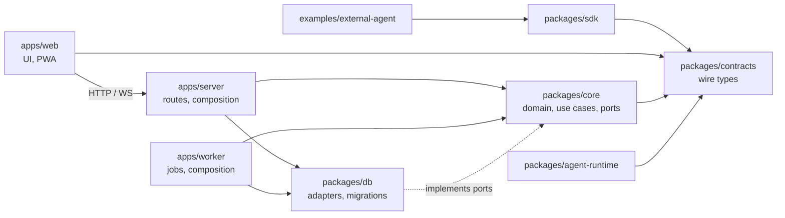

# Architecture and dependency rules (issue #46)

This page describes how the Flux monorepo is layered today, which way dependencies
may point, and where new code and tests belong. The stack and package boundaries
were accepted in the [architecture proposal](../product/application-architecture-proposal.md);
this page turns them into rules that a test enforces. Access rules are detailed in
[access policy](access-policy.md); the environment is described in
[containers](containers.md).

## Layers

| Path | Package | Role | May depend on |
| --- | --- | --- | --- |
| `packages/contracts` | `@flux/contracts` (Apache-2.0) | Public wire types and event versions for HTTP/WebSocket clients. | Nothing external. |
| `packages/sdk` | `@flux/sdk` (Apache-2.0) | TypeScript client of the public API. | `@flux/contracts` only. |
| `packages/core` | `@flux/core` | Domain rules, authorization, use cases and the ports they need. | `@flux/contracts` and Node built-ins. No Drizzle, `@flux/db`, `pg`, pg-boss, Fastify, web-push or React. |
| `packages/db` | `@flux/db` | Schema, reviewed SQL migrations and persistence adapters that implement core ports. | `@flux/contracts`, `@flux/core`, Drizzle, `pg`. |
| `packages/agent-runtime` | `@flux/agent-runtime` | Optional model/provider adapter. | Not `@flux/db`, Drizzle, `pg`, pg-boss, Fastify, the apps or React; it receives a work brief and permitted capabilities. |
| `apps/server` | `@flux/server` | Composition root of the API: Fastify routes, identity, push and static PWA assets. Maps HTTP to core use cases. | Any package except `@flux/worker`, `@flux/web` and React. |
| `apps/worker` | `@flux/worker` | Composition root of background jobs (pg-boss handlers, Web Push delivery). | Any package except `@flux/server`, `@flux/web`, Fastify and React. |
| `apps/web` | `@flux/web` | Browser application and PWA. Talks to the server only through HTTP/WebSocket contracts. | `@flux/contracts` and UI libraries. Never core, db, server, worker, queue or Node built-ins. Build tooling (`vite.config.ts`, `build/`, `scripts/`) is separate from `src/`. |
| `examples/external-agent` | Apache-2.0 example | An agent outside Flux using the public API. | `@flux/sdk`, `@flux/contracts`, Node built-ins. |
| `infra` | root | Dockerfile, Compose files and the migration entry point. | Any package except the apps and UI. |

Arrows point from the depending module to its dependency. Dependencies point inward:
the domain does not know which database, queue, transport or UI uses it. The apps
are the only places that choose concrete adapters and wire them together.

## Rules

- **Imports follow the table.** Import another workspace package by its name
  (`@flux/core`), never by a relative path out of the package or a deep path
  (`@flux/db/src/...`). A package's `dependencies` must obey the same rules.
- **License boundary.** `contracts`, `sdk` and `examples/external-agent` are
  Apache-2.0 and never import AGPL application packages ([licensing](../product/licensing.md)).
- **Ports belong to core.** When a use case needs persistence, a queue or a
  delivery channel, core declares a small interface and the app passes an adapter
  (see `packages/core/src/push/ports.ts` and `apps/server/src/push/adapters.ts`).
  Introduce a port only when a real use case needs it.
- **One authorization path.** Access decisions come only from `authorize`,
  `assertAuthorized` and `visibleFilter` in `packages/core/src/access/policy.ts`,
  or from core use cases that call them. Routes, jobs, adapters and the UI never
  query collaborative tables for a caller directly and never add a second policy
  module. See [access policy](access-policy.md#one-choke-point).
- **Typed errors.** Core signals expected failures with the `DomainError`
  subclasses in `packages/core/src/access/errors.ts` (stable `code`, HTTP-neutral
  `status`). Entry points map them to their transport; they do not parse messages.
- **No global mutable state.** Configuration, database handles, queues and clocks
  are created in a composition root and passed in. Modules do not keep mutable
  singletons or caches that make tests or multiple workers interfere.
- **Focused modules.** An `index.ts` is a bounded public entry point or bootstrap.
  Put a new capability in its own folder (`core/src/<capability>/`,
  `server/src/<capability>/`, `db/src/repositories/<capability>.ts`) instead of
  growing an existing index or a multi-capability file.
- **Transactions stay in one place.** Writes that must be atomic (domain row,
  event, outbox, job) run in one transaction owned by the use case or by an
  adapter method designed for it, not split across callers.

## Tests

| Kind | Location | Runs in |
| --- | --- | --- |
| Application, API, persistence and core tests | `tests/app/<capability>.test.ts` | `test` service of `./scripts/check_application.sh` |
| Shared test helpers and mocks | `tests/app/support/` | imported by the above |
| Browser checks (PWA, service worker) | `tests/app/e2e/*.e2e.ts` | `e2e` service |
| Checks against a restarted or reconfigured stack | `tests/app/*.ts` / `*.check.ts` called by the script | `check_application.sh` |
| Repository and agent tooling | `tests/test_*.py` | `python3 -m unittest discover -s tests -p 'test_*.py'` |

Pure core use cases can be tested with in-memory port implementations
(`tests/app/push-core.test.ts`); behavior that depends on SQL, locks or the queue is
tested against the Compose PostgreSQL.

## Automated check

`tests/app/architecture.test.ts` runs in the Docker test suite. It scans every source
file under `apps/`, `packages/`, `examples/` and `infra/` and every workspace
`package.json`, assigns each to a layer defined in
[`tests/app/support/architecture.ts`](../../tests/app/support/architecture.ts) and
fails when:

- a file imports a package its layer does not allow, a relative import leaves its
  workspace package, or an import reaches into another package's `src`/`dist`;
- a package declares a runtime dependency its layer does not allow;
- a violation is found that is not listed in
  [`tests/app/architecture-allowlist.json`](../../tests/app/architecture-allowlist.json),
  or an allowlist entry no longer matches a violation (remove it when fixed);
- `packages/core/src/push/**` reaches an adapter library through any relative import.

The allowlist can only shrink. Do not add entries for new code; change the code or,
if a layer rule itself is wrong, update this page and the rule in the same reviewed PR.

## Known debt

The first application slices put SQL next to domain logic in core. These imports are
recorded in the allowlist and tracked by [#46](https://github.com/ColdPhase/flux/issues/46):

| File | Imports | Planned change |
| --- | --- | --- |
| `packages/core/src/access/policy.ts` | `drizzle-orm`, `@flux/db` | Split pure policy decisions from the SQL grant lookup and visibility filter, which move to a `@flux/db` adapter behind a core port. |
| `packages/core/src/access/domain.ts` | `drizzle-orm`, `@flux/db` | Split the workspace, project/grant, agent and draft use cases; move queries and row mapping to `@flux/db` repositories. Keep the current locks and transactions. |
| `packages/core/src/index.ts` | `drizzle-orm`, `pg-boss`, `@flux/db` | Move the integration-fixture sample use case behind a transaction/outbox port or out of core; leave `index.ts` as exports only. |
| `packages/core/src/types.ts` | `@flux/db` | Replace the Drizzle-derived `Database`/`Executor` types with a core-owned transaction port. |
| `packages/core/src/events.ts`, `stream-audience.ts` | `drizzle-orm`, `@flux/db` | Merged in #47 before this rule. Move event recording and the per-recipient audience queries to `@flux/db` repositories behind `EventRepository` and `StreamAudienceRepository` ports. |
| `packages/core/src/idempotency.ts` | `drizzle-orm`, `@flux/db` | Merged in #47. Put key storage and replay behind an `IdempotencyStore` port. |
| `packages/core/src/jobs/draft-summary.ts` | `drizzle-orm`, `pg-boss`, `@flux/db` | Merged in #47. Split it into a pure use case plus repository and `JobQueue` ports. |
| `packages/core/package.json` | `@flux/db`, `drizzle-orm`, `pg-boss` | Remove each dependency when no core file uses it. |

Until the access policy is split, new core modules that call `authorize` import it
from `access/policy.ts` and therefore depend on Drizzle transitively. That is
accepted for now; they must not import `drizzle-orm` or `@flux/db` themselves. The
refactor happens in small PRs after the active feature branches that touch these
files have merged, with the existing access, revocation and transaction tests
locking the behavior. Other structural hotspots (the multi-capability
`apps/server/src/access/routes.ts`, fixture wiring in `apps/server/src/index.ts`
and `apps/worker/src/index.ts`, the growing `packages/db/src/schema.ts`) follow the
same plan.
