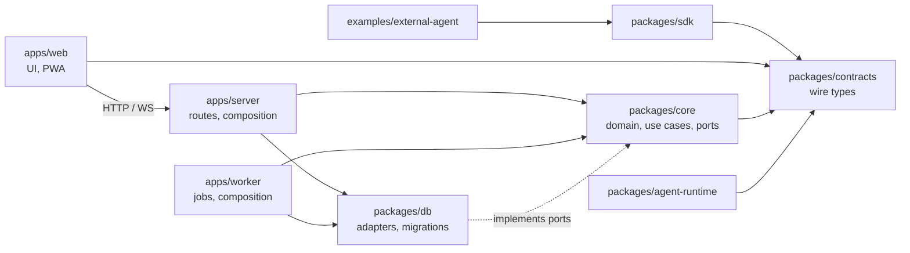

# Architecture and dependency rules (issue #46)

This page describes how the Flux monorepo is layered today, which way dependencies
may point, and where new code and tests belong. The stack and package boundaries
were accepted in the [architecture proposal](../product/application-architecture-proposal.md);
this page turns them into rules that a test enforces. Access rules are detailed in
[access policy](access-policy.md); the environment is described in
[containers](containers.md).

The application workspace is `app/`; source and test paths below are repository-relative.
The scanner uses paths relative to that workspace, so package keys and the debt
allowlist retain their meaning after the move. `docker/` contains deployment inputs.

## Layers

| Path | Package | Role | May depend on |
| --- | --- | --- | --- |
| `app/packages/contracts` | `@flux/contracts` (Apache-2.0) | Public wire types and event versions for HTTP/WebSocket clients. | Nothing external. |
| `app/packages/sdk` | `@flux/sdk` (Apache-2.0) | TypeScript client of the public API. | `@flux/contracts` only. |
| `app/packages/core` | `@flux/core` | Domain rules, authorization, use cases and the ports they need. | `@flux/contracts` and Node built-ins. No Drizzle, `@flux/db`, `pg`, pg-boss, Fastify, web-push or React. |
| `app/packages/db` | `@flux/db` | Schema, reviewed SQL migrations and persistence adapters that implement core ports. | `@flux/contracts`, `@flux/core`, Drizzle, `pg`. |
| `app/packages/agent-runtime` | `@flux/agent-runtime` | Optional model/provider adapter. | Not `@flux/db`, Drizzle, `pg`, pg-boss, Fastify, the apps or React; it receives a work brief and permitted capabilities. |
| `app/apps/server` | `@flux/server` | Composition root of the API: Fastify routes, identity, push and static PWA assets. Maps HTTP to core use cases. | Any package except `@flux/worker`, `@flux/web` and React. |
| `app/apps/worker` | `@flux/worker` | Composition root of background jobs (pg-boss handlers, Web Push delivery). | Any package except `@flux/server`, `@flux/web`, Fastify and React. |
| `app/apps/web` | `@flux/web` | Browser application and PWA. Talks to the server only through HTTP/WebSocket contracts. | `@flux/contracts` and UI libraries. Never core, db, server, worker, queue or Node built-ins. Build tooling (`vite.config.ts`, `build/`, `scripts/`) is separate from `src/`. |
| `app/examples/external-agent` | Apache-2.0 example | An agent outside Flux using the public API. | `@flux/sdk`, `@flux/contracts`, Node built-ins. |
| `app/tooling` | app workspace | Migration and operations entry points; Dockerfiles/Compose are separate under `docker/`. | Any package except the apps and UI. |

Arrows point from the depending module to its dependency. Dependencies point inward:
the domain does not know which database, queue, transport or UI uses it. The apps
are the only places that choose concrete adapters and wire them together.

## Rules

- **Imports follow the table.** Import another workspace package by its name
  (`@flux/core`), never by a relative path out of the package or a deep path
  (`@flux/db/src/...`). A package's `dependencies` must obey the same rules.
- **License boundary.** `contracts`, `sdk` and `app/examples/external-agent` are
  Apache-2.0 and never import AGPL application packages ([licensing](../product/licensing.md)).
- **Ports belong to core.** When a use case needs persistence, a queue or a
  delivery channel, core declares a small interface and the app passes an adapter
  (see `app/packages/core/src/push/ports.ts` and `app/apps/server/src/push/adapters.ts`).
  Introduce a port only when a real use case needs it.
- **One authorization path.** Access decisions come only from `authorize`,
  `assertAuthorized` and `visibleFilter` in `app/packages/core/src/access/policy.ts`,
  or from core use cases that call them. Routes, jobs, adapters and the UI never
  query collaborative tables for a caller directly and never add a second policy
  module. See [access policy](access-policy.md#one-choke-point).
- **Typed errors.** Core signals expected failures with the `DomainError`
  subclasses in `app/packages/core/src/access/errors.ts` (stable `code`, HTTP-neutral
  `status`). Entry points map them to their transport; they do not parse messages.
- **No global mutable state.** Configuration, database handles, queues and clocks
  are created in a composition root and passed in. Modules do not keep mutable
  singletons or caches that make tests or multiple workers interfere.
- **Focused modules.** An `index.ts` is a bounded public entry point or bootstrap.
  Put a new capability in its own folder (`core/src/<capability>/`,
  `server/src/<capability>/`, `db/src/repositories/<capability>.ts`) instead of
  growing an existing index or a multi-capability file.
- **Transactions stay in one place.** Writes that must be atomic (domain row,
  event, outbox, job) run in one transaction owned by the use case or by an
  adapter method designed for it, not split across callers.

## Tests

| Kind | Location | Runs in |
| --- | --- | --- |
| Application, API, persistence and core tests | `app/tests/app/<capability>.test.ts` | `test` service of `./scripts/check_application.sh` |
| Shared test helpers and mocks | `app/tests/app/support/` | imported by the above |
| Browser checks (PWA, service worker) | `app/tests/app/e2e/*.e2e.ts` | `e2e` service |
| Checks against a restarted or reconfigured stack | `app/tests/app/*.ts` / `*.check.ts` called by the script | `check_application.sh` |
| Browser journeys in the web app (Playwright, Python) | `app/tests/ui/test_*.py` | `./scripts/check_ui.sh` |
| The normal (non-test) deployment: fixture rollback header ignored, worker processes, restart keeps data | `scripts/check_runtime.sh` | `./scripts/check_runtime.sh` |
| Repository and agent tooling | `tests/test_*.py` | `python3 -m unittest discover -s tests -p 'test_*.py'` |

Pure core use cases can be tested with in-memory port implementations
(`app/tests/app/push-core.test.ts`); behavior that depends on SQL, locks or the queue is
tested against the Compose PostgreSQL.

## Automated check

`app/tests/app/architecture.test.ts` runs in the Docker test suite. It scans every source
file under `app/apps/`, `app/packages/`, `app/examples/` and `app/tooling/` and every workspace
`package.json`, assigns each to a layer defined in
[`app/tests/app/support/architecture.ts`](../../app/tests/app/support/architecture.ts) and
fails when:

- a file imports a package its layer does not allow, a relative import leaves its
  workspace package, or an import reaches into another package's `src`/`dist`;
- a package declares a runtime dependency its layer does not allow;
- a violation is found that is not listed in
  [`app/tests/app/architecture-allowlist.json`](../../app/tests/app/architecture-allowlist.json),
  or an allowlist entry no longer matches a violation (remove it when fixed);
- `app/packages/core/src/push/**` reaches an adapter library through any relative import.

The allowlist can only shrink. Do not add entries for new code; change the code or,
if a layer rule itself is wrong, update this page and the rule in the same reviewed PR.

## Known debt

The first application slices put SQL next to domain logic in core. These imports are
recorded in the allowlist and tracked by [#46](https://github.com/ColdPhase/flux/issues/46):

| File | Imports | Planned change |
| --- | --- | --- |
| `app/packages/core/src/access/policy.ts` | `drizzle-orm`, `@flux/db` | Split pure policy decisions from the SQL grant lookup and visibility filter, which move to a `@flux/db` adapter behind a core port. |
| `app/packages/core/src/access/domain.ts` | `drizzle-orm`, `@flux/db` | Split the workspace, project/grant, agent and draft use cases; move queries and row mapping to `@flux/db` repositories. Keep the current locks and transactions. |
| `app/packages/core/src/types.ts` | `@flux/db` | Replace the Drizzle-derived `Database`/`Executor` types with a core-owned transaction port. |
| `app/packages/core/package.json` | `@flux/db`, `drizzle-orm`, `pg-boss` | Remove each dependency when no core file uses it. |

Until the access policy is split, new core modules that call `authorize` import it
from `access/policy.ts` and therefore depend on Drizzle transitively. That is
accepted for now; they must not import `drizzle-orm` or `@flux/db` themselves. The
refactor happens in small PRs after the active feature branches that touch these
files have merged, with the existing access, revocation and transaction tests
locking the behavior. The growing `app/packages/db/src/schema.ts` follows the same plan.

Resolved outside the allowlist: identity no longer queries session rows itself. The
session list/revoke queries live in `app/packages/db/src/repositories/sessions.ts` behind
the `SessionStore` port in `app/apps/server/src/identity/routes.ts`, identity takes a
`@flux/db` `DbExecutor` instead of core's `Database`, and only `identity/auth.ts` wires
Drizzle, for Better Auth's adapter ([#81](https://github.com/ColdPhase/flux/issues/81)).

Resolved outside the allowlist: `app/apps/worker/src/index.ts` is the worker's composition root
only (environment, pool, pg-boss, signals). Each job registers itself from
`app/apps/worker/src/jobs/` or its feature folder, like `registerPushWorker`; the sample job's
queries live in `app/packages/db/src/repositories/sample.ts`, and the VAPID JWT cache is an
authorizer the composition root creates and passes in, not module state
([#82](https://github.com/ColdPhase/flux/issues/82)).

Resolved from the allowlist: `app/packages/core/src/idempotency.ts` keeps key parsing, request
hashing, the expiry decision, the reuse error and replay authorization; key storage (the
transaction-scoped advisory lock, lookup, save for 2xx only and expired-key cleanup) sits behind
its `IdempotencyStore` port with the adapter `app/packages/db/src/repositories/idempotency.ts`
([#86](https://github.com/ColdPhase/flux/issues/86)).

Resolved from the allowlist: `app/packages/core/src/jobs/draft-summary.ts` keeps the word
count, the summary shape and the orchestration (the locked read check before the request's
insert and enqueue, the recheck with locks inside the commit transaction). Result rows sit
behind its `DraftResultRepository` port (`app/packages/db/src/repositories/draft-results.ts`),
and the job is sent through the shared core `JobQueue` port, whose pg-boss adapter
(`pgBossQueue` in `app/apps/server/src/push/adapters.ts`) enqueues in the caller's transaction
([#87](https://github.com/ColdPhase/flux/issues/87)).

Resolved from the allowlist: `app/packages/core/src/index.ts` only exports. The integration-fixture
sample command lives in `app/apps/server/src/fixture/` over the `@flux/db` sample repository, with
typed errors, and exists only when `FLUX_FIXTURE_TOKEN` is set (with failure injection, so do the
test-only stream and search routes). The API's composition root is `app/apps/server/src/app.ts`
(`buildApp(config)` from `config.ts`, read once); `index.ts` only builds and listens, and the health
check is `health/routes.ts` ([#88](https://github.com/ColdPhase/flux/issues/88)).

Resolved outside the allowlist: the access routes are one module per capability in
`app/apps/server/src/access/` (workspaces, projects and grants, agents, drafts, draft summaries)
over a shared context, each under about 120 lines. Header helpers and schema fragments are in
`app/apps/server/src/http/{headers,schemas}.ts`, and `http/errors.ts` maps domain errors and a
missing session once, on the API's root: access, push, stream and identity answer a missing session
with the same `UNAUTHENTICATED` body ([#85](https://github.com/ColdPhase/flux/issues/85)); identity's
401 was Fastify's default body before. Route plugins that tests register alone call `useDomainErrors`,
the same mapper; agent connection, conversation and proactive comparison still set their own handlers,
which drop a domain error's details (follow-up with #36).

Resolved from the allowlist: `app/packages/core/src/events.ts` keeps `principalKey`, the audience
loop over an `EventAuthorizer` and the final-write ordering (every audience resolved before the
first insert takes the sequence lock). Storage is the `EventRepository` port (`candidates`,
`insert`), implemented by `app/packages/db/src/repositories/events.ts`. Callers pass
`policyEventPorts(tx, eventRepository(tx))`; the server and worker build it with their
`events.ts` helper ([#89](https://github.com/ColdPhase/flux/issues/89)).
