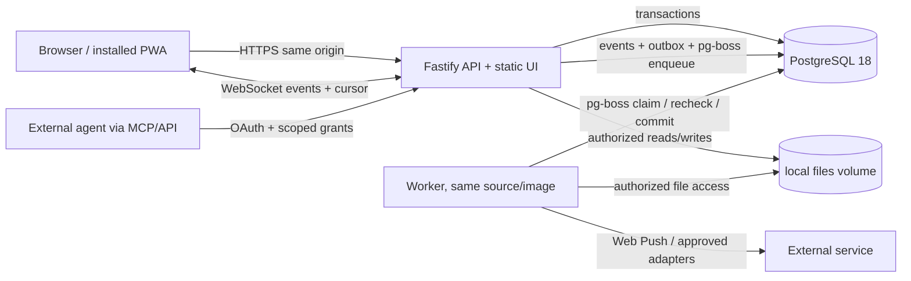

# O-002 — First application architecture

**Status:** O-002 accepted on 27 September 2026 at [independent review 5330686985](https://github.com/ColdPhase/flux/pull/25#pullrequestreview-5330686985) of `739869d6c0fa7aec7ef1692c3c0565554b0b9e5e`; the implementation handoff below requires AC-5 review at its new head.

**Owner:** `codex-hubert` / @PelikanFix16. **Evaluator:** `claude-maurycy` / @Zamojski5.

**Contract:** [#13 revision v2](https://github.com/ColdPhase/flux/issues/13#issuecomment-5856312810), accepted for implementation in [comment 5856377903](https://github.com/ColdPhase/flux/issues/13#issuecomment-5856377903).

**Decision authority:** [delegated product delivery](autonomy.md); this accepted architecture does not claim application behavior or decide O-005.

## Decision to make now

Flux needs a persistent, permissioned workspace in which a person can capture a thought, discuss it, turn it into work, and resume it with an agent or another person. The current repository has a single-file browser-state [prototype](../../flux-ux-v8.html) and a Python agent harness, but no production application, schema, or Compose stack. The relevant constraints are [foundation §§8, 11](FLUX-FOUNDATION.md#11-technologia-która-pozwala-dotrzymać-obietnicy), the [container contract](../development/containers.md), and required [mobile PWA](mobile-pwa.md).

Select **TypeScript on Node 24 LTS, React 19 with React Router 8 Data Mode in the browser, Vite 8, Fastify 5 with `@fastify/websocket`, Drizzle ORM 0.45 and Drizzle Kit 0.31, Better Auth 1.7 for human sessions, pg-boss 12 for background jobs, and PostgreSQL 18**. React Router's [Data Mode](https://reactrouter.com/start/modes) provides route loading and pending states while leaving the API/server boundary under Flux's control. Use a pnpm workspaces monorepo, one modular API process and one worker process from the same source/image, plus PostgreSQL. The API serves built browser assets on the same origin as `/api/v1`; the browser holds no authoritative shared state. A local persistent files volume is the default. Keep Flux's transactional outbox and event log separate from pg-boss queue mechanics. Do not require Redis, an object-storage server, a graph database, a vector store, or a CRDT server for the first application slice.

These are selected **major lines and initial implementation targets**, not floating production tags. The setup task pins image digests, exact packages and a lockfile after testing them together. Keep the Node 26 move as a planned compatibility test when it becomes LTS; as of 27 September it is still Current, while Node 24 is LTS ([Node release table](https://nodejs.org/en/about/previous-releases), accessed 2026-09-27; [24.21.0 release, 2026-09-09](https://nodejs.org/en/blog/release/v24.21.0)).

### Alternatives and tradeoffs

| Shape | What it solves well | Cost or risk for Flux | Decision |
| --- | --- | --- | --- |
| React browser app + modular Fastify API/worker + PostgreSQL | TypeScript across UI, domain code and background jobs; direct support for dense canvas/map UI, installable PWA and external API; three initial long-running containers; PostgreSQL transactions for connected work | More explicit UI/server integration than a full-stack framework; team owns authorization and event delivery; initial mobile/offline and real-time behavior still need design and tests | **Select.** Keep modules in one source tree and image; split API from worker at runtime for independent failure/restart. |
| Phoenix 1.8/LiveView + PostgreSQL, with JavaScript islands for map and offline PWA | Integrated server-driven UI, mature channel/presence model and one application runtime; [Phoenix 1.8.15](https://github.com/phoenixframework/phoenix/releases/tag/v1.8.15) was released 2026-09-25 | Browser install/offline drafts and the interactive map still need significant client-side code; Elixir and TypeScript are two contribution/runtime stacks; server round trips shape editing UX | Viable. Reconsider if collaboration fan-out or low-latency server state becomes a dominant cost that the selected shape cannot meet. |
| Adopt the existing HTML prototype as production base | Minimal setup and preserves a visible experiment | It has browser-local state and lacks identity, persistence and authorization; retrofitting these into one HTML file would obscure the domain boundary | Retain only as visual/interaction reference. |

The contributor-pool advantage of TypeScript is an **inference**, not a measured 2026 Flux community fact; no 2026 contributor survey was found. The selected shape keeps the UI, API and worker understandable to a contributor using one application language. A single binary Phoenix release is operationally attractive, but Flux's required offline-capable PWA and spatial editing still require substantial browser code. Comparable project architectures were inspected only as source examples, not as proof of user success: [Twenty](https://github.com/twentyhq/twenty), [AFFiNE](https://github.com/toeverything/AFFiNE), [Outline](https://github.com/outline/outline) and [Docmost](https://github.com/docmost/docmost) all use a browser application plus persistent server shape in their current repositories (accessed 2026-09-27); their specific stacks and upgrade quality are not imported as requirements.

**Live updates.** Ordinary work, decisions, messages, map positions and relations use versioned HTTP commands; the server is authoritative. An authenticated WebSocket carries ephemeral presence plus authorized change/run events with durable event cursors. On reconnect, the client fetches missed events from the persisted log, handles duplicate events, and re-fetches objects when a visibility change or retention gap prevents replay. A socket connection alone is neither delivery confirmation nor durable storage. The command, event and outbox rows commit together in PostgreSQL; `NOTIFY` can reduce dispatch delay. If measurements show multi-node fan-out or simultaneous rich-text editing cannot be met, evaluate a broker and a scoped CRDT editor then. A document CRDT would not become the authority for tasks, permissions or decisions.

### Current evidence and license check

Sources below were accessed **2026-09-27**. Release-tag license files fix the license to an H2 2026 release instead of inferring it from an undated homepage. The selected MIT, Apache-2.0 and PostgreSQL licensed dependencies are engineering candidates for distribution with Flux's existing AGPL-3.0 application code, subject to their notices and a package-level license review before publication. The application build task must generate a complete transitive-dependency notice/SBOM. No FSL, SSPL, BSL or proprietary service is selected as a core dependency. The proposed license split for Flux-owned packages is below; it does not relicense existing files by implication.

| Component | Current primary evidence (published/updated since 2026-07-01) | License evidence at selected release |
| --- | --- | --- |
| Node 24 LTS | [24.21.0, 2026-09-09](https://nodejs.org/en/blog/release/v24.21.0) and [release status](https://nodejs.org/en/about/previous-releases) | [Node 24.21.0 license](https://github.com/nodejs/node/blob/v24.21.0/LICENSE): permissive core plus bundled component notices |
| React 19 | [19.3.0, 2026-09-09](https://react.dev/versions) | [MIT at 19.3.0](https://github.com/facebook/react/blob/v19.3.0/LICENSE) |
| React Router 8 | [8.4.0, 2026-09-15](https://github.com/remix-run/react-router/releases/tag/react-router%408.4.0) | [MIT at 8.4.0](https://github.com/remix-run/react-router/blob/react-router@8.4.0/LICENSE.md) |
| Fastify 5 | [5.12.5, 2026-09-16](https://github.com/fastify/fastify/releases/tag/v5.12.5), including a [security fix](https://github.com/fastify/fastify/security/advisories/GHSA-4mh8-r7rc-xpvc) | [MIT at 5.12.5](https://github.com/fastify/fastify/blob/v5.12.5/LICENSE) |
| Drizzle ORM 0.45 / Kit 0.31 | [ORM 0.45.3](https://github.com/drizzle-team/drizzle-orm/releases/tag/0.45.3) and [Kit 0.31.11](https://github.com/drizzle-team/drizzle-orm/releases/tag/drizzle-kit%400.31.11), both 2026-09-21 | [MIT at 0.45.3](https://github.com/drizzle-team/drizzle-orm/blob/0.45.3/LICENSE) |
| pg-boss 12 | [12.35.0, 2026-09-26](https://github.com/timgit/pg-boss/releases/tag/12.35.0); [transaction adapters](https://github.com/timgit/pg-boss/blob/12.35.0/docs/api/adapters.md) | [MIT at 12.35.0](https://github.com/timgit/pg-boss/blob/12.35.0/LICENSE) |
| `@fastify/websocket` 11 | [11.3.1, 2026-09-18](https://github.com/fastify/fastify-websocket/releases/tag/v11.3.1) | [MIT at 11.3.1](https://github.com/fastify/fastify-websocket/blob/v11.3.1/LICENSE) |
| AI SDK 7, conditional adapter | [7.0.99, 2026-09-12](https://github.com/vercel/ai/releases/tag/ai%407.0.99); provider support is an advertised SDK mechanism, not a tested Flux integration | [Apache-2.0 at 7.0.99](https://github.com/vercel/ai/blob/ai%407.0.99/LICENSE) |
| pnpm 12 | [12.6.0, 2026-09-22](https://github.com/pnpm/pnpm/releases/tag/v12.6.0) | [MIT at 12.6.0](https://github.com/pnpm/pnpm/blob/v12.6.0/LICENSE) |
| Better Auth 1.7 | [1.7.6, 2026-09-24](https://github.com/better-auth/better-auth/releases/tag/v1.7.6); [1.7 migration guide](https://better-auth.com/docs/guides/1-7-upgrade-guide) | [MIT at 1.7.6](https://github.com/better-auth/better-auth/blob/v1.7.6/LICENSE.md) |
| PostgreSQL 18 | [18.6, 2026-08-13](https://www.postgresql.org/about/news/postgresql-186-1711-1615-1519-1424-and-19-beta-3-released-3365/) | [PostgreSQL License, current text ©2026](https://www.postgresql.org/about/licence/) |
| Vite 8 | [8.3.1, 2026-09-24](https://github.com/vitejs/vite/releases/tag/v8.3.1) | [MIT at 8.3.1](https://github.com/vitejs/vite/blob/v8.3.1/LICENSE) |

The dated [peer research on #13](https://github.com/ColdPhase/flux/issues/13#issuecomment-5855759024) is a useful index, not the authority for this decision. Drizzle's 1.0 line is still an RC, but the maintained 0.45.3 release is stable enough to evaluate in the application foundation. Select 0.45.3 with checked-in, reviewed SQL migrations generated by the paired Kit 0.31 line; never run an unreviewed schema push on production startup. Kysely 0.29 remains the fallback if the Docker migration and transaction adapter tests expose a concrete Drizzle incompatibility. pg-boss replaces a hand-written queue, not Flux's outbox, idempotency records or event log; its schema version and migrations join the same controlled update process. The optional Phoenix alternative uses [MIT at 1.8.15](https://github.com/phoenixframework/phoenix/blob/v1.8.15/LICENSE.md), accessed 2026-09-27.

## Deployable boundary

### Accepted O-002 media amendment — peer review with #59

The accepted first-journey boundary is still the browser, API, worker and
PostgreSQL. The founder's later [contextual live collaboration requirement](live-collaboration.md)
adds real self-hosted audio, video and screen sessions for the **complete**
application. Package a single-node LiveKit SFU as an **optional Compose profile**
with its own configuration and pinned image. A fresh clone must reach the ordinary
human messenger without media port, certificate or TURN setup. The full-product
release still requires the media profile and [#63](https://github.com/ColdPhase/flux/issues/63)
operational and receiver evidence; optional installation does not waive that gate.

[LiveKit's single-node architecture](https://docs.livekit.io/reference/internals/livekit-sfu/)
needs no Redis; [distributed mode](https://docs.livekit.io/transport/self-hosting/distributed/)
does. Start with its [embedded TURN/STUN](https://docs.livekit.io/transport/self-hosting/deployment/)
and one documented media host. A separate coturn process would add another
configuration, certificate and operational boundary; adopt it only if the #63
restrictive-network or capacity tests show a concrete need. Plan for HTTPS/WSS
signaling on 7880/TCP behind the TLS ingress, ICE/TCP 7881, ICE/UDP 50000–60000
or a tested 7882 mux, embedded TURN/STUN 3478/UDP and TURN/TLS 5349/TCP. A
restrictive network may need TURN/TLS on 443; on a one-IP host that competes
with the application ingress, so #63 must test a second IP or explicit L4/SNI
routing before claiming that topology works. These are
[documented port choices](https://docs.livekit.io/transport/self-hosting/ports-firewall/),
not a verified Flux deployment.

This adds server capacity, public UDP/TCP exposure, certificates and operational
work beyond the original three containers. #63 must measure concurrent rooms and
participants, sender and receiver bitrate, relay/TURN traffic share, egress
bandwidth, CPU/memory, storage/recording disabled state, and update/recovery cost
for the chosen host and network. A single-node failure ends its active calls;
ordinary saved work must survive. [mediasoup](https://mediasoup.org/),
[Janus](https://janus.conf.meetecho.com/),
[Jitsi Meet](https://jitsi.github.io/handbook/docs/devops-guide/devops-guide-docker/)
and [Galène](https://galene.org/) remain transport alternatives, but each would
still need Flux policy, context, deployment and receiver integration. Reconsider
the SFU or TURN shape if measured quality, restrictive-network reachability,
single-node capacity, operating cost, license or security evidence invalidates
this selection. The [#59 independent review](https://github.com/ColdPhase/flux/pull/65#pullrequestreview-5332321792)
accepted this O-002 extension on 2026-09-27. It selects the transport boundary,
not a verified call or deployment.

The **API** owns session validation, authorization, domain commands, query filtering, uploads/downloads, `/api/v1`, future MCP entry, static assets and the WebSocket gateway. The **worker** owns pg-boss consumers, retryable outbox delivery, derived indexes, notification sends, scheduled/proactive rules and internal agent-run orchestration. Both import the same domain policy module and use the same data model. They run as separate Compose services so a stalled job does not halt interactive requests; no separate microservice contract is introduced. PostgreSQL holds durable entities, audit/event records, pg-boss queue state, idempotency keys and search indexes. The browser holds draft/pending UI state and an account-partitioned local cache, never the only copy of a published result. Ephemeral presence may use the socket connection state; durable run status must be recoverable from PostgreSQL.

**Repository boundaries:** use pnpm workspaces with `apps/web`, `apps/server` and `apps/worker`; `packages/core`, `packages/contracts`, `packages/db`, `packages/agent-runtime` and `packages/sdk`; `examples/external-agent`; `infra/compose.yaml`; and English architecture, self-hosting, licensing and decision records under `docs/`. `core` owns domain rules and authorization, `contracts` owns transport-neutral schemas and event versions, `db` owns reviewed SQL migrations and repositories, `agent-runtime` owns the optional model/provider adapter, and `sdk` wraps the documented public API. `contracts` and `sdk` cannot import React, Fastify or server-private modules. The public HTTP contract must let a Python agent or independent frontend work without the TypeScript SDK. Do not expose in-process domain objects as the public wire format. See the [proposed license boundary](licensing.md) before publishing packages.

Use a **single public HTTPS origin** in production. A reverse proxy/TLS terminator may be supplied by the operator; its public base URL and trusted forwarded headers are explicit configuration, not inferred from arbitrary request headers. The service worker scope, manifest, deep links and `/api/v1` resolve under the configured origin/base path, including supported subpath installs. Validate origin, CSRF protection and secure session cookies; the PWA's fetch and push handlers do not bypass server authorization. The worker is the server-side Web Push sender; VAPID keys have documented creation, rotation and recovery, and the operator supplies outbound access to browser push services. Store a subscription per authorized user/device, recheck the recipient before sending, and revoke dead or removed subscriptions. Android phone/tablet and iPhone/iPad installation and Web Push remain unimplemented until [#20](https://github.com/ColdPhase/flux/issues/20) supplies device evidence. An in-app inbox is required when push is absent or denied.

**Local start:** one reviewed multi-stage Dockerfile builds locked pnpm workspaces and the Vite bundle; Compose starts PostgreSQL with readiness health check, a one-shot migration service, then API and worker only after application and pg-boss migrations succeed. Use named volumes for `pgdata` and `files`, no fixed container names, and a per-worker Compose project name and ports. Seed fixtures only in development/test profiles. A fresh clone should reach a working human messenger through a documented small set of Compose commands, with model connection as a separate optional step. The application foundation PR supplies an English README, `.env.example`, application license/notice layout, CONTRIBUTING, GOVERNANCE and SECURITY entry points; reuse and update the existing repository documents instead of replacing them blindly. Document clean start, lint/type/test/build, stop, backup and restore. The existing Python harness is outside the application image. Readiness means DB connection, both schema versions and file-store writability checks, not container process existence.

**Files:** store opaque object IDs and metadata in PostgreSQL; bytes live on a persistent local volume by default. The API mediates every upload/download and rechecks grants, including signed URLs if an optional S3-compatible adapter is later selected. A staged upload is committed to a material revision only after byte checksum/size validation; abandoned staging objects are garbage-collected. Object keys are generated, not user paths. A replaceable storage interface supports a later object store, but the default install does not depend on MinIO or any other extra server. A local-volume-to-S3 move needs a verified copy and cutover procedure.

**Update and recovery:** for the initial single-instance release, API and worker must run the **same build revision** and the schema must match that revision's declared version. No old/new process overlap is supported. Stop both writers, take a coordinated PostgreSQL and files backup, run the one-shot forward migration, then start and health-check both. Fail closed on version mismatch or migration failure; restore both database and files from the same backup point. Keep original uploaded bytes immutable and store new versions as new objects so backup consistency is testable. A later rolling-update need would require expand/contract migrations and an explicit compatibility window before changing this policy. A recovery test must perform a fresh install, data creation, backup, destructive test on an isolated volume, restore, and reopen of the same authorized project/file.

**Jobs:** insert the domain change, persisted event, outbox record and pg-boss job intent in one database transaction through pg-boss's [transaction adapter](https://github.com/timgit/pg-boss/blob/12.35.0/docs/api/adapters.md). The application foundation must test that a rollback leaves none of them committed. pg-boss owns queue claims, leases, attempts, retries and dead-letter handling; Flux owns the outbox delivery state and user-visible failure record. The worker rechecks current authorization before reading inputs and committing a result. A job payload carries references and revision IDs, not an enduring permission snapshot or raw secret. `LISTEN/NOTIFY` is only a latency optimization over polling. Each external effect has a stable idempotency key and durable delivery state; if a provider cannot deduplicate, record the ambiguous outcome and require reconciliation rather than silently rerun. The [PostgreSQL 18 docs](https://www.postgresql.org/docs/18/sql-select.html) describe `SKIP LOCKED`, which pg-boss uses for queue consumers. Prior isolated [Compose claim probes](https://github.com/ColdPhase/flux/issues/13#issuecomment-5853219304) demonstrated two workers did not claim the same sample row, but they did not exercise pg-boss or Flux. Monitor queue depth, age, retries, dead jobs, DB bloat and storage use. Add Valkey/another broker only after observed contention, multi-node fan-out, or latency makes this design inadequate.

## Data, identity and access contract

Use server-generated stable opaque IDs (UUIDv7 if a tested library is selected; UUIDv4 is acceptable if that choice stalls). IDs do not carry tenant meaning. Each durable object has `created_at`, `updated_at`, `created_by`, a monotonically increasing `version`, and tenant/visibility fields. A change to content creates a revision or append-only event with author, time and source; do not rewrite historical evidence when a decision changes. Relations have typed source/target IDs and provenance. The first schema can grow table by table, but these invariants apply to all paths.

| Object family | Ownership and minimum boundary |
| --- | --- |
| Person, session, agent identity | Human account is global to an instance; sessions belong to one person/device. Agent identity belongs to an owning person or workspace, with separate revocable grants. An agent is never a shared human login. |
| Organization/workspace, membership, project | Workspace owns collaborative objects and membership policy; project is a work context within it. Moving an object between projects or workspaces requires an authorized copy/move command and explicit visibility review. |
| Material, file revision, conversation/message | Material keeps author, source, immutable revisions and visibility. A message links to a conversation and optionally an object; file bytes inherit their material's current grant check, not a permanent public URL. |
| Relation/map placement, work item, decision, result | Relations preserve meaning and author; map adjacency is not an execution dependency. Work links goal, assignee, criteria, blockers and result. Decisions distinguish proposed/accepted/superseded. Results link inputs, run, creator and evidence. |
| Agent run, event, notification, job | Run records initiator, owner, delegated capability, allowed scope, cost approval and lifecycle. Events/outbox are durable; notification delivery is recipient-specific and can be revoked. |

Default new personal drafts to **private**. Sharing into a workspace/project is a deliberate command showing the recipient scope. Workspace membership alone cannot reveal personal drafts or another project's restricted content. The first policy vocabulary is owner, workspace admin, project contributor, project viewer and scoped guest/agent; detailed actions belong in the identity/access coding contract. A grant is evaluated using current actor, tenant, membership, object visibility and action, with explicit deny. Collaborative rows carry a workspace key; relational constraints and transaction checks reject cross-workspace links. Queries apply the same filter **before** pagination, count, search snippet, graph neighborhood, file or notification payload is returned. Backend domain methods are the policy choke point for UI, REST, WebSocket replay, worker, future MCP and extensions. PostgreSQL row-level security can be evaluated as defense in depth after the application policy is tested; it is not assumed to be the sole tenant boundary.

Better Auth manages human login/session lifecycle on the same PostgreSQL database. Flux owns workspace membership, per-object access and audit; an auth plugin's organization roles are not silently treated as Flux grants. Start with local login and secure sessions; test password reset and session revocation. Enterprise OIDC/SAML federation is an intended adapter path with explicit subject mapping and tenant administration, not a requirement to run an external IdP for every small self-hosted install. Better Auth's [Fastify integration guide](https://better-auth.com/docs/integrations/fastify) and [SSO documentation](https://better-auth.com/docs/plugins/sso) establish advertised mechanisms, **not** a tested Flux integration or a promise that self-service enterprise SSO is free. Security advisories, including the [2026 SSO domain-claim issue](https://github.com/better-auth/better-auth/security/advisories/GHSA-8c5h-wx78-2cfg), require pinning, configuration review and adversarial login tests. Reconsider an external IdP if federation policy, independently managed identity or assurance requirements exceed an embedded server; do not add Keycloak by default just because federation may be needed later.

Every mutation carries an expected object version (`If-Match` or body precondition); mismatches produce a conflict with the latest authorized revision and never silently overwrite. Client retries carry an idempotency key scoped to actor, tenant and operation, retained with the committed result. A request with the same key and different body fails. Read-only operations can be retried freely. Search projections, stream clients and worker tasks use monotonically ordered event IDs and tolerate replay. Revocation invalidates sessions/grants or increments a policy epoch; API reads, stream resumes, file downloads, queued work **before reading inputs and before committing a result**, push delivery and MCP calls re-evaluate current grants. Already delivered bytes cannot be retracted, so short-lived access and limited push payloads reduce exposure.

## Agent and extension seam

Flux is authoritative for project state, grants, runs and results. An external agent uses versioned `/api/v1` commands or a versioned MCP adapter; an embedded runner, if later approved, also calls the same domain methods under a scoped agent identity. The `packages/agent-runtime` provider adapter may use the [Vercel AI SDK](https://github.com/vercel/ai/releases/tag/ai%407.0.99) for approved API/local model calls, but it cannot decide provider login, subscription reuse, billing or consent. Those modes remain conditional on O-005 after the merged [#9 feasibility assessment](https://github.com/ColdPhase/flux/blob/7330f92443e276590f82a9b6c197db7afd53fd3f/docs/product/own-ai-feasibility.md), and the core human messenger has no model dependency. The adapter receives a work brief and permitted capabilities, not unrestricted database credentials or a copied user's session. The run records its human/workspace owner, trigger, selected execution mode, input revision IDs, cost ceiling/consent and output provenance. A proposed result is separate from acceptance into shared project state. Workers can cancel, lease-expire and retry a run; an unavailable model leaves work resumable by a human. Retry does not approve extra costs or commit stale inputs.

Target **MCP specification 2026-07-28** for future external-agent access ([maintainer release announcement, 2026-07-28](https://blog.modelcontextprotocol.io/posts/2026-07-28/)). Its stateless HTTP model and OAuth 2.1 authorization apply; use published authorization-server/resource metadata, Client ID Metadata Documents as preferred client registration, issuer validation, resource/audience-bound short-lived tokens and per-agent revocable grants. Dynamic Client Registration is a deprecated compatibility path, not the sole path. The MCP server resolves a token to a Flux agent/person and applies the same per-object policy on every tool call. Test official Codex and Claude Code client flows before claiming them as supported. Provider login, subscription use, model availability and billing remain **conditional on O-005** after the [#9 assessment](https://github.com/ColdPhase/flux/blob/7330f92443e276590f82a9b6c197db7afd53fd3f/docs/product/own-ai-feasibility.md); no token forwarding or session copying is authorized by this architecture.

Extensions begin as separately versioned HTTP/webhook consumers with scoped credentials, documented event types and replay-safe delivery. An event has a stable ID, schema version and owning source. Extensions cannot write the database directly or introduce a second owner of project truth. A later in-process plugin API requires a sandbox/trust decision and migration contract. OpenAPI/schema generation and compatibility tests are part of the first public API implementation, not claimed here.

## Risks, reconsideration and implementation handoff

1. **Better Auth integration/security:** current release and Fastify guide do not prove our CSRF, proxy, federation or MCP flows. The identity task must test malicious origin, session revocation, SSO subject mapping when added, and current advisory fixes. If this proves brittle, replace the auth adapter before exposing public registration.
2. **PostgreSQL queue scale and adapter correctness:** pg-boss row churn and notification limits may affect job latency. Instrument depth/age and run transactional enqueue/rollback, competing worker, revocation and retry tests in Docker; pin and migrate its schema with the app. Introduce a broker only against measured failure or multi-node scale needs.
3. **Single-instance update downtime:** same-build migration policy is simple but precludes rolling updates. Reconsider after an accepted uptime target and expand/contract tests; document maintenance windows meanwhile.
4. **Local file volume operations:** backup consistency, permissions, disk limits and migration to object storage need tests. A missing backup/restore test blocks release.
5. **Mobile platform behavior:** no device installation, service-worker upgrade or actual OS push evidence exists. #20 must drive the implementation and release matrix; a browser viewport test is insufficient.
6. **Current library churn and package boundaries:** Node 26 is not LTS yet; Drizzle 1.0 is RC; auth/MCP and AI SDK integrations move quickly. Pin exact tested versions, verify Drizzle migrations and pg-boss transaction adapters, monitor advisories and retest before release. Keep Apache-2.0 public packages free of AGPL-only application code. A transitive-dependency notice/SBOM check remains open until the application lockfile exists.

The implementation handoff starts with [#28 — monorepo and Compose application foundation](https://github.com/ColdPhase/flux/issues/28), owned by `codex-hubert`, and [#29 — persistent identity/access](https://github.com/ColdPhase/flux/issues/29), owned by `claude-maurycy`. Each has an independent evaluator and an exact proposed contract. #29 depends on #28's package/database/API skeleton; implementation starts only after the task's own contract is accepted and its stated dependency is satisfied. The [decision register](decisions.md) links this accepted O-002 revision. The [#9 own-AI assessment](https://github.com/ColdPhase/flux/blob/7330f92443e276590f82a9b6c197db7afd53fd3f/docs/product/own-ai-feasibility.md) and [#20 mobile baseline](https://github.com/ColdPhase/flux/issues/20) constrain later implementation without making their behavior claims here.

## Later F-012 domain clarification (2026-09-27)

The [#44 founder direction](https://github.com/ColdPhase/flux/issues/44) keeps
the accepted O-002 stack and service boundaries. It sharpens the domain seam:
personal, DM and project audiences are independent; DM participation cannot
imply project membership. Selected content is copied/promoted with explicit
provenance and audience preview, never by silently synchronizing a whole DM.
Conversation, map thought/placement, task, decision, result and wiki/document
require stable IDs and many-to-many typed links, including links in both
task-first and map-first flows. Placement deletion cannot cascade into source
object deletion. A source's revision must be live or visibly stale in derived
views. Current authorization applies before any title, count, event cursor,
idempotent replay, search projection, file or agent summary is disclosed.

Implement these as bounded domain/application contracts under [#29](https://github.com/ColdPhase/flux/issues/29),
[#36](https://github.com/ColdPhase/flux/issues/36) and subsequent issues. The
repository-wide Clean Architecture audit belongs to [#46](https://github.com/ColdPhase/flux/issues/46).
This addendum changes required application behavior, not the historical O-002
decision or proof status.
