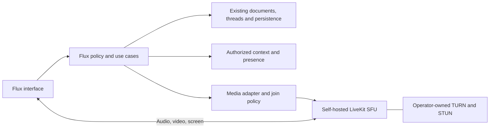

# Live collaboration at the work

**Status:** founder-required product behavior, 27 September 2026. Implementation
and real media acceptance remain open. [Design/reference task #59](https://github.com/ColdPhase/flux/issues/59)
records the source, with backend [#61](https://github.com/ColdPhase/flux/issues/61),
interface [#62](https://github.com/ColdPhase/flux/issues/62), and deployment/quality
[#63](https://github.com/ColdPhase/flux/issues/63).

This extends the [creative collaboration direction #44](https://github.com/ColdPhase/flux/issues/44),
[personal AI requirement #57](https://github.com/ColdPhase/flux/issues/57),
[mobile contract](mobile-pwa.md), and [working application milestone](milestones/02-working-application.md).
The [supplied interactive reference](../design/references/live/README.md) illustrates
the interaction; its palette, demo data and monolithic script are not a new
production design or architecture. Continue the accepted
[O-003 C/v8 direction](../design/direction.md).

## 1. Job and complete journey

Two collaborators encounter a problem in existing work and want to solve it
together. Start a session at a task, selected map material, wiki section or
conversation, with the current context and audience already known. Use the
ordinary human workflow even when no agent is connected.

**Required journey:** blocked camera test → colleague joins at the task → show
the relevant map/wiki fragment or external screen → perform the test → save its
result and any authorized edits → leave and continue independently. Repeat with
four participants. Joining a person, discussing a task or ending a session never
automatically resolves a blocker or completes work.

“Let's work on this together” is the primary action. Starting gives permitted
people a quiet opportunity to join. A targeted invitation is one ordinary inbox
item, with join, later or text response and the recipient's notification controls.
Avoid a meeting wizard, default ringing, an answer/reject takeover, missed-call
pressure, or a separate meeting home that replaces the material being worked on.
The useful difference is continuity of context and outcomes; silence alone is
not a claim of market uniqueness.

## 2. States people can understand

| State/action | Required behavior |
| --- | --- |
| Session available | Show purpose, audience and actual participants only to people with access. Invitations do not grant project membership. |
| Join | Show the participant, including listen-only participants. Request no microphone, camera or screen access. Devices start off; acknowledge browser playback restrictions before claiming the person can hear. |
| Enable a device | A direct user action requests that device. Show permission, capture, publication and failure truthfully; a stopped or muted device is never shown as transmitting. |
| Navigate | Maintain one session across conversation, task, map and wiki routes. Preserve drafts, selection and scroll where possible. Private navigation is not a broadcast. |
| Work quietly | Stop capture/publication of microphone, camera and screen; stop incoming audio and following. Keep visible quiet presence and access to the actual work. |
| Return | Resume listening when permitted; microphone, camera and screen remain off until explicitly enabled. |
| Reconnect | Show reconnecting/lost states, recheck access, avoid duplicate identity or sessions, and preserve mute/quiet intent. Never reacquire a stopped screen silently. |
| Leave / session ends | Release device tracks and subscriptions. Persisted work remains. Define last-person exit and bounded reconnect grace so abandoned rooms do not run forever. |

Keep a compact session control strip while the material remains primary. Camera
tiles are optional, stable in position and sized for their use. Speaking can be
indicated without rearranging the screen. Keep mute and leave discoverable;
additional controls must not duplicate a full second control panel.

On phones/tablets, fit safe areas, rotation, split view, large text and the virtual
keyboard. The reference's tall fixed mobile strip obscures part of the work: the
production layout must reserve space or adapt the controls without hiding the
composer, result actions or focused content. Preserve visible state when opening
the device menu. Verify keyboard/focus and touch separately from screenshots.

## 3. Two ways to show something

**Show this fragment** sends an authorized object reference and selection: map
thought IDs/viewport, a stable wiki text anchor and revision, a task result, or a
message. The recipient opens usable Flux content, can read sources and navigate
independently. This is not a screen stream or a new copy of the material.

Use the existing synchronization and access model. A presentation event never
grants edit permission, merges threads, changes a task's status or overwrites
someone else's selection. Handle a removed/moved target and changed revisions.
Only publish material allowed for the session's audience; a private title or
preview must not leak through a pointer, participant metadata or notification.

Showing offers **View**; **Follow** is a separate, reversible choice. Following
ends on independent navigation or deliberate pan/zoom/editing. It must not pull
someone back repeatedly. A presenter entering a private project does not change
what the session sees. Revalidate every later presented target; previous access
to one map does not authorize another map or project.

**Share screen** transmits an explicitly selected external window, tab or display
for an IDE, terminal or demo. Keep source/stop indicators visible, handle browser
stop and permission denial, avoid unnecessary local preview feedback loops, and
let each viewer choose a screen, zoom or use 1:1 pixels. Support two simultaneous
screens without forcing both into unreadable thumbnails.

Browser capture requires a fresh user gesture/selection; permission cannot be
silently reused. Audio-source support varies by browser and OS.
[MDN capture documentation](https://developer.mozilla.org/en-US/docs/Web/API/MediaDevices/getDisplayMedia)
describes these constraints. Flux must explain unavailable functions, not suggest
that an administrator or another participant can remotely switch them on.

## 4. Outcomes stay in existing work

| Change made during a session | Durable home |
| --- | --- |
| Reply or agreement | The existing work conversation, with author and sources |
| Task blocker/result/status | The existing task through its normal authorized action |
| Thought or connection | The same map with its normal history |
| Wiki improvement | A new version of the existing page |

Showing a wiki section does not move the session's conversation into that page.
Map, conversation, work and knowledge retain their separate identities and
many-to-many relationships. The session adds a temporary collaboration context.

An optional exit recap links the operations actually committed during the
session. It must distinguish a participant's written note from inferred speech.
No saved operation and no consented audio processing means no invented minutes.
Do not require a closing form or create an empty meeting document each time.
Media failure never rolls back a saved result or prevents ordinary text work.

## 5. Personal AI help and optional audio notes

Apply [#57](https://github.com/ColdPhase/flux/issues/57) without a shared workspace
bot exception. Hubert may enable his personal agent to help within authorized
application context and an explicit request or standing rule. Other participants
can see permitted output; they cannot invoke, retry or continue Hubert's agent,
spend his quota, or acquire his private context. Attribute owner and initiator.

Default help has no access to room audio, camera or shared screen. A bounded rule
may prepare a sourced wiki change after a written test result; it must remain
quiet, version-aware, editable/dismissible and consistent with the human workflow.
Session entry, an invitation, another person's message or audio consent is not
permission to consume somebody else's AI connection. Human media sessions work
with AI entirely disabled.

Audio notes are a future, separately scoped capability outside milestone 2 and
off by default:

- The connection owner initiates; every current participant explicitly consents
  to the disclosed processor, output audience and retention before audio flows
  to a processor. Consent is product behavior, not a blanket legal certification.
- Display the named processing participant, continuous state and a stop control
  available to everyone. Never use a hidden agent/listener grant.
- A newcomer or withdrawal pauses processing before further audio is delivered;
  discard pending unconsented audio. Reconnection must not bypass this boundary.
  A late “participant joined” UI notification is insufficient for that guarantee.
- Explain audio, transcript and note storage separately. Default recording is
  off. An optional external model requires explicit disclosure/configuration;
  local processing keeps an entirely self-hosted option. Do not infer agreement,
  assignments or deadlines from casual suggestions.
- Analyzing a screen or camera needs its own scoped permission. Text help comes
  first; the agent does not spontaneously interrupt with synthesized speech.

Room-media recording, egress or transcription is outside milestone 2, including
when an operator configures a LiveKit service. The deployment must leave those
paths disabled. A later scoped implementation must show every participant a
visible state before capture, collect each current participant's explicit
consent, pause before any newcomer receives or sends captured media, and let
any participant stop processing. Operator configuration alone never grants
participant consent.

Choose and document the encryption/key boundary before claiming E2EE. LiveKit
supports E2EE, but the application handles keys; signaling/API protection has a
different scope. An audio-analyzing agent must be an explicitly authorized
decrypting recipient. Never silently downgrade protection to enable notes.
[Official encryption documentation](https://docs.livekit.io/transport/encryption/)
is a capability reference, not evidence that Flux has implemented that guarantee.
The current boundary is recorded in the
[encryption boundary record](../development/live-media-encryption.md): media is
encrypted in transit (DTLS-SRTP, checked automatically) and readable in the SFU.
E2EE is not implemented and is not claimed.

## 6. Self-hosted architecture and access

**Recommended transport:** self-hosted LiveKit, integrated behind a Flux adapter.
Its [server uses Apache-2.0](https://github.com/livekit/livekit/blob/master/LICENSE)
and supports [self-hosted realtime media](https://docs.livekit.io/transport/self-hosting/).
The final version/configuration requires the implementation task's independent
review and real proof. Do not start another broad stack selection exercise.

Own the signaling, SFU, relay and persisted application data. No mandatory cloud
account, external public relay, hosted analytics or paid media quality tier.
Inventory outbound dependencies. Recording, egress and transcription stay
disabled for milestone 2 under section 5; model inference is optional. Human
calling must remain available without them. Self-hosting still consumes
bandwidth and server capacity.

Keep domain session/audience rules and use cases independent of SDK objects.
Use adapters for grants, media events and diagnostics, existing policy for
objects, and existing persistence for results. Do not copy the demo's global
state machine into a giant production component or adopt a new document-sync
library merely because the supplied description mentions Yjs.

Session discovery, invitation, join, context delivery and reconnect need current
authorization. An Arduino + AI session is not discoverable to an unrelated
Marketplace participant. Use opaque room/participant identifiers, minimal grants,
backend-only signing secrets, checked callbacks and idempotent event processing.
A media token is not an application data token.

**Revocation is a concrete implementation gate.** LiveKit's documentation says
self-hosted removal does not invalidate existing tokens; connected clients can
also receive refreshed reconnect tokens. Therefore a short original TTL and
client-side hiding do not prove immediate cutoff. Test cached and refreshed
tokens against the actual deployed versions. Adopt a reviewed server enforcement
or session/room-generation strategy that prevents recovery of current media and
context after revocation, and record the measured cutoff. Never market an
unverified guarantee. [Tokens and grants](https://docs.livekit.io/frontends/reference/tokens-grants/).

## 7. Quality that can be checked

These are starting capture/quality targets, not guaranteed support on every
device. The implementation/evaluation pair records reproducible network profiles
and actual pass/fail thresholds before the final run; it cannot lower them to
hide a discovered failure.

| Material | Initial target under suitable hardware/network | Observe at the receiver |
| --- | --- | --- |
| Code / terminal / document | Up to 2560×1440, 15–30 fps | Readable 14–16px text and scrolling, zoom/1:1, time to a clear frame |
| Moving demo | Up to 1920×1080, 60 fps | Delivered frame rate, motion and latency |
| Camera | Up to 1080p30, smaller for thumbnails | Stable image without starving screen or speech |
| Voice | Clear, continuous speech; supported echo/noise handling | Interruptions, delay, clipping, loss and device switching |

Default to automatic quality. Prioritize speech, stop wasting bandwidth on hidden
camera tiles, and prefer lower frame rate over destroying code readability when
appropriate. Adapt per receiver where supported; one weak receiver need not
reduce everyone to the same quality. LiveKit supplies
[adaptive subscription mechanisms](https://docs.livekit.io/transport/media/subscribe/),
but actual results depend on publication layers, codecs, clients and hardware.

Expose measured resolution, fps and a useful reason for degradation on demand.
Record sender/receiver bitrate, jitter/loss, latency method, interruptions,
reconnect time and SFU/relay resource use. Configured values and a local preview
are insufficient. Screen/system audio has its own capability and permission
states; [LiveKit's screen-sharing guide](https://docs.livekit.io/transport/media/screenshare/)
separates browser and native platform paths.

## 8. Deployment and platform acceptance

Use Docker/Compose for development and tests. Document the intended k3s topology
with public reachability/NAT, HTTPS/WSS certificates, SFU UDP/TCP, relay addresses,
TURN/TLS and explicit firewall/load-balancer behavior. A web ingress alone does
not carry all media traffic. See the official
[port requirements](https://docs.livekit.io/transport/self-hosting/ports-firewall/)
and [Kubernetes host-network deployment](https://docs.livekit.io/transport/self-hosting/kubernetes/).
Validate the chosen deployment, including restrictive networks with UDP blocked,
instead of assuming a chart installs a working call.

Keep services/version pins, health checks, metrics, capacity/room limits,
bandwidth estimates, drain/restart, update and rollback instructions reviewable.
Run media/real-device/network workloads locally or on authorized test hardware;
keep PR Actions to fast checks and release only the completed candidate.

Required matrix: two and four people; two concurrent screens; good and constrained
links; Fedora/Wayland, Windows and macOS with supported Chromium/Firefox/Safari;
Android phone/tablet, iPhone and iPad browser/PWA participation. Include denial,
device disappearance, headphones/Bluetooth changes, background/lock/foreground,
rotation, network changes and service-worker updates. Preserve unfinished work;
show suspension honestly instead of promising uninterrupted mobile background
audio without platform evidence. Founder direction
[#266](https://github.com/ColdPhase/flux/issues/266) item 10, 2026-10-05: the
platform rows run Chromium, Firefox and WebKit in Docker with emulated
phone/tablet viewports, touch and fake media devices, plus documented platform
capabilities with dated sources ([mobile evidence](mobile-pwa.md#acceptance-evidence));
physical phones, tablets and other machines are optional extra evidence.

**Mobile screen viewing and screen publication are different capabilities.** On
the research date, [MDN browser compatibility data](https://github.com/mdn/browser-compat-data/blob/main/api/MediaDevices.json)
marks `getDisplayMedia` unsupported in Chrome/Firefox Android and Safari iOS.
Installing a PWA does not create native capture APIs. Provide the supported
voice/camera, received screen and native Flux-fragment flows with clear capability
states; verify each in emulation against the documented capabilities. If full
mobile OS-screen publication is required, explicitly track a native
implementation with its lifecycle/permissions.
Do not silently remove the existing mobile requirements or claim universal capture.

## 9. Evidence and delivery ledger

Research above was checked against official sources on **2026-09-27**. These are
vendor/documentation facts and a Flux design derived from them. No LiveKit server,
real remote call, throughput or hardware test was performed for this requirements
change. The [reference inspection](../design/references/live/README.md#inspection)
only verifies local prototype behavior with its stated limits.

| Work | Owner / evaluator | Completion evidence |
| --- | --- | --- |
| [#59 requirements and reference](https://github.com/ColdPhase/flux/issues/59) | Hubert / Maurycy | Source provenance, render/interaction observations, dated feasibility, linked tasks |
| [#61 server and context](https://github.com/ColdPhase/flux/issues/61) | Hubert / Maurycy | Real two-client transport, persisted context, policy and revocation regressions |
| [#62 live interface](https://github.com/ColdPhase/flux/issues/62) | Maurycy / Hubert | Independent visual review plus real integrated human journey |
| [#63 quality and operation](https://github.com/ColdPhase/flux/issues/63) | Hubert / Maurycy | Receiver/network/device results and operable self-hosted deployment at the candidate |

Only the first row is documentation. The others are required full-application
outcomes and stay open until demonstrated. Optional audio notes require a later
scoped task and must satisfy section 5 before processing. They are not a
prerequisite for ordinary human calls. Agents can split
these tasks into bounded PRs while retaining their criteria and single owners.
