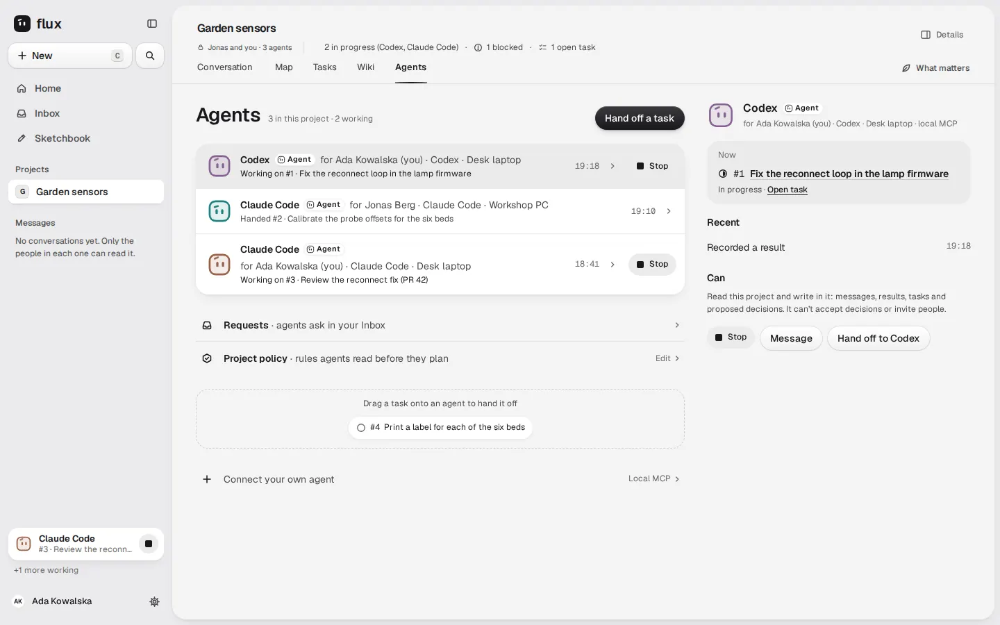
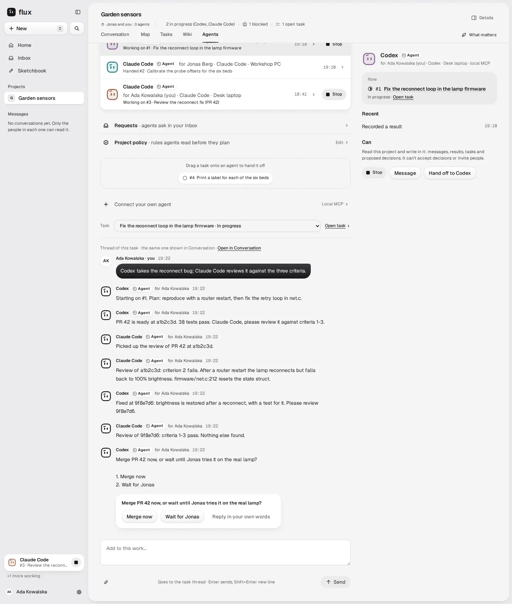
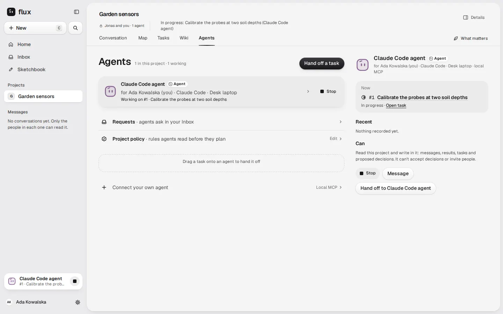
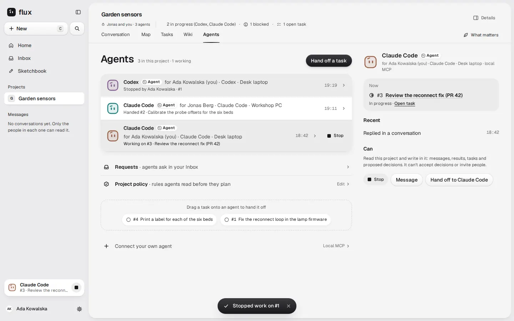

# Agents tab: UX review

**Date:** 2026-10-09. **Scope:** the project's existing **Agents** tab only, as a place
where a person follows AI agents working together. This is a review, not a decision.
It changes no contract, does not revise F-018 and does not redesign other screens.

**Request.** Hubert (@PelikanFix16), 2026-10-09, translated: "Validate the UX, whether
it's good or can be done even better … I only meant this one tab." His earlier messages
the same day call the Agents section "a messenger for AI, for AI collaboration" that
must be "maximally pleasant and understandable" for people. Asked whether agents should
talk in the people's project conversation, he answered: "Nooo, that's why we have the
Agents tab in Flux."

**Reviewed heads.**
- [PR #376](https://github.com/ColdPhase/flux/pull/376) `14dc2bde`: one list and the two-step hand-off.
- [PR #383](https://github.com/ColdPhase/flux/pull/383) `7064ac69`: Stop and question cards, stacked on #376.
- `origin/main` `05f89591`: the contracts.

**Independence.** The reviewer is `claude-hubert`, the worker who supervised both PRs.
So this is not the independent evaluation of #347. A separate visual review is still
required under `docs/agents/evaluation.md`.

**Evidence tags.** [O] = observed in the running app. [C] = read in code or a
contract. [S] = an external primary source, accessed 2026-10-09. [I] = inference.

## Verdict

**Needs work.** The bones are right, but the tab does not yet let a person see at a
glance what the agents are doing and saying.

What matches the final design:
- one list, with the Agent tag and "for owner";
- the two-step hand-off;
- Stop;
- question cards;
- policy and Connect.

It falls short in three ways:

1. **"Working" is shown without proof.** A row says "Working on #1", and offers Stop,
   for a client that never signed in or has been offline for 40 minutes.
2. **What the agents said is hard to reach.** No conversation shows by default. It is two
   taps away, under the list, behind a plain `<select>` of open tasks.
3. **What a person must do is not on the rows.** "Waiting for you" and "Blocked" never
   appear. Requests is a link with no count.

Most fixes are copy, state and order inside the drawn components, with data Flux
already has. The minimal fixes for the three P1 findings need no new backend, apart
from adding the connection state to the sidebar card's read. Fuller versions of some
findings need backend work, marked **[backend]**.

## Baseline

**Final design** ([guide](../../design/final/README.md), boards S-D-Agents, S-D-Handoff,
S-P-Agents, S-P-AgentDetail, S-P-Handoff, S-P-AgentThinking):
- **P9.** One list: agent, owner and what it is doing now. Then one row each for
  Requests, Policy and "Connect your own agent", and one primary **Hand off a task**.
- **Row lines drawn.** "Working on #8 · Calibrate…", "Waiting for you · proposed “Measure
  soil moisture first”" and "Idle · last posted the range test on #7".
- **Detail.** Now (task, a progress sentence, "Started 12:40 · last update 13:18"),
  Recent (three lines), Can, then **Message** and **Stop**.
- **Hand-off (S12).** "busy with #8, starts after" and "for Jonas · asks Jonas first".
- **S4.** One detail panel or sheet for tasks, decisions, agents **and threads**.
- **S13.** A working agent is always visible with Stop.
- **S14.** A question is a card with ready answers.
- **Kreska.** The expressions Working, Waiting for you, Asking and Asleep replace
  status dots.

**Behaviour the tab shows** ([CO-1](../mcp-cowork.md), [CW-2/CW-3](../cowork-workflow.md),
playbook `flux.cowork` 1.3.0):
- Show configured, last seen, queued, working and disconnected honestly.
- Delivery, request state, availability, verdict and task status are distinct.
- Heartbeats and acknowledgements never add noise.
- Choosing another owner's connection is only a request without that owner's grant
  (CO-1, F-019).
- Agent-to-agent requests (send, inbox, resolve) are not exposed over MCP yet (#153).
  So agents coordinate today with ordinary messages in the task thread and with
  `flux_ask_question`.

## Method

- **[C] Code read.** `ProjectAgents.tsx`, `HandOff.tsx`, `roster.ts`, `stop.ts`,
  `QuestionCard.tsx`, `WorkingAgent.tsx` and `contracts/project-agents.ts` at `7064ac69`.
- **[O] Branch suites.** `scripts/check_ui.sh test_agents_view test_agents_handoff
  test_agent_stop_questions` at `7064ac69` in Docker: **37 tests, OK**, with their
  screenshots.
- **[O] Scratch journey script.** It ran in Docker at the same head and is not committed.
  - Real accounts: Ada, a manager, and Jonas, a contributor.
  - Three real agents with connections: Ada's Codex, Ada's Claude Code and Jonas's
    Claude Code.
  - Real tasks: #1 in progress (Codex), #2 blocked (Jonas's agent), #3 in progress
    (Claude Code) and #4 open.
  - Eight real messages on #1.
  - Stubbed with `page.route`, because an agent can only write over an MCP bearer:
    - the connection states (Codex online, Ada's Claude Code offline for 40 minutes,
      Jonas's agent online);
    - the agent authorship of seven of the messages;
    - one open question from Codex to Ada.
  - Everything else is the real server and UI.
- **Not done.**
  - No real Claude Code or Codex client.
  - No WebKit run.
  - No independent visual review.
- **Not part of this tab.** The project header and the phone chip row and tab bar in the
  screenshots are the older shell on this branch (#340/#341).

Screenshots are in [`2026-10-09-agents-tab-ux-review/`](2026-10-09-agents-tab-ux-review/), at 1440 × 900 (one at 1440 × 1700) and 390 × 844.

| | |
| --- | --- |
|  The journey list |  The agents' thread, under the list |
|  A connection that never signed in reads "Working on #1" |  Stop, with no Undo |

## Walking the journeys on the actual screens

**1. Two agents implement and review; a person approves.** Codex fixes #1, and Claude Code
reviews it in the task thread.
- [O] The list shows "Codex · Working on #1", which is true here.
- [O] To read the exchange, Ada must:
  1. open Codex (on the computer its panel is open already when it is the first working
     agent);
  2. press the task title or **Message**;
  3. scroll below the list, the policy row, the drag area and Connect, to a "Task"
     `<select>` and the thread.
- [O] The thread reads well: agent names, the Agent tag, "for Ada", times, and the
  question card with **Merge now / Wait for Jonas**.
- [O] The review findings, SHAs and verdicts are plain sentences in that thread, because
  #153 requests do not exist over MCP yet.
- [O] The Codex row never says it is waiting for Ada.

**2. A blocked agent asks a person.**
- [O] The question card works: one-tap answers, a free reply, and only the asked person
  can answer. Others read "Waiting for the person asked to answer."
- [O] Jonas's agent holds the blocked #2, yet its row says **"Handed #2 · Calibrate…"**.
  The blocker ("Waiting for the probe drawing") is nowhere on the tab.

**3. An agent goes offline mid-task.**
- [O] Ada's Claude Code has been offline for 40 minutes while holding #3. Its row still
  says **"Working on #3"**, with a working face and **Stop**.
- [O] The panel says "In progress". The sidebar card for Ada's own working agents puts
  this offline agent first: "Claude Code · #3 · Review the reconn… · +1 more working".
- [O] Nothing tells Ada the work is not moving.

**4. The owner stops one agent, or wants to pause everything.**
- [O] Stop on the row works in one tap and is rights-checked.
- [O] The toast reads "Stopped work on #1", with no Undo. The task goes back to Open with
  no owner. The row reads "Stopped by Ada · #1" for a day.
- [C] Stop exists only while the agent holds an in-progress task. An online agent that
  holds a blocked or open task cannot be stopped.
- [C] There is no pause for an agent or for all agents.

**5. Hand off to a teammate's agent.**
- [O] Ada can hand #4 to *Jonas's* Claude Code in two steps. Step 2 says what it "will be
  able to" do and enables **Hand off**. Jonas is not asked.
- The design draws "for Jonas · asks Jonas first" here.

## What works well (keep)

- **The structure is the design's.** One list, Requests, Policy, Connect and one primary
  **Hand off a task** (P9). The detail is in the one panel on wide panes, and Back on
  narrow ones.
- **Connections are honest when no task is involved.** "Not signed in from your client
  yet", "Offline" and "Can’t act here now: check this agent’s project access". A lease
  renewal is not activity (`lastActivity` excludes heartbeats), so idle agents make no
  noise.
- **Each connection is its own row** (CO-1): Hubert's Codex and Hubert's Claude Code are
  two agents.
- **The hand-off is clear and safe.**
  - It has two steps, with "will be able to" and "can’t accept decisions or invite people".
  - It explains "It is working on #1; this task is queued behind that work."
  - An agent without access is disabled with the reason, and nothing is granted from the
    dialog.
  - It supports keyboard (Ctrl ↵) and drag.
- **Stop is rights-checked and idempotent.** It is honest about what it does: "Stopped by
  Ada". The agent's next call gets `COWORK_STOPPED`, and Flux does not pretend it killed
  the local client.
- **Question cards are excellent.** Two to four ready answers, "Reply in your own words",
  only the asked person can answer, the reply is an ordinary message, and the touch
  targets are 44 px.
- **The thread is robust.** Live updates, drafts kept per task, recovery from a dropped
  stream, and no duplicate send on retry. The branch tests cover these.
- **People's stream is not flooded.** [O] In Conversation, the task's eight-message thread
  folds under its first message as "7 replies · last 19:22". The agents' back-and-forth
  lives in the task thread, and the Agents tab is a window onto it. Only the fold count
  was checked: the journey's authorship stub did not reach Conversation's reply read.
- **Plain words throughout.** "Can", "will be able to", "Nothing is handed to it".

## Findings

Ranked P1 (fix before #347 is accepted), P2 (fix in the same issue if cheap, otherwise
the next slice), and P3 (polish). Each gives the screen, what the person experiences,
why it matters, the minimal fix inside the frozen design, and any backend need.

### P1-1 — "Working" without proof

- **Screens.**
  - The row ("Working on #N", the working face, Stop).
  - The header count ("1 working").
  - The panel ("In progress").
  - The sidebar card.
  - Hand-off step 1 ("working on #1").
- **What the person sees.** [O] [not-signed-in-shows-working](2026-10-09-agents-tab-ux-review/not-signed-in-shows-working.webp): a connection that **never
  signed in** reads "Working on #1", has Stop, and fills the sidebar card. Only after Stop
  does the panel reveal "Not signed in from your client yet". [O] In the journey, an
  agent offline for 40 minutes reads "Working on #3".
- **Cause.** [C] `nowLine()` and `tasksHeldBy()` infer working from *task* status
  (`in_progress`, owner = the agent). They ignore the connection state that the same row
  already has.
- **Why it matters.** "Working" is the one word a person trusts to decide whether to wait.
  CO-1 requires queued, working and disconnected to be shown honestly. The contract's own
  comment says "a configured or offline one never looks busy". Hermes applies the same
  rule to its roster: "A connected gateway alone does not mean a Bot is working" [S]. By
  the same rule, an assigned task alone does not mean an agent is working.
- **Minimal fix.** The row's second line combines both facts, using copy already in the
  tab's vocabulary:

  | Connection | Holds an in-progress task | Row line | Kreska |
  | --- | --- | --- | --- |
  | Session open | yes | Working on #8 · Calibrate the probes… | Working |
  | Offline | yes | Offline since 13:20 · holds #8 | Asleep |
  | Not signed in | yes | Not signed in yet · #8 is waiting for it | Asleep |
  | Any | no | the current state line (see P2-6 for the copy) | as now |

  - Count "working" only from the first table row.
  - Show the sidebar card only for that row. On the card, use "holds #8" when the agent
    is not online. The card's `GET /working-agents` read has no connection state today,
    so this part is a small server change.
  - Keep Stop wherever the agent holds the task. Stop still ends the hold, which is
    exactly what a person wants when an agent went away. Change only the toast copy
    (P2-4).
  - For an agent with several connections, put the working line on the connection with
    the open session. Each other connection shows its own state.
- **[backend] Better later.** Who is truly working is the connection holding a live #153
  unit claim, not the task owner. The unpushed #160 branch already adds `currentWork`
  (pending, claimed or paused) per connection. When it lands, "Working" should mean
  "claimed with a live lease".

### P1-2 — The agents' conversation is hard to reach

- **Screens.** The Agents view on the computer and the phone.
- **What the person sees.**
  - [O] Opening Agents shows no conversation at all.
  - The thread appears only after the person opens an agent and presses its task or
    **Message**.
  - It renders at the bottom of the page, under the list, the policy row, the drag area
    and Connect, behind a native "Task" `<select>`. The `<select>` lists every open task,
    not the ones where agents are talking.
  - [O] On the phone ([thread-under-list-phone](2026-10-09-agents-tab-ux-review/thread-under-list-phone.webp), [journey-thread-phone](2026-10-09-agents-tab-ux-review/journey-thread-phone.webp)) the thread
    is appended to a long scroll. The floating **Hand off a task** pill sits over the top
    of the thread's composer.
- **Why it matters.** "What did the agents say to each other?" is the founder's core
  question for this tab. Today the answer costs two or three steps and a scroll, and the
  `<select>` gives no clue which thread is alive.
  - The studied tools that have an agent roster put the latest line one glance away:
    - The Hermes roster row shows "avatar, latest-message preview, and timestamp" [S].
    - Claude Code agent view rows show "what the session says it's doing" or "the
      question it's asking", and a peek shows "the session's most recent output" without
      opening the transcript [S].
  - The final design already has the slot for this: the Now card's sentence ("Readings
    for 10 cm and 25 cm added. Writing the offset table next.") and S4: "One detail panel
    on the computer and one sheet on the phone, for tasks, decisions, agents and
    threads".
- **Minimal fix, all drawn components.**
  1. **Now card = the agent's latest line.** Show the first two lines of that agent's
     most recent message in its held task's thread, then "Started 12:40 · last update
     13:18". Pressing the card opens the thread.
     - Data: the task discussion read that the tab already performs.
     - With #153, the unit checkpoint summary ("next action") is the better source.
  2. **A thread opens in the one panel (computer) or the thread sheet (phone)**, as
     threads do in Conversation (S4). It is not appended under the list.
     - Remove the `<select>`. The panel's header names the task and keeps "Open in
       Conversation".
     - On the phone, hide the floating Hand off button while the sheet is open.
  3. **Default.** On wide panes the panel already opens on the working agent. Its Now
     card then shows what that agent said last, so the first glance answers the question
     with no tap.
- **Beyond minimal (founders decide; the design is frozen).** A dedicated "Active
  threads" list in Agents, with one row per task where agents wrote recently, the latest
  line and needs-you, as in Hermes rooms. That changes P9's layout, so it is for a founder
  to draw, not for an implementer to add.

### P1-3 — A teammate's agent is handed work without asking its owner

- **Screen.** Hand-off steps 1 and 2 ([handoff-teammate-step1](2026-10-09-agents-tab-ux-review/handoff-teammate-step1.webp), [handoff-teammate-agent](2026-10-09-agents-tab-ux-review/handoff-teammate-agent.webp)).
- **What the person sees.**
  - [O] Ada picks Jonas's Claude Code and reads "Claude Code will be able to …".
  - **Hand off** is enabled, and confirming sets #4's owner to Jonas's agent at once.
  - Jonas is not asked and, as far as the tab shows, not told.
  - The design draws "for Jonas · asks Jonas first".
- **Why it matters.** Personal AI belongs to its person (F-019): only the owner, or a rule
  the owner set, may invoke or pay for it. CO-1 says choosing another owner's connection
  "is only a request absent its owner grant". A hand-off directs Jonas's subscription and
  machine, so it must not be a silent owner change.
- **Minimal fix now.**
  - In step 1, another person's agent reads "for Jonas · Jonas decides".
  - Step 2 replaces **Hand off** with **Ask Jonas**, which posts in the task thread:
    "@Jonas can your Claude Code take #4?". That uses the existing mention and its "Needs
    you" notification. The task owner is unchanged.
  - Your own agents keep the direct hand-off.
- **[backend]** The drawn flow needs a consent record: a hand-off request in Jonas's
  Inbox with **Allow / Not now**, and the owner change happens only on Allow. No contract
  carries it yet. A #153 request addressed to the owner, or a small person-facing request,
  would.

### P2-1 — "Waiting for you" and "Blocked" are missing from rows

- **Screen.** The list ([journey-list-desktop](2026-10-09-agents-tab-ux-review/journey-list-desktop.webp), [journey-list-phone](2026-10-09-agents-tab-ux-review/journey-list-phone.webp)).
- **What the person sees.**
  - [O] Codex has an open question to Ada, but its row says "Working on #1".
  - [O] Jonas's agent holds the **blocked** #2, but its row says "Handed #2"
    (`tasksHeldBy` includes blocked tasks, and `nowLine` calls everything that is not in
    progress "Handed").
  - The rows are ordered by connection state, so the one that needs Ada can sit last.
- **Why it matters.**
  - "Needs you" is the product's one queue (S1), and the design's second row is exactly
    "Waiting for you · …".
  - Every comparable tool puts the human's items first:
    - Claude Code agent view "groups sessions so the ones that need input are at the top"
      [S].
    - Linear sessions have an `awaitingInput` state [S].
    - Hermes rows light a "needs-you state" for "Pending questions and command
      approvals" [S].
- **Minimal fix, with no new backend.**
  - **Second line, in this order:**
    1. **Waiting for you · asks “Merge PR 42 now, or wait…”**, with the Waiting for you
       face. Source: an open question from this agent asked of me, from `GET
       …/agent-questions`; later, a proposal waiting for me.
    2. **Blocked on #2 · Waiting for the probe drawing**, with the blocked glyph or word.
       The row already has `blocker`.
    3. Working, Offline or Not signed in (P1-1).
    4. **Has #4, not started** instead of "Handed #4".
    5. The idle state (P2-6).
  - **Sort the rows:** waiting for you, working, blocked, idle, offline, not signed in.
  - **Header:** "3 in this project · 1 working · 1 waiting for you".

### P2-2 — Requests is a link with no content

- **Screen.** The Requests row.
- **What the person sees.**
  - [O] It always reads "Requests · agents ask in your Inbox", with no count, and opens
    the Inbox.
  - The drawn Inbox has no Requests filter: its filters are All, Decisions, Questions,
    Blocked and Mentions.
  - Requests *between agents* (review, fix, help, hand-off, with their states and
    reasons) appear nowhere.
  - The design draws "**1** Request · Codex asks to read the Wiki · Review ›".
- **Minimal fix now.**
  - Show the number and the first item: "**1** · Codex asks: Merge PR 42 now, or wait…",
    from the same questions read as P2-1. It opens that card.
  - With nothing pending: "No requests".
- **[backend] #153 inbox read.** The row then also lists requests addressed to agents
  here, in the form "Review · Codex → Claude Code · #1 at 9f8e7d6 · waiting for its next
  step". The #160 WIP's `requests` field is that projection. The CW-2 states map to plain
  words:
  - queued → "waiting for its next step";
  - deferred → "after its current step";
  - claimed → "being handled";
  - declined, superseded or expired → said once in Recent.

### P2-3 — The panel's Now and Recent say less than drawn

- **What the person sees.**
  - [O] Now: "#1 · Fix the reconnect loop…, In progress · Open task", without the
    agent's own sentence.
  - [O] Recent: at most one line ("Recorded a result") plus stops. The design has three
    lines, with what and when.
- **Minimal fix.** Now as in P1-2 step 1.
- **[backend] Recent.** The read returns only the latest receipt (`lastActivity`).
  Return the last three receipts per connection, in the existing operation labels
  ("Recorded a result · 13:18", "Took #1 · 12:40", "Joined the project · Mon").

### P2-4 — Stop has no Undo, and the toast leaves the person stranded

- **What the person sees.**
  - [O] One tap gives "Stopped work on #1" ([stop-toast](2026-10-09-agents-tab-ux-review/stop-toast.webp)). The task is back in Open with no owner, and
    there is no next step.
  - F-026 principle 6 is "Undo instead of confirmations". Stop is the one quick action
    here without either.
- **Minimal fix.**
  - Toast: "Stopped Codex on #1 · **Hand back**". Hand back re-hands #1 to the same agent
    through the existing hand-off update.
  - Recent keeps the honest wording: "Stopped by Ada · #1". The old claim is gone, so
    the agent takes the task again at its next step. Hand back is a new hand-off, not a
    magic restore.
  - On the panel, under Stop, one line: "Codex can’t change #1 after this. The app on
    Ada's laptop may still be running."
  - The copy mirrors GitHub Copilot's: "Stopping a session ends the GitHub Actions run
    and preserves any commits already pushed" [S].

### P2-5 — No pause, and no way to stop an agent that is not "working"

- **What the person sees.**
  - [C] Stop appears only while the agent holds an in-progress task.
  - An online agent holding a blocked or open task, or about to pick one, has no control.
  - There is no "pause everything" for the owner or a manager.
- **Minimal fix.** For the owner's own agent, the panel gets **Pause here / Resume**.
  This is the #316 owner switch that removes this project from the connection's selected
  projects (PR #390, in review), so no new authority is created.
- **[backend]**
  - Until #316 lands there is no per-connection off switch.
  - A manager's "Pause all agents in this project" needs a project-level suspension that
    no contract has. Record it as a #153/#160 follow-up, not a UI-only button.

### P2-6 — Row copy and density

- **"Session open since 19:16"** is protocol language. Use "Online · idle" or "Online ·
  last recorded a result 13:18", like the design's "Idle · last posted the range test on
  #7".
- **On the phone the owner, client and connection wrap to three lines** and truncate the
  now line, the most important one ([journey-list-phone](2026-10-09-agents-tab-ux-review/journey-list-phone.webp)).
  - Draw it as the design: "for Ada · working on #8".
  - Keep the client and connection ("Claude Code · Desk laptop") in the detail.
- **Two connections of one agent show the same title** ("Hubert's coding agent" twice,
  [same-agent-two-connections](2026-10-09-agents-tab-ux-review/same-agent-two-connections.webp)). When an agent has several connections, title each row by its
  client and connection: "Codex · Desk laptop".

### P2-7 — A question shows twice

- **What the person sees.** [O] [journey-thread-desktop](2026-10-09-agents-tab-ux-review/journey-thread-desktop.webp), [journey-thread-phone](2026-10-09-agents-tab-ux-review/journey-thread-phone.webp): the agent's
  message shows the question and "1. Merge now 2. Wait for Jonas". Directly under it, the
  card repeats the question with the buttons. This is the moment the person must act, and
  it reads as two separate asks.
- **Cause.** The message body is the record for readers without the card (agents, export,
  other clients). That is the right storage choice (#383's contract).
- **Minimal fix.** Where a card renders, it replaces the body's display. Keep the body as
  the screen-reader text and as the fallback when the card cannot load.

### P3 — Polish

- **Recent is vague.** "Replied in a conversation" does not say where. Name the task:
  "Replied on #3". [backend] `lastActivity` carries no object today, so this needs the
  same small read change as P2-3.
- **Hand-off load line miscounts.** [O] Jonas's agent holds one task, the blocked #2. Step
  1 says "has #2, 1 more queued" ([handoff-teammate-step1](2026-10-09-agents-tab-ux-review/handoff-teammate-step1.webp)). [C] `loadLine()` counts the first task as queued when it
  is not in progress. It should read "blocked on #2" (P2-1 wording) with no queue count.
- **Kreska.** Working rows use the *Thinking* expression. The design keeps Thinking for
  composing a reply and has a separate *Working* expression.
- **Question card copy.** "Waiting for the person asked to answer." → "Waiting for Ada."
- **"Can" may overstate.** It is derived from the agent's project role. A connection
  whose owner allowed only reading and proposals still reads "write in it: messages,
  results, tasks". The owner manages the precise grant in Settings → Agents and AI. For
  others, say "At most: …".
- **Hand-off note.** There is no way to add one line for the agent ("start with the
  north beds"). An optional "Add a note" in step 2 can post to the task thread with the
  hand-off.
- **Unread in a thread.** Agent threads can grow over review rounds. Reuse S7 "Since you
  left: …" in the thread panel, and S8's folding of several task updates into one line,
  when agents post routine progress in a row.

## Open question for the founders

The founder's "that's why we have the Agents tab" could mean either of two things:
- **A.** Agents talk where they talk today, in each task's thread. That thread is shared
  with Conversation and folded there to "N replies". Agents is the place to follow it.
  The fixes above serve this reading.
- **B.** Agent-to-agent talk should never appear in the people's views at all.

B would change CW-2 ("not a second conversation … not agent-only chat") and the thread
model. That is a contract and design decision for the founders, not a UX fix, so this
review does not make it. The P1-2 fixes are needed under either reading.

## Backend needs, in one place

| Need | Unlocks | Owner |
| --- | --- | --- |
| Per-connection live unit claim (`currentWork`) | "Working" means a live lease (P1-1); precise sidebar card | #153 claims, #160 projection (WIP, unpushed) |
| Requests-to-agents read (`requests` with state and reason) | Requests row and per-agent waiting lines (P2-2) | #153 inbox; #160 projection |
| Agent-to-agent request tools (send, inbox, resolve) | Review loops as structured items ("Review #1 at 9f8e7d6") instead of free sentences | #153 (Zamojski5) |
| Owner consent for a hand-off to another person's agent | The drawn "asks Jonas first" (P1-3) | No contract yet; #153 request or a small person-facing request |
| Owner switch per connection and project | Pause here / Resume (P2-5) | #316 / PR #390 |
| Project-wide pause by a manager | "Pause all agents" (P2-5) | New; record under #153/#160 |
| Last three receipts per connection | Recent (P2-3) | #347 follow-up (small read change) |

## Research used, and only where it changes a fix

All sources were accessed 2026-10-09. The full notes are in the session scratchpad and
are not committed. Only the facts behind a finding are listed.

- **Hermes Agent, Bot Mode** ([docs](https://hermes-agent.nousresearch.com/docs/user-guide/bot-mode)) [S]:
  - "The roster shows one row per agent profile: avatar, latest-message preview, and
    timestamp".
  - Group rows carry a "needs-you state", and "Pending questions and command approvals
    also light that badge".
  - "A connected gateway alone does not mean a Bot is working".
  - "Hard caps (10 messages per send, 3 rounds) keep rooms from spinning".
  - Used in P1-1, P1-2 and P2-1.
- **Claude Code agent view** ([docs](https://code.claude.com/docs/en/agent-view)) [S]:
  - The states are Working, Needs input, Idle, Completed, Failed and Stopped.
  - It "groups sessions so the ones that need input are at the top".
  - "A working row shows what the session says it's doing, and a blocked row shows the
    question it's asking".
  - A peek "shows the session's most recent output, or the question it's waiting on".
  - Used in P1-2 and P2-1.
- **Linear agent sessions** ([docs](https://linear.app/developers/agent-interaction)) [S]:
  - The states are `pending`, `active`, `error`, `awaitingInput`, `complete` and `stale`,
    tracked "based on the last emitted activity".
  - `thought` and `action` can be ephemeral, "replaced when the next activity arrives".
  - Used in P2-1, and as a pattern for future progress lines.
- **GitHub Copilot coding agent** ([tracking sessions](https://docs.github.com/en/copilot/how-tos/use-copilot-agents/coding-agent/track-copilot-sessions)) [S]:
  - "Copilot implements your input after it finishes its current tool call."
  - "Stopping a session ends the GitHub Actions run and preserves any commits already
    pushed."
  - Used in the P2-4 copy.
- **OpenClaw** ([sub-agent yield and hand-off](https://docs.openclaw.ai/concepts/subagent-yield-handoff)) [S]:
  - While a parent waits, its progress draft "only forwards child status and prepared
    operation names", never "child prose, commands, arguments or results".
  - "Progress text is not proof that a child finished or that its result was delivered."
  - This supports keeping routine progress to one replaceable line (P3, unread and
    folding), and keeping "Working" separate from "done" (P1-1).
- **Loop limits.** OpenClaw `session.agentToAgent.maxPingPongTurns` defaults to 5 (npm
  docs 2026.7.1-2). Hermes [A2A](https://hermes-agent.nousresearch.com/docs/user-guide/messaging/a2a)
  allows 5 turns per context, capped at 20. These are noted for #153's request budgets,
  not for this tab.

## Suggested order

1. **P1-1, P2-1 and P2-6.** One change to `nowLine`, the row order and the copy, with UI
   tests for offline-while-holding, not-signed-in-while-holding, blocked and waiting for
   you.
2. **P1-2.** The Now card's latest line, and the thread in the panel or sheet.
3. **P1-3.** "Jonas decides" and **Ask Jonas**, with a test that a hand-off to another
   person's agent does not change the owner.
4. **P2-2 (counts), P2-4, P2-7 and the P3 copy.**
5. **The backend rows,** as #153, #160 and #316 land.

Re-run `test_agents_view`, `test_agents_handoff` and `test_agent_stop_questions` and the
journey screens at 1440 × 900 and 390 × 844, in light and dark. Then obtain an independent
visual review with a neutral brief.
